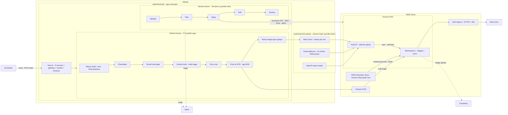
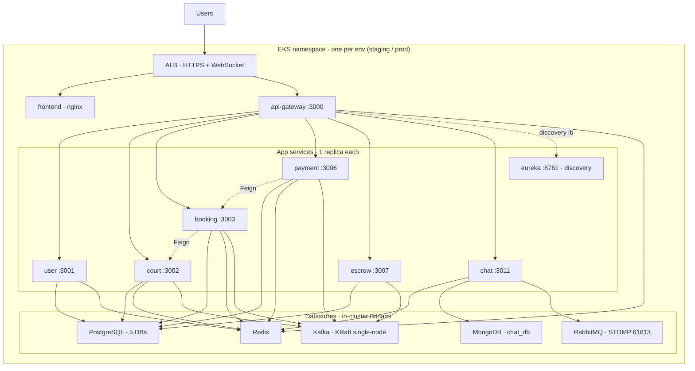
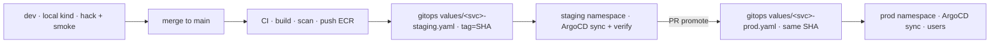

# Planning_CICD.md — GitOps CI/CD cho BadmintonHub lên AWS EKS

> **Mô hình**: *Reproducible ephemeral production-shaped demo* — làm **đúng chuẩn production**, đẩy lên **AWS Free-Tier**, chạy **ổn** rồi **`terraform destroy` xoá sạch**; khi cần demo **`terraform apply` dựng lại**. Toàn hệ thống **tái lập 100% bằng code**.
>
> Kiến trúc bám sát khoá **vprofile GitOps** đã học (Terraform→EKS · GitHub Actions→ECR · Helm+ArgoCD · SonarQube · Slack), điều chỉnh cho **các service ĐÃ BUILD** của BadmintonHub.
>
> **Tài liệu này là KẾ HOẠCH để hiểu + runbook 7 ngày (+ Day 8 gắn domain) + prompt paste-ready mỗi Day.** Chưa tạo Dockerfile/Helm/Terraform thật — đó là việc từng Day.

> 🎯 **Buổi demo = `terraform apply` → người dùng thật vào dùng 5–10 phút → `terraform destroy`.** Cụm chỉ sống đúng lúc demo → chi phí ≈ vài xu/buổi. Mọi thiết kế (IaC + GitOps + image ở ECR + state ở S3) tồn tại để **dựng lại trong ~15' và xoá sạch trong ~10'**. Không giữ data (ephemeral). Runbook buổi demo: **§7.3**.

---

## 1. Mục tiêu & phạm vi

**Mục tiêu**: đưa hệ thống BadmintonHub từ *chạy-local-bằng-`mvn spring-boot:run`* lên **cụm Kubernetes trên AWS EKS**, vận hành theo **GitOps** (mọi thay đổi = 1 commit → tự động deploy), có **CI đầy đủ** (build/test/quét chất lượng/quét bảo mật) và **tái lập được** (destroy → apply → tự hồi phục).

**Deploy cái gì** (9 image):

| Nhóm | Thành phần | Port | Ghi chú |
|---|---|---|---|
| Platform | `eureka-server` | 8761 | service discovery — **giữ nguyên**, 0 đổi code |
| Platform | `api-gateway` | 3000 | JWT filter · rate-limit (cần Redis) · CORS · `lb://` routing |
| Business | `user-service` | 3001 | auth/JWT/OAuth2 |
| Business | `court-service` | 3002 | sân/slot/pricing · Kafka consumer |
| Business | `booking-service` | 3003 | đặt sân · Outbox · Feign→court |
| Business | `payment-service` | 3006 | Bank QR · Outbox · Feign→booking |
| Business | `escrow-service` | 3007 | ký quỹ · Outbox (đang "ngủ") |
| Business | `chat-service` | 3011 | STOMP realtime · Mongo · RabbitMQ relay |
| Frontend | `frontend` (nginx) | 80 | React 19 + Vite (static) |

**KHÔNG deploy trong core demo**:
- `ai-service` (3010) — đã build (**Python** · LangGraph · chatbot đặt sân) nhưng **NGOÀI scope** vì cần Ollama `qwen2.5:3b` (~2GB RAM, nặng cho node Free-Tier spot) hoặc Gemini API. Đưa vào = **Phụ lục** (stretch).
- `matchmaking` (3004), `coach` (3005), `notification` (3008), `event` (3009) — mới scaffold rỗng. Gateway vẫn có route sẵn — khi build xong chỉ cần thêm 1 `values-*.yaml`.

**Nguyên tắc vàng của tài liệu này**:
1. **Reproducible-from-code** — không click tay trên AWS Console. `terraform apply` + ArgoCD = cả hệ thống tự lắp ráp.
2. **Rẻ nhất có thể** — datastore chạy **in-cluster** (không managed), node **spot**, **teardown sau mỗi demo** (§7.3).
3. **Chất lượng production ở chỗ MIỄN PHÍ** — GitOps, CI gates, health probe (liveness/readiness tách riêng), TLS, secret ngoài cụm (External Secrets + SSM), observability.
4. **Gần như 0 đổi code service** — cấu hình 100% qua env (`${VAR:default}` + `spring-dotenv`) → map thẳng ConfigMap/Secret. Hai ngoại lệ có chủ đích: **2 file FE** (`axiosClient.ts` + `stompClient.ts` → URL tương đối, §Day 4) và **pom + `application.yml`** để expose `/actuator/prometheus` (§Day 7). Backend Java: **0 dòng logic**.

---

## 2. Bản đồ khoá học → dự án (cái đã học dùng ở đâu)

| Section khoá vprofile | Áp vào BadmintonHub | Day |
|---|---|---|
| S8 — Containerization (Docker) | Dockerfile multi-stage cho 8 service Java + nginx cho FE | **Day 1** |
| S15–16 — Kubernetes + Java trên K8s | Helm chart tái sử dụng · Deployment/Service/Ingress · probe | **Day 2, 4** |
| S17–18 — Terraform + State | `terraform/` dựng VPC/EKS/ECR + backend S3/DynamoDB | **Day 3** |
| S14, S20 — GitHub Actions CI/CD + GitOps | `.github/workflows` CI + Terraform pipeline | **Day 5** |
| S12–13 — Continuous Delivery | ArgoCD GitOps loop + promote staging→prod | **Day 6** |
| S10–11 — CI với SonarQube/Nexus/Slack | SonarCloud gate + Trivy + Slack notify | **Day 5** |
| S19 — GitOps (Argo) | `badmintonHub-gitops` repo + app-of-apps | **Day 6** |
| (mở rộng) — Observability | kube-prometheus-stack + Loki + tracing | **Day 7** |

> Khác biệt so với vprofile: vprofile deploy 1 app Java + MySQL/Memcached/RabbitMQ. BadmintonHub = **8 service Spring Cloud** (Eureka discovery, Kafka event-driven, 2 loại DB) → ta tái dùng **cùng bộ khung** (Terraform/Helm/ArgoCD/GHA) nhưng nhân bản chart cho nhiều service + thêm Kafka/Mongo/RabbitMQ vào tầng data.

### 2.5 Day nào làm ở REPO nào (tra nhanh)

> 2 repo, mỗi repo có **CLAUDE.md riêng**. Mở Claude Code **đúng thư mục repo** của Day → context tự đúng. Prompt paste-ready của mỗi Day nằm ở **§6**.

| Day | Mở Claude Code ở | Deliverable chính | Sở hữu bởi |
|---|---|---|---|
| **1** | `badmintonHub` (app) | 8 Dockerfile Java + FE nginx + `.dockerignore` + `docker-compose.app.yml` | app repo |
| **2** | `badmintonHub-gitops` | `charts/service/` + `values/<svc>-<env>.yaml` + `values/infra.yaml` → test **kind** (dev) | gitops repo |
| **3** | `badmintonHub` (app) | `terraform/` (VPC/EKS/ECR/IRSA + backend S3/DynamoDB) + add-on | app repo |
| **4** | `badmintonHub-gitops` | Deploy infra+app lên EKS `staging` + Ingress (http, ALB DNS) + **FE same-origin** | gitops repo |
| **5** | `badmintonHub` (app) | `.github/workflows/ci.yml` + `terraform.yml` | app repo |
| **6** | `badmintonHub-gitops` | `apps/` ApplicationSet + cài ArgoCD + External Secrets (SSM) + promote | gitops repo |
| **7** | **cả 2** | Observability (gitops) + teardown/rebuild (`terraform destroy` ở app repo) | cả 2 |
| **8** | **cả 2** | *(T-2 trước demo)* Gắn domain + HTTPS: Route53 zone + ACM ở `bootstrap/` (app) · điền 2 values ingress (gitops) | cả 2 |

- **app repo `badmintonHub`** sở hữu: Dockerfiles · `docker-compose.app.yml` · `terraform/` · `.github/workflows/`.
- **gitops repo `badmintonHub-gitops`** sở hữu: `charts/service/` · `values/` · `apps/` · `external-secrets/` · `infra/`.

---

## 3. Kiến trúc tổng thể

### 3.1 Sơ đồ 1 — Luồng GitOps CI/CD đầu-cuối (bản BadmintonHub của PDF vprofile)



**Giải thích từng thành phần:**

| Thành phần | Vai trò |
|---|---|
| **app monorepo** (`badmintonHub`) | Chứa source + Dockerfile + workflow CI + `terraform/`. Developer commit vào đây. |
| **CI (GitHub Actions)** | Build→test→Checkstyle→Sonar→Docker→Trivy→push ECR→**bump tag** sang gitops repo. |
| **Terraform pipeline** | Dựng/huỷ hạ tầng AWS (6 hộp validate→destroy). |
| **gitops repo** (`badmintonHub-gitops`) | **Desired state**: Helm chart + values mỗi env + `ExternalSecret` (chỉ **ref tên** SSM param, không chứa giá trị) + ArgoCD Application. ArgoCD chỉ đọc repo này. |
| **SSM Parameter Store** | Nơi giữ giá trị secret thật — **ngoài cụm**, nên `terraform destroy` không xoá. External Secrets Operator (IRSA) đọc và tạo K8s `Secret` sau mỗi rebuild. |
| **ECR** | Kho image Docker. |
| **ArgoCD** (trong EKS) | Watch gitops repo → **sync** cụm về đúng desired state (self-heal + prune). Đây là "watches Git Repo" trong PDF. |
| **ALB Ingress** | Cổng HTTPS + WebSocket vào cụm, chia route `/`→FE, `/api`+`/ws`→gateway. |
| **Slack / Cloudinary** | Notify CI/CD · lưu ảnh biên lai + ảnh chat (SaaS ngoài). |

**Vì sao tách 2 repo?** CI (app repo) *ghi* tag vào gitops repo, ArgoCD *đọc* gitops repo → không có vòng lặp "CI commit → CI tự trigger lại". Đây là chuẩn app/helm-repo của vprofile.

### 3.2 Sơ đồ 2 — Bên trong cụm EKS (1 environment: routing + service→datastore)



**Service → datastore matrix** (nguồn: khảo sát code thật):

| Service | PostgreSQL | Redis | Kafka | MongoDB | RabbitMQ | Ghi chú |
|---|:---:|:---:|:---:|:---:|:---:|---|
| user | `user_db` | ✅ | — | — | — | Kafka có dep nhưng **không dùng runtime** |
| court | `court_db` | ✅ | ✅ | — | — | consumer `booking.slot.changed` + scheduler gen slot |
| booking | `booking_db` | ✅ | ✅ | — | — | Outbox + Feign→court |
| payment | `payment_db` | ✅ | ✅ | — | — | Outbox + Feign→booking + Cloudinary |
| escrow | `escrow_db` | — | ✅ | — | — | **không Redis**; Outbox; đang ngủ |
| chat | — (exclude JPA) | ✅ | — | `chat_db` | ✅ (STOMP :61613) | Cloudinary; `CHAT_BROKER_RELAY=true` |
| gateway | — | ✅ | — | — | — | rate-limit token-bucket |

**Ghi chú kiến trúc quan trọng:**
- **Eureka được GIỮ** làm 1 pod. Gateway + Feign vẫn resolve `lb://<service>` qua Eureka → **0 đổi code**. (Hướng "cloud-native" bỏ Eureka dùng K8s DNS = Phụ lục.)
- **1 PostgreSQL** chứa **5 database** (init script tạo user/court/booking/payment/escrow_db) — nhẹ hơn 5 instance, đúng tinh thần demo.
- **RabbitMQ chỉ để STOMP relay** (fan-out tin nhắn chat cross-instance) — dữ liệu ephemeral, không cần bền.
- **Tất cả app = 1 replica** (demo ephemeral, khớp posture pilot của CLAUDE.md; HA = Phụ lục).

### 3.3 Sơ đồ 3 — Promote dev → staging → prod (cùng image SHA đi lên)



| Env | Chạy ở đâu | Chi phí | Mục đích |
|---|---|---|---|
| **dev** | Cụm **local kind/minikube** | **$0** | Hack + smoke-test nhanh, không tốn AWS |
| **staging** | Namespace `staging` trên EKS | ephemeral | ArgoCD auto-sync mọi merge → verify trước |
| **prod** | Namespace `prod` trên EKS | ephemeral | Promote **cùng image SHA** đã verify ở staging bằng 1 PR |

> **Promote = đổi tag ở `values/<svc>-prod.yaml` sang đúng SHA đã chạy ổn ở staging.** Không build lại → image bất biến, "cái đã test là cái lên prod".

---

## 4. Quyết định kiến trúc & lý do

| Quyết định | Chọn | Lý do |
|---|---|---|
| Datastore | **In-cluster Bitnami** (không managed) | Demo bị xoá sau mỗi lần → backup/HA/PITR của RDS/MSK là **lãng phí** + phá Free-Tier. |
| Sửa code app? | **KHÔNG** | Mỗi demo rebuild DB rỗng ở **1 replica** → `ddl-auto=update` tạo schema mới sạch; đua Outbox/scheduler chỉ cắn khi >1 replica. |
| ai-service? | **NGOÀI core demo** | Python + Ollama ~2GB RAM (hoặc Gemini API) → nặng/đắt cho node Free-Tier; là mảnh mới nhất. Stretch = Phụ lục. |
| Discovery | **Giữ Eureka** | Lift-and-shift, 0 rủi ro. Bỏ Eureka = code change → để Phụ lục. |
| Replica | **1 mỗi service** | Ephemeral demo, tiết kiệm RAM Free-Tier. |
| Môi trường | **dev-local + staging/prod trên EKS** | 3 env như yêu cầu, nhưng dev free-local để rẻ. |
| Secret | **External Secrets Operator + SSM Parameter Store** | SealedSecrets khoá keypair **theo từng cụm** → xoá cụm là mọi ciphertext đã commit thành rác, phá đúng §7.2 ("ArgoCD tự lắp lại"). SSM sống ngoài cụm, standard param **free**, IRSA đã có ở Day 3. Git chỉ chứa `ExternalSecret` ref tên param → vẫn an toàn khi repo public. |
| Node | **t3.xlarge spot ×2** (32 GB) | Footprint thật ≈ 20–24 GB (18 app pod 2 env + 2×5 datastore + ArgoCD + Prometheus/Loki). 2× t3.large (16 GB) sẽ Pending/OOMKilled giữa demo — `requests: 128Mi` không cứu được vì JVM `MaxRAMPercentage=75` ăn thật 400–600 MB/pod. Spot ≈ $0.13/giờ, vẫn vài xu/buổi. |
| Kiến trúc URL | **Same-origin, FE dùng URL tương đối** | FE + gateway đã chung 1 ALB host (`/`→FE, `/api`,`/ws`→gateway) → 1 image FE cho mọi env, CORS thành same-origin, và **ALB DNS đổi sau mỗi `apply` không cần build lại gì**. Đổi lấy ~5 dòng ở 2 file FE. |
| TLS / domain | **Day 1–7: http qua ALB DNS thô** (không domain) · **Day 8: HTTPS bằng ACM** | **KHÔNG cert-manager** — ALB terminate TLS ở tầng AWS và chỉ nhận cert từ **ACM/IAM**, *không đọc được K8s Secret* nơi cert-manager cất cert → ghép vào là im lặng không có HTTPS. Phụ: Let's Encrypt giới hạn **5 cert/tuần cùng bộ hostname** mà cụm này rebuild mỗi buổi. ACM free, sống ngoài cụm (destroy không đụng), tự gia hạn, 0s chờ lúc rebuild. Domain tách hẳn thành **§Day 8** để Day 1–7 không phụ thuộc gì. |
| IaC state | **S3 + DynamoDB lock** | State **sống sót qua destroy→rebuild** → apply lại 1 phát. |

---

## 5. Tiền đề & công cụ

**Tài khoản/dịch vụ:**
- AWS account (12-tháng Free-Tier) + IAM user có quyền EKS/EC2/VPC/ECR/IAM/S3/DynamoDB.
- **Domain: KHÔNG phải tiền đề của Day 1–7.** Toàn bộ lộ trình chạy được trên ALB DNS thô + http. Domain chỉ vào ở **§Day 8** (Route53 zone ~$0.50/tháng + ACM **free**). ⚠️ Nhưng **mua sớm, gắn muộn**: đổi nameserver mất 1–48h và không cần cụm — nên mua từ giai đoạn Day 3 rồi để đó. **Nên mua thẳng tại Route53** (~$13–15/năm `.com`, đắt hơn Namecheap ~$3) vì NS tự cấu hình → hết rủi ro propagation trước buổi demo.
- GitHub account (2 repo: `badmintonHub`, `badmintonHub-gitops`) + GitHub Actions. **Đã chốt: cả 2 repo PUBLIC** → SonarCloud free + Actions **không giới hạn phút** (quan trọng: đổi `common/**` fan-out ra 8 build Testcontainers ≈ 80 phút billed/lần push nếu private, mà quota private chỉ 2000 phút/tháng).
  - ✅ **Pre-flight public đã verify** ở repo app: `git ls-files` chỉ track `.env.example` + `frontend/.env.example` (toàn `FILL_IN`); `.env` và `frontend/.env` **chưa từng vào history**; `.gitignore` đã chặn (`.env`, `.env.*`, `frontend/.env*`, trừ `*.example`). Giữ nguyên rule này khi thêm biến mới.
- SonarCloud (free vì repo public) · Slack workspace + Incoming Webhook.
- Cloudinary account (ảnh biên lai/chat) — bắt buộc khi `SPRING_PROFILES_ACTIVE=prod`.

**Cài trên máy dev:**
```bash
aws --version          # AWS CLI v2
kubectl version --client
helm version           # v3
terraform version      # >= 1.6
docker version
kind version           # cụm K8s local (dev)
docker buildx version  # BẮT BUỘC — máy dev arm64, node EKS amd64 (xem ⚠️ dưới)
eksctl version         # (tuỳ chọn, tiện tạo add-on/IRSA)
```

> ⚠️ **arm64 → amd64**: máy dev Apple Silicon build ra image **arm64**, node `t3.*` là **amd64** → pod chết ngay `exec format error`. Mọi lệnh build-để-đẩy-ECR phải có `--platform linux/amd64` (Day 1 · Day 4 · Day 5). GitHub Actions `ubuntu-latest` vốn là amd64 nên CI an toàn, nhưng vẫn ghi `platforms: linux/amd64` cho tường minh.

**Secret cần chuẩn bị** — nạp **1 lần** vào **SSM Parameter Store** (`SecureString`), Git chỉ chứa `ExternalSecret` ref tên param:

```bash
aws ssm put-parameter --type SecureString --name /badminton/staging/JWT_SECRET        --value "$(openssl rand -hex 64)"
aws ssm put-parameter --type SecureString --name /badminton/staging/POSTGRES_PASSWORD --value '...'
# lặp cho: SENDGRID_API_KEY · CLOUDINARY_CLOUD_NAME/API_KEY/API_SECRET · GOOGLE_CLIENT_ID/SECRET
#          MONGODB_CHAT_URI · RABBITMQ_PASS   (RABBITMQ_USER=badminton là non-secret → ConfigMap)
# rồi lặp cả cây cho /badminton/prod/*
```
*(Danh sách biến đầy đủ = `application.yml` của từng service, đối chiếu `.env.example` repo app — xem ⚠️ ở §Day 2.)* **Param sống ngoài cụm nên `terraform destroy` không xoá → rebuild là có secret ngay, 0 thao tác tay.**

---

## 6. Lộ trình 7 ngày + Day 8 gắn domain (mỗi Day: repo + việc làm + prompt paste-ready + acceptance check)

> Mỗi Day = 1 mảng trọn vẹn, kết thúc bằng **✅ acceptance check**. Thứ tự phụ thuộc: Docker → Helm/local → EKS → deploy → CI → CD/GitOps → observability/teardown.
>
> **Cách dùng prompt**: mở Claude Code **đúng thư mục repo** ghi ở đầu Day → paste nguyên block **📋 Prompt paste-ready** → Claude tự plan-mode + khảo sát code + hỏi lại nếu cần → build.

> ⚠️ **Ephemeral = mất data mỗi lần teardown.** Mô hình này hợp **buổi demo ngắn có người thật vào dùng 5–10'** rồi `destroy` (§7.3, đúng scope đã chốt). Nếu cần **onboard user giữ dữ liệu lâu dài** → xem **Phụ lục** (RDS/không teardown/Flyway) — ngoài scope demo này.

### Day 1 — Containerize (Docker)

> 🗂 **Repo: `badmintonHub` (app)** — mở Claude Code ở thư mục app repo.

**Mục tiêu**: mọi service + FE chạy được bằng image tự build.

**Việc làm:**
1. **Dockerfile multi-stage dùng chung** cho 8 service Java (`eureka-server`, `api-gateway`, `user/court/booking/payment/escrow/chat-service`). Vì monorepo → build cần các module nội bộ (`common`, `common-security`).
2. **Dockerfile FE** (`frontend/`): build Vite → phục vụ `dist/` bằng nginx (kèm `nginx.conf` fallback SPA + proxy `/api`,`/ws` khi chạy compose).
3. `.dockerignore` (bỏ `target/`, `node_modules/`, `.git/`).
4. `docker-compose.app.yml` = `docker-compose.yml` (infra) **+ 9 app image** — wiring env sang DNS service (`postgres-user`, `redis`, `kafka:29092`, `mongodb-chat`, `rabbitmq`, `eureka-server`).

**Ví dụ Dockerfile Java (mẫu, chỉnh `SERVICE`):**

> ⚠️ **Monorepo aggregator**: `pom.xml` gốc liệt kê **15 module** (`ai-service` bị comment vì là Python) và các service (user/court/booking/payment/escrow/chat) **đều depend `common-test`**. Nếu chỉ `COPY` lẻ vài module, Maven reactor fail ngay: `Child module /app/matchmaking-service does not exist`. → **`COPY . .` cả repo** (hoặc pom rút gọn liệt kê đúng module cần) + BuildKit cache mount cho `.m2` để bù layer-cache. Đánh đổi: build context lớn hơn.
>
> ✅ Đã verify: chỉ 12 module service khai `spring-boot-maven-plugin`; `common`, `common-security`, `common-test` là **lib thuần** → `-am` kéo chúng vào reactor mà **không** fail vì `repackage` thiếu main class.

```dockerfile
# ---- build ---- (COPY cả repo; KHÔNG copy lẻ 3 module — aggregator cần đủ module dir)
FROM maven:3.9-eclipse-temurin-21 AS build
WORKDIR /app
COPY . .
RUN --mount=type=cache,target=/root/.m2 \
    mvn -q -pl user-service -am -DskipTests package
# ---- runtime ----
FROM eclipse-temurin:21-jre
WORKDIR /app
ENV JAVA_TOOL_OPTIONS="-XX:MaxRAMPercentage=75 -XX:+UseContainerSupport"
# glob, KHÔNG hardcode version — repackage để lại *.jar.original nên glob không nhập nhằng
COPY --from=build /app/user-service/target/*.jar app.jar
EXPOSE 3001
ENTRYPOINT ["java","-jar","app.jar"]
```

**Lệnh chính:**
```bash
# Dev local (compose): build native arm64 cho nhanh — không cần --platform
docker build -f user-service/Dockerfile -t badmintonhub/user-service:dev .
docker compose -f docker-compose.yml -f docker-compose.app.yml up -d

# Bất cứ image nào SẼ đẩy lên ECR (Day 4/5): BẮT BUỘC amd64
docker buildx build --platform linux/amd64 -f user-service/Dockerfile -t <ecr>/user-service:<sha> --push .
```

✅ **Check**: `docker compose ... up` → toàn stack lên bằng image tự build; đăng ký → đăng nhập → đặt sân → thanh toán → chat chạy qua các container.

📋 **Prompt paste-ready — Day 1**
```text
Vai trò: senior DevOps engineer, quen Spring Cloud monorepo + Docker multi-stage.
Repo/thư mục: mở ở badmintonHub (app repo).
Đọc trước: CLAUDE.md (app repo) · Planning_CICD.md §Day 1 (repo gitops sibling) · pom.xml gốc + module <modules> · docker-compose.yml · .env.example · frontend/ (Vite).
Chốt-cứng:
  - Multi-stage: build với maven:3.9-eclipse-temurin-21, runtime eclipse-temurin:21-jre.
  - Monorepo aggregator: COPY . . (KHÔNG copy lẻ module — reactor cần đủ 15 module dir; ai-service là Python, bị comment khỏi <modules>) + BuildKit cache mount .m2.
  - Mỗi service build bằng `mvn -pl <svc> -am -DskipTests package`; JAVA_TOOL_OPTIONS MaxRAMPercentage=75.
  - COPY jar bằng GLOB `target/*.jar` → app.jar, KHÔNG hardcode <svc>-1.0.0-SNAPSHOT.jar (repackage để lại *.jar.original nên glob an toàn).
  - ARCH: máy dev arm64, node EKS amd64. Compose local build native cho nhanh; nhưng ghi rõ trong README/script rằng mọi build đẩy ECR phải là `docker buildx build --platform linux/amd64 --push`.
  - 0 đổi code Java (chỉ Dockerfile/.dockerignore/compose); config qua env.
  - Chỉ 9 image (8 Java + FE nginx). KHÔNG containerize ai-service/matchmaking/coach/notification/event.
  - Commit KHÔNG thêm Co-Authored-By.
Plan-mode trước: khảo sát pom + docker-compose thật, xác nhận tên jar + port từng service, rồi mới viết.
Phạm vi: (1) 1 Dockerfile/service Java (8 file) · (2) frontend/Dockerfile + nginx.conf (SPA fallback + proxy /api,/ws) · (3) .dockerignore · (4) docker-compose.app.yml nối infra + 9 app image, wiring env DNS service (postgres-*, redis, kafka:29092, mongodb-chat, rabbitmq, eureka-server).
DoD: `docker compose -f docker-compose.yml -f docker-compose.app.yml up -d` lên toàn stack bằng image tự build; e2e login→đặt sân→thanh toán→chat qua container.
```

---

### Day 2 — Helm + cụm DEV local (kind)

> 🗂 **Repo: `badmintonHub-gitops`** — chart + values sống ở repo này. Test trên kind (dev, $0).

**Mục tiêu**: deploy toàn hệ thống lên Kubernetes local (= môi trường **Dev**), **de-risk trước khi trả tiền EKS**.

**Việc làm:**
1. **1 Helm chart tái sử dụng** `charts/service/` (template chung): `Deployment` (probe `startup` + `liveness` + `readiness`, **path lấy từ `.Values.probePath`**) + `Service` (ClusterIP) + `envFrom` (ConfigMap + Secret, **optional**) + `resources` (requests nhỏ `128Mi/100m`) + `imagePullPolicy`.
   - Chart phải **generic thật** (`port`, `probePath`, `envFrom` bật/tắt) để dùng được cho **cả 9** service kể cả `frontend` (nginx :80, `probePath: /`, không có env Eureka) → Day 6 ApplicationSet trỏ cả 9 vào **một** chart. **KHÔNG** viết chart riêng cho FE/eureka.
2. **values theo (service × env)** — quy ước **duy nhất, dùng xuyên Day 2/4/5/6**:
   ```
   values/<svc>-<env>.yaml      env ∈ { dev, staging, prod }
   values/user-service-dev.yaml · values/user-service-staging.yaml · values/user-service-prod.yaml · ...
   ```
   > ⚠️ Đây là **hợp đồng giữa CI và ArgoCD**: CI (Day 5) bump `image.tag` vào đúng đường dẫn này, ApplicationSet (Day 6) đọc đúng đường dẫn này. Sai tên = CI ghi vào file ArgoCD không đọc, deploy im lặng không xảy ra. Day 2 tạo **cả 3 env** ngay (dev cho kind).
3. **ConfigMap** (env non-secret trỏ DNS in-cluster) + **ExternalSecret** (Day 6 nối SSM; Day 2 trên kind tạm dùng `Secret` thường từ `.env` local, **không commit**).
4. **Infra bằng Bitnami Helm** (`values/infra.yaml`): 1 PostgreSQL (initdb 5 DB qua `initdbScripts`), Redis, Kafka (KRaft single-node), MongoDB, RabbitMQ (**bật plugin `rabbitmq_stomp`** + expose 61613). **Cả 5 chart đều có default đánh nhau với app — xem 5 ⚠️ ngay dưới.**
   - ⚠️ **Bitnami 2025→2026**: từ 28/8/2025 ảnh free chuyển sang `bitnamilegacy`, nhiều tag `docker.io/bitnami/*` bị gỡ → chart mặc định có thể **pull 404**. **Bắt buộc**: ghim chart version (`helm install ... --version <x.y.z>`) + override registry (`--set global.imageRegistry=docker.io --set image.repository=bitnamilegacy/`) **HOẶC mirror ảnh vào ECR** (hợp tinh thần "reproducible"). Áp cho cả 5: Postgres/Redis/Kafka/Mongo/RabbitMQ.
   - ⚠️ **Kafka SASL default**: chart mới mặc định **SASL_PLAINTEXT**, nhưng client chỉ có `KAFKA_BOOTSTRAP_SERVERS` (không SASL) → auth fail. Ép PLAINTEXT + single-node + **auto-create topic**:
     ```yaml
     controller.replicaCount: 1
     listeners.client.protocol: PLAINTEXT
     sasl.enabled: false
     offsets.topic.replicationFactor: 1
     transaction.state.log.replicationFactor: 1
     autoCreateTopicsEnable: true      # ⚠️ BẮT BUỘC — xem ⚠️ Kafka topic dưới
     ```
   - ⚠️ **Kafka phải auto-create topic**: code publish/consume **~17 topic theo tên ở runtime** (`booking.slot.changed`, `payment.proof.submitted`, `payment.host.confirmed`, `payment.refund.queued`, `escrow.host.reimbursed`, …) và **không có bean `NewTopic`** nào. `docker-compose.yml` có `KAFKA_AUTO_CREATE_TOPICS_ENABLE: true` nên local không lộ ra; chart Bitnami không bật thì consumer treo / producer lỗi `UNKNOWN_TOPIC_OR_PARTITION` — **im lặng, chỉ thấy đặt sân không cập nhật slot**. Bật `autoCreateTopicsEnable: true` (hoặc Job pre-create đủ 17 topic).
   - 🔴 **Redis auth — cái vỡ to nhất, tài liệu cũ bỏ sót.** Bitnami Redis mặc định `auth.enabled=true` + random password, **nhưng app không có chỗ nhập password**: đã kiểm `api-gateway`, `user`, `court`, `booking`, `payment`, `chat` chỉ khai `spring.data.redis.host` + `port`, **không có** `password` → mọi lệnh Redis trả `NOAUTH`. Nặng hơn: gateway có `default-filters: RequestRateLimiter` áp cho **mọi route** → **toàn bộ request 500**, không phải mất một tính năng.
     ```yaml
     auth.enabled: false        # đúng cho demo ephemeral in-cluster
     architecture: standalone   # svc = redis-master
     ```
     *(Muốn giữ auth: nạp env `SPRING_DATA_REDIS_PASSWORD` từ Secret — relaxed binding của Spring Boot nhận, vẫn **0 đổi code**.)*
   - ⚠️ **MongoDB `authSource`**: Bitnami mặc định `auth.enabled=true` với **root user nằm ở db `admin`**. URI trỏ `/chat_db` bằng creds root mà thiếu `?authSource=admin` → auth fail lúc boot. Chọn 1: thêm `?authSource=admin` vào `MONGODB_CHAT_URI`, **hoặc** (sạch hơn) khai user scoped bằng `auth.usernames`/`auth.passwords`/`auth.databases` của chart → URI giữ nguyên dạng.
   - ⚠️ **PostgreSQL**: dùng **superuser `postgres`** (`auth.postgresPassword`) cho cả 5 DB, vì `ddl-auto=update` cần quyền tạo schema và app chỉ có **một** cặp `POSTGRES_USERNAME`/`POSTGRES_PASSWORD` dùng chung.
   - ⚠️ **RabbitMQ là 3 chỗ riêng, không phải 1**: `extraPlugins: "rabbitmq_stomp"` (bật plugin) **+** `extraContainerPorts` (mở 61613 trên pod) **+** `service.extraPorts` (mở 61613 trên Service) **+** `auth.username: badminton` (khớp default `RABBITMQ_USER=badminton` trong code). Thiếu bất kỳ cái nào → chat kết nối STOMP relay thất bại.
5. **Probe = endpoint riêng, KHÔNG phải `/actuator/health`** — xem ⚠️ dưới bảng env.

**Bảng env → giá trị in-cluster.** Gộp **1 PostgreSQL/5 DB**: compose dev chạy 9 PG riêng, ở K8s dùng **1 instance**, mỗi service trỏ 1 DB qua **full-URL** `DB_<SVC>_URL` (nên "0 đổi code"):

> ⚠️ **Nguồn sự thật về tên biến = `<svc>/src/main/resources/application.yml` của từng service**, `.env.example` chỉ để **đối chiếu** — nó **KHÔNG đầy đủ**. Đã kiểm: `CHAT_BROKER_RELAY` (dùng trong `chat-service/application.yml`) và `BOOKING_MAX_HOLD_MINUTES` (dùng trong `booking-service/application.yml`) **không có** trong `.env.example`. Đọc bằng đường dẫn tương đối sang repo sibling: `../badmintonHub/<svc>/src/main/resources/application.yml`.

| Env var | Giá trị (staging · ns `data-staging`) | Loại |
|---|---|---|
| `DB_<SVC>_URL` | `jdbc:postgresql://postgresql.data-staging.svc.cluster.local:5432/<svc>_db` | ConfigMap |
| `POSTGRES_USERNAME` / `POSTGRES_PASSWORD` | dùng chung 1 user cho 5 DB | **Secret** |
| `REDIS_HOST` / `REDIS_PORT` | `redis-master.data-staging.svc.cluster.local` / `6379` | ConfigMap |
| `KAFKA_BOOTSTRAP_SERVERS` | `kafka.data-staging.svc.cluster.local:9092` | ConfigMap |
| `MONGODB_CHAT_URI` | `mongodb://<user>:<pass>@mongodb.data-staging.svc.cluster.local:27017/chat_db`**`?authSource=admin`** ← đừng quên (xem ⚠️ Mongo) | **Secret** |
| `RABBITMQ_HOST` / `RABBITMQ_STOMP_PORT` | `rabbitmq.data-staging.svc.cluster.local` / `61613` | ConfigMap |
| `RABBITMQ_USER` / `RABBITMQ_PASS` · `CHAT_BROKER_RELAY` | `badminton` · creds · `true` | Secret · ConfigMap |
| `EUREKA_URL` | `http://eureka-server.staging.svc.cluster.local:8761/eureka` | ConfigMap |
| `FRONTEND_URL` | URL công khai của env — sau khi chuyển same-origin (§Day 4) biến này **chỉ còn** dùng cho **link trong email** của user-service (verify/reset), **không còn** là CORS origin | ConfigMap |
| `MANAGEMENT_ENDPOINT_HEALTH_PROBES_ENABLED` | `true` → mở `/actuator/health/liveness` + `/readiness` (xem ⚠️ probe) | ConfigMap |
| `JWT_SECRET`, `CLOUDINARY_*`, `GOOGLE_CLIENT_*`, `SENDGRID_*` | giá trị nằm ở SSM `/badminton/<env>/*`, Git chỉ ref tên | **Secret (ExternalSecret)** |

> Bitnami PG `initdbScripts` tạo 5 DB: `user_db, court_db, booking_db, payment_db, escrow_db` (escrow **không** Redis; chat **không** Postgres, chỉ Mongo). Prod: thay `staging`→`prod`, `data-staging`→`data-prod`.

**⚠️ Probe: KHÔNG dùng `/actuator/health` cho liveness.** Endpoint composite gộp `db` + `redis` + `mongo` + `discoveryComposite` (Eureka). Redis hoặc Eureka nhấp nháy 3 nhịp → **liveness fail → K8s restart pod** → cascade restart đúng giữa buổi demo, và pod restart lại làm Eureka/Redis thêm tải → vòng xoáy. Đây là anti-pattern K8s kinh điển, **không phải** chuyện "đủ cho demo".

**Cách sửa tốn 0 dòng code, 0 dòng pom** — chỉ 1 biến env trong ConfigMap:

```yaml
# ConfigMap: MANAGEMENT_ENDPOINT_HEALTH_PROBES_ENABLED=true
#   → mở /actuator/health/liveness (chỉ phản ánh app còn sống)
#     và /actuator/health/readiness (app sẵn sàng nhận traffic)
#   Spring Boot còn TỰ bật nhóm probe này khi phát hiện đang chạy trên K8s
#   (biến KUBERNETES_SERVICE_HOST) — set env chỉ để tường minh + chạy được cả trên kind.
#   `include: health` hiện có đã đủ để expose 2 endpoint con, KHÔNG cần đổi pom.

# charts/service/templates/deployment.yaml
startupProbe:                                   # cho JVM thời gian boot, tránh liveness giết sớm
  httpGet: { path: {{ .Values.probePath }}/liveness, port: {{ .Values.port }} }
  failureThreshold: 30
  periodSeconds: 5                              # tối đa 150s để boot
livenessProbe:
  httpGet: { path: {{ .Values.probePath }}/liveness, port: {{ .Values.port }} }
  periodSeconds: 10
readinessProbe:
  httpGet: { path: {{ .Values.probePath }}/readiness, port: {{ .Values.port }} }
  periodSeconds: 10
```

> `probePath` mặc định `/actuator/health` cho 8 service Java; **`frontend` override thành `/`** (nginx, không có actuator) và bỏ hậu tố `/liveness`+`/readiness` — nên để chart nhận `livenessPath`/`readinessPath` đầy đủ thay vì tự nối chuỗi.
>
> **Cách kiểm ở Day 2 (miễn phí, trên kind)**: `kubectl scale --replicas=0` Redis → `/actuator/health` trả **503** nhưng `/actuator/health/liveness` **vẫn 200** → pod **không** bị restart. Đó là bằng chứng đã tách đúng.

**Lệnh chính:**
```bash
kind create cluster --name badminton-dev
kubectl create ns badminton && kubectl create ns data
helm install infra bitnami-umbrella -n data -f values/infra.yaml
helm install user-service charts/service -n badminton -f values/user-service-dev.yaml   # lặp cho từng service
kubectl -n badminton port-forward svc/api-gateway 3000:3000
```

✅ **Check**: e2e xanh trên kind (login→book→pay→chat); `kubectl get pods -A` tất cả Running/Ready.

✅ **Check 3 bẫy P0 — làm ở đây vì MIỄN PHÍ, đừng để lộ ra trên EKS:**
```bash
kubectl -n badminton exec deploy/api-gateway -- sh -c 'nc -z redis-master.data 6379 && echo redis-ok'
kubectl -n data exec statefulset/redis-master -- redis-cli ping          # PONG, KHÔNG phải NOAUTH   → A2
kubectl -n badminton exec deploy/chat-service -- sh -c 'echo $MONGODB_CHAT_URI'   # phải có ?authSource → A6
# đặt 1 sân rồi:
kubectl -n data exec statefulset/kafka-controller -- kafka-topics.sh --list --bootstrap-server localhost:9092 \
  | grep booking.slot.changed                                            # topic tự sinh              → A7
kubectl -n badminton scale deploy/redis-proxy --replicas=0 2>/dev/null    # hoặc scale Redis xuống 0:
#   /actuator/health → 503  NHƯNG  /actuator/health/liveness → 200, pod KHÔNG restart                  → B1
```
> Docker Desktop cần **≥12 GB RAM** cho 5 datastore + 9 service. Thiếu RAM thì deploy 2 đợt (infra trước, app sau).

📋 **Prompt paste-ready — Day 2**
```text
Vai trò: senior Platform engineer, thạo Helm chart tái sử dụng + Bitnami + kind.
Repo/thư mục: mở ở badmintonHub-gitops (repo này). Chart + values sống ở đây.
Đọc trước: CLAUDE.md (repo này) · Planning_CICD.md §Day 2 (bảng env + 6 khối ⚠️ Bitnami + ⚠️ probe) · và QUAN TRỌNG: ../badmintonHub/<svc>/src/main/resources/application.yml của cả 8 service Java để lấy tên biến THẬT.
Chốt-cứng:
  - 1 chart charts/service/ TÁI SỬ DỤNG cho CẢ 9 service, KỂ CẢ frontend. Chart phải generic: port, livenessPath/readinessPath, envFrom optional (FE không có actuator, không có env Eureka). KHÔNG viết chart riêng cho FE/eureka — Day 6 ApplicationSet trỏ cả 9 vào chart này.
  - PROBE: KHÔNG dùng /actuator/health cho liveness (composite gộp db+redis+mongo+eureka → Redis blip = restart loop). Dùng /actuator/health/liveness + /readiness, bật bằng env MANAGEMENT_ENDPOINT_HEALTH_PROBES_ENABLED=true trong ConfigMap (0 đổi code, 0 đổi pom). frontend override probe path = /.
  - ĐẶT TÊN VALUES (hợp đồng với CI + ArgoCD, sai là deploy im lặng không xảy ra): values/<svc>-<env>.yaml, env ∈ {dev,staging,prod}. Tạo cả 3 env ngay. VD values/user-service-staging.yaml.
  - Nguồn tên biến = application.yml từng service; .env.example CHỈ để đối chiếu và KHÔNG đầy đủ (thiếu CHAT_BROKER_RELAY, BOOKING_MAX_HOLD_MINUTES).
  - Infra = Bitnami Helm, GHIM chart version + override registry bitnamilegacy (né 404 2025→2026). 5 default phải override:
      • Redis: auth.enabled=false + architecture=standalone — app KHÔNG có chỗ nhập password (chỉ có host/port) → auth bật là NOAUTH, và gateway rate-limit áp mọi route nên TOÀN BỘ request 500.
      • Kafka: KRaft single-node, listeners.client.protocol=PLAINTEXT, sasl.enabled=false, RF=1, VÀ autoCreateTopicsEnable=true (code dùng ~17 topic theo tên, không có bean NewTopic).
      • MongoDB: URI phải có ?authSource=admin (root user ở db admin), hoặc khai user scoped qua auth.usernames/passwords/databases.
      • PostgreSQL: dùng superuser postgres (auth.postgresPassword) cho cả 5 DB — ddl-auto=update cần quyền tạo schema, app chỉ có 1 cặp POSTGRES_USERNAME/PASSWORD.
      • RabbitMQ: extraPlugins=rabbitmq_stomp + extraContainerPorts 61613 + service.extraPorts 61613 + auth.username=badminton (3-4 chỗ riêng, không phải 1).
  - 1 PostgreSQL / 5 DB qua initdbScripts (user/court/booking/payment/escrow_db); mỗi service trỏ DB_<SVC>_URL full-URL → 0 đổi code.
  - Secret: TUYỆT ĐỐI không commit giá trị thô. Day 2 trên kind dùng Secret local sinh từ .env (gitignore); Day 6 thay bằng ExternalSecret trỏ SSM. Env non-secret → ConfigMap.
  - 1 replica mỗi service, resources requests 128Mi/100m.
  - Commit KHÔNG thêm Co-Authored-By.
Plan-mode trước: đọc application.yml của cả 8 service, lập bảng biến → ConfigMap/Secret (ghi rõ biến nào không có trong .env.example), rồi mới viết template.
Phạm vi: (1) charts/service/ generic (template + values.yaml default) · (2) values/<svc>-<env>.yaml cho 9 svc × 3 env · (3) values/infra.yaml Bitnami umbrella với 5 override trên · (4) ConfigMap + Secret placeholder.
DoD: kind create cluster → helm install infra + 9 service → `kubectl get pods -A` Running/Ready → port-forward gateway → e2e login→book→pay→chat xanh; VÀ 4 check bẫy: redis-cli ping trả PONG (không NOAUTH) · MONGODB_CHAT_URI có authSource · topic booking.slot.changed tự sinh sau 1 lần đặt sân · scale Redis về 0 thì /actuator/health=503 nhưng /actuator/health/liveness=200 và pod KHÔNG restart.
```

---

### Day 3 — EKS bằng Terraform + add-on

> 🗂 **Repo: `badmintonHub` (app)** — `terraform/` sống ở app repo.

**Mục tiêu**: hạ tầng AWS **dựng bằng code**, có ECR, sẵn sàng nhận app.

**Việc làm:**
1. **Tách 2 stack Terraform** — quyết định kiến trúc, làm ngay từ hôm nay để §Day 8 chỉ là *thêm 2 resource vào stack đã có*:
   ```
   terraform/bootstrap/   # apply MỘT LẦN, KHÔNG BAO GIỜ destroy
                          #   Day 3: S3 bucket (state) · DynamoDB table (lock) · 9 ECR repo
                          #   Day 8: + Route53 hosted zone · ACM wildcard cert
   terraform/             # destroy MỖI BUỔI: VPC · EKS · node group spot · IRSA
   ```
   Tiêu chí phân loại: **thứ gì phải sống sót qua `destroy` thì thuộc `bootstrap/`**. State/lock (để `apply` lại được), image (để không phải build lại), và sau này cert/DNS (để không phải xin lại) — cả ba đều là điều kiện của "rebuild 0 thao tác tay".
2. `terraform/` (dùng module cộng đồng `terraform-aws-modules/vpc` + `.../eks`): VPC (public + private subnet, 2 AZ) · EKS control plane · **1 managed node group spot** (**t3.xlarge ×2** — xem ⚠️ sizing) · OIDC provider + **IRSA** (cho ALB controller, EBS CSI, **External Secrets**, **ExternalDNS**).
3. `terraform apply` → `aws eks update-kubeconfig --name badminton`.
4. **Add-on cụm** (Helm, dùng IRSA): **AWS EBS CSI driver** + StorageClass `gp3` · **AWS Load Balancer Controller** · **External Secrets Operator** (+ `ClusterSecretStore` trỏ SSM). **ExternalDNS cài ở §Day 8** (chưa có zone thì cài vô nghĩa) — nhưng **IRSA role của nó tạo ngay từ hôm nay**: IAM role không tính tiền khi không dùng, còn để đến T-2 trước demo mới tạo thì phải `terraform apply` stack ephemeral dưới áp lực thời gian.
   - 🔴 **KHÔNG cài cert-manager.** ALB terminate TLS ở tầng AWS và **chỉ nhận cert từ ACM/IAM — nó không đọc được Kubernetes Secret**, mà Secret lại đúng là nơi cert-manager cất cert. Ghép hai thứ này thì cert-manager xin cert thành công, tạo Secret, rồi **ALB lờ đi** → không có HTTPS mà chẳng báo lỗi ở đâu. HTTPS của dự án này đi bằng **ACM** (§Day 8).

> ⚠️ **Sizing — đừng dùng t3.large.** 2× t3.large = 4 vCPU / **16 GB**, nhưng footprint đã khai là: 9 app pod × 2 env (staging+prod) + 5 datastore × 2 namespace + ArgoCD (4-5 pod) + kube-prometheus-stack + Loki + ALB controller + ESO ≈ **20–24 GB**. `requests: 128Mi` **không cứu được** vì JVM `MaxRAMPercentage=75` ăn thật 400–600 MB/pod → `Pending`/`OOMKilled` giữa buổi demo. → **`t3.xlarge` spot ×2** (32 GB), spot ≈ $0.13/giờ nên vẫn "vài xu/buổi". *(Muốn giữ t3.large thì chỉ chạy 1 env trên EKS, staging verify ở kind.)*

> ⚠️ **Subnet tag cho ALB Controller — thiếu là Day 4 tắc mà không hiểu vì sao.** AWS Load Balancer Controller **tự dò** subnet qua tag; không có tag thì Ingress treo vô hạn, `kubectl describe ingress` chỉ nói `couldn't auto-discover subnets`. Khai ngay ở module VPC:
> ```hcl
> public_subnet_tags = {
>   "kubernetes.io/role/elb"                    = "1"        # internet-facing ALB
>   "kubernetes.io/cluster/${var.cluster_name}" = "shared"
> }
> private_subnet_tags = {
>   "kubernetes.io/role/internal-elb"           = "1"
>   "kubernetes.io/cluster/${var.cluster_name}" = "shared"
> }
> ```

> ⚠️ **IRSA cho External Secrets** (thay SealedSecrets — xem §4): role cho ServiceAccount `external-secrets` trong ns `external-secrets`, policy tối thiểu `ssm:GetParameter*` + `ssm:DescribeParameters` trên `arn:aws:ssm:<region>:<acct>:parameter/badminton/*` và `kms:Decrypt` trên key `alias/aws/ssm`. **Không** cấp `ssm:*` toàn account.

**Lệnh chính:**
```bash
cd terraform/bootstrap && terraform init && terraform apply   # 1 lần duy nhất: state + lock + 9 ECR
cd ../ && terraform init && terraform apply                   # stack ephemeral
aws eks update-kubeconfig --name badminton --region ap-southeast-1
helm install aws-lb-controller eks/aws-load-balancer-controller -n kube-system ...
helm install external-secrets external-secrets/external-secrets -n external-secrets --create-namespace
# KHÔNG cài cert-manager (xem 🔴 ở mục 4) · ExternalDNS để §Day 8
```

✅ **Check**: `kubectl get nodes` → **2× t3.xlarge** Ready; `aws ecr describe-repositories` liệt kê 9 repo; StorageClass `gp3` tồn tại; `kubectl get clustersecretstore` → `Valid`; `aws ec2 describe-subnets --query 'Subnets[].Tags'` có `kubernetes.io/role/elb`.

📋 **Prompt paste-ready — Day 3**
```text
Vai trò: senior Cloud/Terraform engineer, thạo terraform-aws-modules + EKS + IRSA.
Repo/thư mục: mở ở badmintonHub (app repo). terraform/ sống ở đây.
Đọc trước: CLAUDE.md (app repo) · Planning_CICD.md §Day 3 (3 khối ⚠️) + §8 (chi phí) + §9 (rủi ro né NAT).
Chốt-cứng:
  - TÁCH 2 STACK: terraform/bootstrap/ (S3 state + DynamoDB lock + 9 ECR — apply 1 lần, KHÔNG BAO GIỜ destroy) và terraform/ (VPC/EKS/node/IRSA — destroy mỗi buổi). Day 8 sẽ thêm Route53 zone + ACM cert vào bootstrap/, nên dựng đúng cấu trúc ngay từ giờ.
  - Dùng module cộng đồng vpc + eks. Node group SPOT **t3.xlarge ×2** (KHÔNG t3.large: footprint thật 20-24GB vì chạy staging+prod+observability; 16GB sẽ OOM giữa demo). 9 ECR repo (mỗi service 1).
  - SUBNET TAG bắt buộc, thiếu là Ingress Day 4 treo vô hạn "couldn't auto-discover subnets":
      public_subnet_tags  = { "kubernetes.io/role/elb" = "1",          "kubernetes.io/cluster/<name>" = "shared" }
      private_subnet_tags = { "kubernetes.io/role/internal-elb" = "1", "kubernetes.io/cluster/<name>" = "shared" }
  - OIDC + IRSA cho: ALB controller · EBS CSI · **External Secrets** (policy tối thiểu ssm:GetParameter* + ssm:DescribeParameters trên parameter/badminton/* và kms:Decrypt alias/aws/ssm — KHÔNG ssm:* toàn account) · **ExternalDNS** (route53:ChangeResourceRecordSets + ListHostedZones + ListResourceRecordSets — tạo role ngay dù Day 8 mới cài chart; IAM role không tốn tiền).
  - KHÔNG cert-manager, KHÔNG ClusterIssuer letsencrypt: ALB chỉ nhận cert từ ACM/IAM, KHÔNG đọc được K8s Secret nơi cert-manager cất cert → gắn vào là im lặng không có HTTPS. HTTPS đi bằng ACM ở Day 8.
  - Rẻ nhất: né NAT Gateway (node public subnet map_public_ip_on_launch=true) HOẶC thêm VPC endpoints ecr.api/ecr.dkr/s3/sts/logs — nếu không pod kẹt ImagePullBackOff.
  - Teardown-được: mọi resource trong `terraform destroy` trừ S3/DynamoDB/ECR. Secret KHÔNG nằm trong cụm (ở SSM) nên destroy không mất.
  - Commit KHÔNG thêm Co-Authored-By.
Plan-mode trước: chốt region + AZ + CIDR + tên cluster, liệt kê 9 ECR repo name khớp service.
Phạm vi: terraform/bootstrap/ (s3 state · dynamodb lock · 9 ecr) + terraform/ (backend.tf · vpc + subnet tags · eks · node group spot t3.xlarge · irsa gồm external-secrets + externaldns) + script/helm cài add-on (EBS CSI + gp3 StorageClass · aws-load-balancer-controller · external-secrets + ClusterSecretStore SSM).
DoD: terraform apply → `kubectl get nodes` = 2× t3.xlarge Ready · `aws ecr describe-repositories` = 9 repo · StorageClass gp3 tồn tại · `kubectl get clustersecretstore` = Valid · describe-subnets có tag kubernetes.io/role/elb.
```

---

### Day 4 — Deploy lên EKS + Ingress (staging)

> 🗂 **Repo: `badmintonHub-gitops`** — manifest deploy (helm install app+infra, ingress) sống ở đây.

**Mục tiêu**: hệ thống truy cập được trên EKS (namespace `staging`) qua **http trên DNS ALB thô** (`k8s-...elb.amazonaws.com`).

> 🚩 **KHÔNG có domain ở Day 4 — và đó là chủ ý.** Day 1–7 chạy hoàn toàn trên ALB DNS + http; domain + HTTPS được gắn ở **§Day 8** (T-2 trước demo). Việc của Day 4 không phải "chọn có domain hay không", mà là **để sẵn chỗ cắm** cho Day 8: Ingress phải template hoá 2 giá trị `host` / `certificateArn` (mặc định rỗng) để hôm gắn domain chỉ là **sửa values + PR**, không phải viết lại manifest dưới áp lực thời gian.

**Việc làm:**
1. **Push image lên ECR** (thủ công lần đầu) — script vòng lặp 9 image, **bắt buộc `--platform linux/amd64`**:
   ```bash
   SHA=$(git rev-parse --short HEAD); ECR=<acct>.dkr.ecr.ap-southeast-1.amazonaws.com
   aws ecr get-login-password | docker login --username AWS --password-stdin $ECR
   for s in eureka-server api-gateway user-service court-service booking-service \
            payment-service escrow-service chat-service frontend; do
     docker buildx build --platform linux/amd64 -f $s/Dockerfile -t $ECR/$s:$SHA --push .
   done
   ```
   > 🔴 **Bỏ `--platform linux/amd64` là chết chắc**: máy dev Apple Silicon build ra **arm64**, node `t3.xlarge` là **amd64** → pod `CrashLoopBackOff` với `exec format error`, và log không hề nói gì về kiến trúc. Kiểm trước khi push: `docker inspect <image> --format '{{.Architecture}}'` phải là `amd64`.
2. `helm install` **infra** (Bitnami) vào ns `data-staging` + **app** (charts/service) vào ns `staging` — trỏ image = ECR URL.
3. **Ingress** (ALB) — **template hoá, một bản duy nhất** cho mọi env và cho cả trước/sau khi có domain. Rule `/`→frontend, `/api/**`+`/ws/**`→gateway.
   - **Hai công tắc mặc định rỗng** (đây là toàn bộ "đường may" để Day 8 rẻ):
     ```yaml
     # infra/values/ingress-staging.yaml (và -prod.yaml)
     ingress:
       host: ""             # rỗng → KHÔNG render rules[].host → ALB nhận mọi Host header → dùng ALB DNS
       certificateArn: ""   # rỗng → chỉ listener 80, không ssl-redirect
     ```
     Template chỉ render `rules[].host` khi `host` khác rỗng, và chỉ render nhóm annotation `certificate-arn` + `listen-ports` + `ssl-redirect` khi `certificateArn` khác rỗng. → **Day 8 = điền 2 dòng × 2 env, mở PR, ArgoCD sync. Rollback = `git revert`.**
   - **Hai annotation thêm ngay, không liên quan domain nhưng đằng nào cũng cần:**
     - `group.name: badminton` — gộp Ingress `staging` + `prod` vào **một ALB** thay vì hai (tiết kiệm $0.0225/giờ và ~2 phút provisioning mỗi lần `apply`).
     - `load-balancer-attributes: idle_timeout.timeout_seconds=300` — mặc định ALB là **60s**, đủ để **ngắt WebSocket chat** khi người dùng ngồi im giữa buổi demo. Đây là lỗi rất khó quy trách nhiệm lúc đang demo.
4. **FE same-origin — 1 image dùng cho MỌI env** (thay cho "build per-env" của bản cũ).

   **Vấn đề của bản cũ**: `VITE_*` bị bake lúc build, mà **ALB DNS đổi sau mỗi `terraform apply`** → mỗi buổi demo phải build+push lại image FE **và** sửa ConfigMap `FRONTEND_URL` của gateway (vì `api-gateway/application.yml` dùng `${FRONTEND_URL}` làm `globalcors.allowedOrigins`) rồi chờ ArgoCD sync. Đó là ~10 phút thao tác tay mỗi buổi và **phá đúng lời hứa "apply là live"**.

   **Cách sửa**: FE và gateway **đã ở chung một ALB host** rồi (`/`→FE, `/api`,`/ws`→gateway) → cho FE gọi **đường dẫn tương đối**, mọi thứ tự khớp theo host đang mở:
   ```ts
   // frontend/src/api/axiosClient.ts
   const BASE_URL = import.meta.env.VITE_API_URL || '';        // '' → gọi /api/... tương đối

   // frontend/src/lib/stompClient.ts  — derive từ window.location, KHÔNG từ VITE_API_URL
   const WS_URL = (import.meta.env.VITE_CHAT_WS_URL as string | undefined)
     ?? `${location.protocol === 'https:' ? 'wss' : 'ws'}://${location.host}/ws`;
   ```
   Kết quả: **1 image FE cho dev/staging/prod** · CORS thành **same-origin** (gateway không cần `FRONTEND_URL` cho CORS nữa — biến này chỉ còn dùng cho **link trong email** của user-service) · ALB DNS đổi **không cần build lại gì**.
   - **Vẫn bake** `VITE_GOOGLE_CLIENT_ID` (public client ID, không phải secret) — thiếu thì nút Google bị `disabled`. Nhưng **đây KHÔNG phải đường đăng nhập của demo**: `GoogleButton.tsx` hiện là stub (`onClick` rỗng, comment `/* Day 5 */`) và FE **chưa load** Google Identity Services. Đường login thật của demo = **email/password** qua `POST /api/auth/login`. → Hệ quả tốt: **không** phải đăng ký "Authorized JavaScript origins" với Google mỗi lần ALB DNS đổi.
   - **Bỏ** `VITE_WS_URL` khỏi mọi values: nó trỏ `matchmaking-service :3004`, service **không deploy** trong 9 image.
   - Chi phí: ~5 dòng ở 2 file FE (đã ghi ở §1 nguyên tắc 4 là ngoại lệ có chủ đích).
   - 🔑 **Chính hai dòng này làm cho §Day 8 gần như miễn phí.** `location.protocol === 'https:' ? 'wss' : 'ws'` nghĩa là hôm bật HTTPS, FE **tự** chuyển `ws://`→`wss://` mà không cần build lại; nếu bake `ws://` cứng thì chat sẽ chết ngay khi trang chạy https (browser chặn mixed content) và bạn phát hiện đúng lúc T-2.
   - ⚠️ **`FRONTEND_URL` trong giai đoạn chưa có domain — hạn chế đã biết, không giấu.** Đã kiểm code app: nó chỉ còn 2 chỗ dùng, `api-gateway/application.yml:17` (`allowedOrigins` — **chết hẳn** sau same-origin vì không còn preflight) và `user-service/.../EmailServiceImpl.java:37,71` (link `/verify-email` + `/reset-password`). Chưa có domain thì link email sẽ trỏ về ALB của buổi trước. **Không chặn demo**: `AuthServiceImpl` không gate đăng nhập theo `emailVerified` ở đường email/password (2 tham chiếu `emailVerified` duy nhất đều nằm trong nhánh Google OAuth). Day 8 set một lần là đúng vĩnh viễn.

**Ingress template (bản duy nhất — dùng cho Day 4 lẫn Day 8):**
```yaml
apiVersion: networking.k8s.io/v1
kind: Ingress
metadata:
  annotations:
    kubernetes.io/ingress.class: alb
    alb.ingress.kubernetes.io/scheme: internet-facing
    alb.ingress.kubernetes.io/target-type: ip
    alb.ingress.kubernetes.io/group.name: badminton                        # staging + prod CHUNG 1 ALB
    alb.ingress.kubernetes.io/load-balancer-attributes: idle_timeout.timeout_seconds=300   # WebSocket chat
    {{- if .Values.ingress.certificateArn }}                               # ⇦ công tắc HTTPS (Day 8)
    alb.ingress.kubernetes.io/certificate-arn: {{ .Values.ingress.certificateArn }}
    alb.ingress.kubernetes.io/listen-ports: '[{"HTTP":80},{"HTTPS":443}]'
    alb.ingress.kubernetes.io/ssl-redirect: '443'
    {{- end }}
    {{- if .Values.ingress.host }}                                         # ⇦ công tắc DNS (Day 8)
    external-dns.alpha.kubernetes.io/hostname: {{ .Values.ingress.host }}
    external-dns.alpha.kubernetes.io/ttl: "60"
    {{- end }}
spec:
  rules:
    - {{- if .Values.ingress.host }}
      host: {{ .Values.ingress.host }}
      {{- end }}
      http:
        paths:
          - path: /api
            pathType: Prefix
            backend: { service: { name: api-gateway, port: { number: 3000 } } }
          - path: /ws
            pathType: Prefix
            backend: { service: { name: api-gateway, port: { number: 3000 } } }
          - path: /
            pathType: Prefix
            backend: { service: { name: frontend, port: { number: 80 } } }
```

| Trạng thái values | Kết quả render | Giai đoạn |
|---|---|---|
| `host: ""` · `certificateArn: ""` | Ingress không host, listener **80**, không cert → truy cập qua `http://k8s-...elb.amazonaws.com` | **Day 4–7** |
| điền cả hai | thêm host + listener 443 + redirect 80→443 + record Route53 tự tạo → `https://staging.badminton.<domain>` | **Day 8** |

> ⚠️ **TTL phải là `60`, đặt ngay từ bản template.** Mặc định ExternalDNS ghi TTL 300s; cụm rebuild mỗi buổi ra ALB mới, mà record cũ còn nằm trong cache resolver 5 phút → mở URL ra trang chết ngay đầu buổi demo, và bạn sẽ nghĩ là cụm hỏng.

✅ **Check**: `curl http://<ALB-DNS>/api/actuator/health` = 200; mở trình duyệt đăng nhập + đặt sân + chat qua URL live. **Và bài kiểm quan trọng nhất của Day 4**: `terraform destroy` → `apply` → ALB DNS mới → mở URL mới → e2e vẫn xanh **mà không build lại image FE nào** (chứng minh same-origin đã đúng). Kiểm thêm `helm template` với `certificateArn` điền tay → phải ra đúng 3 annotation HTTPS, để chắc Day 8 không có bất ngờ.

📋 **Prompt paste-ready — Day 4**
```text
Vai trò: senior Platform engineer, thạo ALB Ingress + Helm on EKS.
Repo/thư mục: mở ở badmintonHub-gitops (repo này). Phần sửa 2 file FE làm ở ../badmintonHub (app repo).
Đọc trước: CLAUDE.md (repo này) · Planning_CICD.md §Day 4 + §Day 2 (values đã có) · output ECR repo URL từ Day 3.
Chốt-cứng:
  - Push 9 image lên ECR bằng `docker buildx build --platform linux/amd64 --push` (tag=SHA). BẮT BUỘC amd64: máy dev arm64, node amd64 → thiếu là CrashLoopBackOff "exec format error" mà log không nói gì về arch. Verify: docker inspect --format '{{.Architecture}}' = amd64.
  - helm install infra vào data-staging, app vào staging, image = ECR URL, dùng values/<svc>-staging.yaml (quy ước Day 2).
  - Ingress ALB internet-facing, target-type=ip, route /→FE · /api,/ws→gateway (WebSocket cho STOMP). Subnet tag đã làm ở Day 3 — nếu Ingress không ra ADDRESS thì kiểm tag trước tiên.
  - FE SAME-ORIGIN, 1 image cho mọi env (KHÔNG build per-env): sửa ../badmintonHub/frontend/src/api/axiosClient.ts → BASE_URL = import.meta.env.VITE_API_URL || ''; và frontend/src/lib/stompClient.ts → derive `${location.protocol==='https:'?'wss':'ws'}://${location.host}/ws` từ window.location. Lý do: ALB DNS đổi mỗi terraform apply, bake URL lúc build = phải rebuild FE + sửa ConfigMap gateway mỗi buổi demo.
  - VẪN bake VITE_GOOGLE_CLIENT_ID (không phải secret; thiếu là nút Google login bị disable). BỎ VITE_WS_URL (trỏ matchmaking :3004, không deploy).
  - Sau khi same-origin: FRONTEND_URL của gateway KHÔNG còn là CORS origin, chỉ còn dùng cho link email verify/reset của user-service (EmailServiceImpl). Giai đoạn chưa có domain nó sẽ trỏ ALB của buổi trước — CHẤP NHẬN, đã verify login email/password không gate theo emailVerified nên luồng demo không bị chặn. Day 8 set 1 lần rồi đúng vĩnh viễn.
  - KHÔNG DOMAIN ở Day 4 — chỉ http qua ALB DNS thô. Nhưng Ingress BẮT BUỘC template hoá 2 giá trị ingress.host và ingress.certificateArn (mặc định ""), chỉ render host/cert annotation khi khác rỗng. Đây là đường may để Day 8 gắn domain chỉ bằng sửa values + PR. KHÔNG viết Ingress hardcode không-host.
  - Thêm luôn group.name=badminton (staging+prod chung 1 ALB) và idle_timeout.timeout_seconds=300 (mặc định 60s ngắt WebSocket chat giữa demo).
  - KHÔNG cert-manager: ALB chỉ nhận cert ACM/IAM, không đọc K8s Secret.
  - Commit KHÔNG thêm Co-Authored-By.
Plan-mode trước: chốt tên file values ingress (infra/values/ingress-<env>.yaml) + vị trí template Ingress trong chart; liệt kê 9 image ECR URL; đọc 2 file FE trước khi sửa.
Phạm vi: (1) script push ECR có --platform linux/amd64 · (2) values/<svc>-staging.yaml trỏ ECR + helm install infra+app ns staging/data-staging · (3) Ingress template hoá 1 bản + values ingress-staging/-prod · (4) patch 2 file FE sang same-origin.
DoD: `curl http://<ALB-DNS>/api/actuator/health`=200; trình duyệt login→đặt sân→chat qua URL live (staging); destroy→apply ra ALB DNS mới thì e2e vẫn xanh mà KHÔNG build lại image FE; VÀ `helm template` với certificateArn điền tay ra đúng 3 annotation HTTPS (chứng minh đường may Day 8 dùng được).
```

---

### Day 5 — CI (GitHub Actions) + Terraform pipeline

> 🗂 **Repo: `badmintonHub` (app)** — `.github/workflows/` sống ở app repo.

**Mục tiêu**: **merge vào `main`** tự build/quét/đẩy image + bump staging; PR/feature branch chỉ **validate** (build/test/gate, KHÔNG đẩy ECR/bump). Hạ tầng có pipeline riêng.

**Việc làm:**
1. **`.github/workflows/ci.yml`**:
   - **path-filter matrix** (`dorny/paths-filter`) → chỉ build service có file đổi; đổi `common/**` → build hết.
   - Job build: `mvn -pl <svc> -am verify` (Testcontainers — `ubuntu-latest` có sẵn Docker) + **Checkstyle**.
   - **SonarCloud** scan + quality gate (fail nếu gate đỏ).
   - Docker build multi-stage (**`platforms: linux/amd64`**) → **Trivy** scan → **push ECR** tag = `${{ github.sha }}` — **chỉ chạy khi push vào `main`** (ở PR có thể `docker build` KHÔNG push để test Dockerfile).
     - ⚠️ **Đừng gate `exit-code: 1` + `HIGH,CRITICAL` ngay**: base `eclipse-temurin:21-jre` gần như **luôn** có HIGH CVE **chưa có bản fix** → gate đỏ mọi merge từ ngày đầu, và kết cục thực tế là bạn tắt gate → mất luôn giá trị. Thực dụng: `--ignore-unfixed` (chỉ fail khi CVE đã có fix, tức là **hành động được**) và/hoặc chỉ fail `CRITICAL`.
   - **Bump tag** *(chỉ khi push `main`)*: checkout `badmintonHub-gitops`, sửa `image.tag` trong **`values/<svc>-staging.yaml`**, commit/push (dùng PAT/deploy key).
     - 🔴 Đường dẫn này là **hợp đồng với ArgoCD** (§Day 2 · §Day 6). Ghi sai tên file thì CI vẫn **xanh**, commit vẫn vào gitops repo, nhưng ArgoCD không đọc file đó → **không deploy gì, không báo lỗi ở đâu**. Đây là kiểu lỗi mất nhiều giờ nhất trong cả lộ trình.
   - **Slack** notify success/fail.
2. **`.github/workflows/terraform.yml`** (mirror vprofile-infra): `validate` + `plan` (comment PR) + `apply` (merge main) + `drift` (scheduled cron) + `destroy` (`workflow_dispatch` thủ công). Auth AWS bằng **OIDC role** (không lưu access key).
3. **Branch protection** `main`: required checks = build + Sonar gate.

**⚙️ Trigger CI — khi nào chạy gì (quan trọng):** CI **KHÔNG** đẩy ECR mỗi lần `git push`. Tách 2 pha theo **sự kiện + nhánh**:

| Sự kiện | CI chạy gì | Đẩy ECR / bump? | Deploy? |
|---|---|:--:|:--:|
| Push `feature/*` **hoặc mở PR → `main`** | build + test + Checkstyle + **Sonar gate** (validate) | ❌ | ❌ |
| **Merge/push vào `main`** | + Docker → Trivy → **push ECR** (tag=SHA) → **bump `values/<svc>-staging.yaml`** → Slack | ✅ | ✅ staging (ArgoCD) |
| PR đổi `values/<svc>-prod.yaml` (promote) | — (dùng lại SHA đã verify) | ❌ | ✅ prod |

```yaml
on:
  pull_request: { branches: [main] }   # validate: build + test + checkstyle + sonar — KHÔNG ECR/bump
  push:         { branches: [main] }   # release: + docker + trivy + push ECR(tag=SHA) + bump values/<svc>-staging.yaml + slack
```

Các bước "release" (docker/trivy/push ECR/bump) gắn điều kiện `if: github.event_name == 'push' && github.ref == 'refs/heads/main'` (đồng thời **không** cấp secret AWS/OIDC cho run `pull_request` — an toàn). `path-filter` matrix vẫn áp cho **cả 2 pha**.

> **Lưu ý nhánh:** `dev` trong tài liệu này = **cụm kind (môi trường)**, KHÔNG phải nhánh git. Mô hình = `feature/* → PR → main` (**main = staging**, ArgoCD auto-sync), promote **prod** = PR đổi `values/<svc>-prod.yaml` sang đúng SHA đã verify ở staging (§Day 6).

**Lệnh/idea chính:**
```yaml
# ci.yml (rút gọn 1 service)
- run: mvn -pl payment-service -am verify
- uses: aquasecurity/trivy-action@master
  with:
    image-ref: "${{ steps.ecr.outputs.uri }}:${{ github.sha }}"
    exit-code: '1'
    severity: 'HIGH,CRITICAL'
    ignore-unfixed: true        # ⚠️ chỉ fail CVE ĐÃ CÓ FIX — nếu không, base Java làm CI đỏ vĩnh viễn
```

> 💰 **Ngân sách CI**: repo **public** (đã chốt §5) nên Actions **không giới hạn phút** — quan trọng vì đổi `common/**` fan-out ra **8 build Testcontainers** (~8–10 phút mỗi cái ≈ **80 phút billed cho 1 lần push**). Nếu sau này chuyển private (quota 2000 phút/tháng) thì phải siết `paths-filter` rất chặt hoặc bỏ Testcontainers khỏi đường merge.

✅ **Check**: mở PR → CI **validate** xanh (KHÔNG image mới, KHÔNG bump); **merge vào `main`** → image mới trong ECR (tag=SHA) + **`values/<svc>-staging.yaml`** trong gitops repo được bump tự động; `git log` ở gitops repo thấy commit của bot.

📋 **Prompt paste-ready — Day 5**
```text
Vai trò: senior CI/CD engineer, thạo GitHub Actions matrix + OIDC-to-AWS + Trivy/Sonar.
Repo/thư mục: mở ở badmintonHub (app repo). .github/workflows/ sống ở đây.
Đọc trước: Planning_CICD.md §Day 5 + §Day 1 (Dockerfile) · Dockerfile 9 service · tên ECR repo (Day 3).
Chốt-cứng:
  - TRIGGER: on.pull_request[main] = validate (build+test+checkstyle+sonar, KHÔNG ECR/bump) · on.push[main] = release (+docker+trivy+push ECR+bump values/<svc>-staging.yaml+slack). Bước release gắn `if: github.event_name=='push' && github.ref=='refs/heads/main'`; KHÔNG cấp secret AWS/OIDC cho run pull_request. dev = cụm kind (env), KHÔNG phải nhánh git; giữ feature/*→PR→main (main=staging), promote PR→prod.
  - path-filter matrix (dorny/paths-filter): chỉ build service đổi; common/** → build hết.
  - build = `mvn -pl <svc> -am verify` (Testcontainers, ubuntu-latest có Docker) + Checkstyle + SonarCloud gate (free vì repo PUBLIC).
  - Docker multi-stage, `platforms: linux/amd64` → Trivy severity HIGH,CRITICAL **kèm `ignore-unfixed: true`** (không có nó, base eclipse-temurin:21-jre làm CI đỏ vĩnh viễn vì CVE chưa có fix) → push ECR tag=github.sha (KHÔNG latest).
  - Bump tag: checkout badmintonHub-gitops, sửa image.tag trong values/<svc>-staging.yaml (đúng quy ước Day 2/Day 6), commit/push (deploy key/PAT). Đây là bước đóng vòng CI→gitops. CẢNH BÁO: ghi sai tên file thì CI vẫn xanh nhưng ArgoCD không đọc → không deploy gì và KHÔNG có lỗi ở đâu cả.
  - AWS auth = OIDC role, KHÔNG lưu access key. Slack notify.
  - Commit KHÔNG thêm Co-Authored-By.
Plan-mode trước: chốt secret cần (ECR registry, GITOPS_DEPLOY_KEY, SONAR_TOKEN, SLACK_WEBHOOK, AWS OIDC role ARN); xác nhận tên file values thật trong gitops repo trước khi viết bước bump.
Phạm vi: (1) ci.yml (matrix build→sonar→trivy→ecr→bump gitops→slack) · (2) terraform.yml (validate/plan/apply/drift/destroy, OIDC) · (3) note branch protection main.
DoD: mở PR → CI validate xanh, KHÔNG đẩy ECR/bump; merge vào main → image tag=SHA trong ECR + values/<svc>-staging.yaml trong gitops repo được bump tự động (kiểm bằng git log ở gitops repo).
```

---

### Day 6 — GitOps CD + promote (ArgoCD)

> 🗂 **Repo: `badmintonHub-gitops`** — `apps/` sống ở đây.

> 🔴 **ĐÃ THỰC THI — 4 chỗ dưới đây LỆCH so với bản kế hoạch này. Bản đã build mới đúng.**
> Nguồn sự thật: [`.claude/rules/argocd-appset.md`](.claude/rules/argocd-appset.md) ·
> [`.claude/rules/secrets-eso.md`](.claude/rules/secrets-eso.md) · [`docs/DAY6-EXPLAINED.md`](docs/DAY6-EXPLAINED.md).
>
> | Kế hoạch viết | Thực tế đã build | Vì sao |
> |---|---|---|
> | `{{svc}}` trong ApplicationSet | **`goTemplate: true`** + `{{.svc}}` | fasttemplate **bị gỡ ở ArgoCD 3.0**; repo ghim v3.5.0 |
> | thư mục `external-secrets/` riêng | ExternalSecret **nhúng trong `charts/platform` + `infra`** | Secret ở 4 namespace, mà 1 Application chỉ khai được 1 `destination.namespace` |
> | `apiVersion: external-secrets.io/v1beta1` | **`v1`** | v1beta1 **bị gỡ ở ESO 0.17.0**; ở 0.16.x thì webhook tự chuyển ⇒ ArgoCD OutOfSync vĩnh viễn |
> | `dataFrom.find` trần | + **`rewrite`** bắt buộc | ESO trả key kèm nguyên path `/badminton/…`, mà key Secret không được chứa `/` |
>
> Thêm 2 thứ kế hoạch không có: **sync-wave giữa các Application** (1 infra → 2 platform → 3 services)
> và **2 param SSM mới** (`MONGODB_ROOT_PASSWORD`, `RABBITMQ_ERLANG_COOKIE`) thay cho 2 việc mà
> `eks-secret.sh` tự chế bằng `sed`/`openssl` — ESO không chạy script được.

**Mục tiêu**: đóng vòng lặp GitOps — commit → tự lên EKS; promote staging→prod bằng PR.

**Việc làm:**
1. **Sắp xếp repo `badmintonHub-gitops`**: `charts/service/` (chart tái sử dụng từ Day 2) + `values/<svc>-<env>.yaml` + **`external-secrets/`** + `apps/` (ArgoCD Application).
2. **Cài ArgoCD** vào ns `argocd` (Helm/manifest) + **External Secrets Operator** (đã cài ở Day 3 cùng add-on).
3. **App-of-apps + ApplicationSet**: 1 root `Application` trỏ `apps/` chứa **ApplicationSet** (matrix generator: services × [staging, prod]) → tự sinh 9×2 = 18 child Application + 1 app cho infra (Bitnami) + 1 cho ingress. Bật `syncPolicy.automated` (prune + selfHeal). Dùng ApplicationSet thay vì viết tay 18 manifest.
4. **Secret qua External Secrets — KHÔNG dùng SealedSecrets.**

   **Vì sao đổi**: SealedSecrets controller sinh **keypair mới mỗi lần cài**. Mô hình này `terraform destroy` sau mỗi buổi → cụm mới = khoá mới → **mọi `SealedSecret` đã commit thành rác không giải mã được** → rebuild xong toàn bộ pod `CreateContainerConfigError`. Nó đánh trực tiếp vào §7.2 ("ArgoCD tự lắp lại"). *(Cách chữa cho SealedSecrets là backup keypair vào SSM rồi seed lại trước khi cài — nhưng nếu đã phải dùng SSM thì dùng thẳng SSM gọn hơn.)*

   **Cách làm**: giá trị thật nằm ở **SSM Parameter Store** (`/badminton/<env>/*`, nạp 1 lần ở §5), Git chỉ chứa **`ExternalSecret` ref tên param**:
   ```yaml
   # apps/ hoặc infra/: ClusterSecretStore (1 lần cho cả cụm)
   apiVersion: external-secrets.io/v1beta1
   kind: ClusterSecretStore
   metadata: { name: aws-ssm }
   spec:
     provider:
       aws:
         service: ParameterStore
         region: ap-southeast-1
         auth: { jwt: { serviceAccountRef: { name: external-secrets, namespace: external-secrets } } }
   ---
   # external-secrets/app-staging.yaml — KHÔNG chứa giá trị, chỉ ref tên
   apiVersion: external-secrets.io/v1beta1
   kind: ExternalSecret
   metadata: { name: app-secrets, namespace: staging }
   spec:
     refreshInterval: 1h
     secretStoreRef: { name: aws-ssm, kind: ClusterSecretStore }
     target: { name: app-secrets }           # ← chính là Secret mà envFrom của chart dùng
     dataFrom:
       - find: { path: /badminton/staging/ }  # hút cả cây param thành 1 Secret
   ```
   → An toàn khi repo **public** (không có ciphertext lẫn plaintext trong Git), và **rebuild là có secret ngay** không thao tác tay.
5. **Đóng vòng**: CI (Day 5) bump `values/<svc>-staging.yaml` → ArgoCD auto-sync ns `staging`.
6. **Promote**: PR sửa `values/<svc>-prod.yaml` sang **đúng SHA** đã verify ở staging → merge → ArgoCD sync ns `prod`.
   > ⚠️ ApplicationSet sinh app `prod` **ngay từ đầu**, nên `values/<svc>-prod.yaml` phải **tồn tại và có `image.tag` hợp lệ** từ Day 2 — nếu để rỗng/sai, 9 app prod sẽ `ImagePullBackOff` và `argocd app list` đỏ dù chưa promote gì.

**Ví dụ ArgoCD ApplicationSet (services × envs):**

> ⚠️ **KHÔNG** dùng `valueFiles: ["../../values/..."]` trong Application đơn — ArgoCD chặn valueFiles nằm ngoài `source.path` (`charts/service`) → app Error `valueFiles must be within the app path`. Dùng **ApplicationSet + multi-source (`$values` ref)**: vừa hợp lệ path, vừa khỏi viết tay 9×2 = 18 Application.
>
> ⚠️ Matrix trỏ **cả 9 service kể cả `frontend`** vào **một** chart `charts/service` → chart phải generic đúng như Day 2 chốt (`port`, `livenessPath`/`readinessPath`, `envFrom` optional). Nếu Day 2 làm chart riêng cho FE/eureka thì ApplicationSet này **không dùng được**.

```yaml
apiVersion: argoproj.io/v1alpha1
kind: ApplicationSet
metadata: { name: badmintonhub, namespace: argocd }
spec:
  generators:
    - matrix:
        generators:
          - list: { elements: [ {svc: eureka-server}, {svc: api-gateway}, {svc: user-service}, {svc: court-service}, {svc: booking-service}, {svc: payment-service}, {svc: escrow-service}, {svc: chat-service}, {svc: frontend} ] }
          - list: { elements: [ {env: staging}, {env: prod} ] }
  template:
    metadata:
      name: '{{svc}}-{{env}}'
      labels:                                      # ⚠️ BẮT BUỘC — xem ⚠️ label dưới
        env: '{{env}}'
        svc: '{{svc}}'
    spec:
      project: default
      sources:
        - repoURL: https://github.com/phucgigital03/BadmintonHub-GitOps
          targetRevision: main
          ref: values                              # nguồn chứa values/, dùng làm $values
        - repoURL: https://github.com/phucgigital03/BadmintonHub-GitOps
          path: charts/service                     # nguồn chart — DÙNG CHO CẢ 9 svc, kể cả frontend
          helm: { valueFiles: [ '$values/values/{{svc}}-{{env}}.yaml' ] }
      destination: { server: https://kubernetes.default.svc, namespace: '{{env}}' }
      syncPolicy:
        automated: { prune: true, selfHeal: true }
        syncOptions: [ CreateNamespace=true ]      # ⚠️ BẮT BUỘC trên cụm mới dựng
```

> ⚠️ **`CreateNamespace=true`**: cụm vừa `terraform apply` **chưa có** ns `staging`/`prod` → thiếu option này thì cả 18 child app Error `namespace not found`, và vì đây là đường rebuild nên nó vỡ **mỗi buổi demo**. (Hoặc tạo sẵn namespace trong Terraform/`bootstrap.sh` — nhưng để ArgoCD tự tạo thì đúng tinh thần GitOps hơn.)
>
> ⚠️ **`labels`**: bản cũ chỉ set `name`, nhưng runbook teardown §7.1 lại chạy `argocd app delete -l env=staging` → **match 0 app**, lệnh chạy "thành công" mà không xoá gì. Set label ở template là điều kiện để mọi lệnh theo nhãn hoạt động.
>
> ⚠️ **Xoá child app là vô nghĩa**: ApplicationSet controller sẽ **sinh lại ngay**. Muốn hạ cả cụm phải xoá **root Application / ApplicationSet** — §7.1 đã sửa theo đúng điều này.
>
> ℹ️ Multi-source + `$values` cần **ArgoCD ≥ 2.6** (nên dùng 2.8+). Ghim version khi cài.

✅ **Check**: đổi 1 dòng code → merge → **tự lên prod không thao tác tay**; `argocd app list` Healthy/Synced; `kubectl get applications -n argocd -l env=staging` ra **11** app (9 service + infra + platform; thêm `,tier=service` để lọc còn 9); `kubectl get externalsecret -A` toàn bộ `SecretSynced`; rollback = `git revert` PR trong gitops repo.

📋 **Prompt paste-ready — Day 6**
```text
Vai trò: senior GitOps engineer, thạo ArgoCD ApplicationSet + External Secrets Operator.
Repo/thư mục: mở ở badmintonHub-gitops (repo này).
Đọc trước: CLAUDE.md (repo này) · Planning_CICD.md §Day 6 (4 khối ⚠️ dưới ApplicationSet) · charts/values đã có (Day 2).
Chốt-cứng:
  - App-of-apps: 1 root Application trỏ apps/ chứa ApplicationSet matrix (9 svc × 2 env = 18 child) + 1 app infra + 1 app ingress.
  - Multi-source $values ref (KHÔNG valueFiles ngoài source.path → ArgoCD chặn). ArgoCD >= 2.8, ghim version.
  - ApplicationSet template BẮT BUỘC có: labels {env: '{{env}}', svc: '{{svc}}'} và syncPolicy.syncOptions [CreateNamespace=true]. Thiếu label → mọi lệnh `argocd app ... -l env=` match 0 app (teardown §7.1 im lặng không xoá gì). Thiếu CreateNamespace → cụm mới dựng chưa có ns staging/prod nên 18 child app Error, vỡ mỗi lần rebuild.
  - Matrix trỏ CẢ 9 svc kể cả frontend vào MỘT chart charts/service (chart đã generic từ Day 2).
  - SECRET = External Secrets Operator + SSM Parameter Store. KHÔNG dùng SealedSecrets (controller sinh keypair mới mỗi lần cài → destroy cụm là mọi ciphertext đã commit thành rác, phá §7.2). Việc cần làm: ClusterSecretStore name=aws-ssm provider aws/ParameterStore region ap-southeast-1 auth jwt serviceAccountRef external-secrets; external-secrets/<env>.yaml dùng dataFrom.find.path=/badminton/<env>/ → target Secret app-secrets (chính là Secret mà envFrom của chart dùng). Git CHỈ chứa ref tên param, KHÔNG chứa giá trị — repo public vẫn an toàn.
  - values/<svc>-prod.yaml phải TỒN TẠI với image.tag hợp lệ từ đầu, vì ApplicationSet sinh app prod ngay (để rỗng → 9 app prod ImagePullBackOff dù chưa promote).
  - Promote staging→prod = PR đổi values/<svc>-prod.yaml image.tag sang đúng SHA đã verify ở staging (KHÔNG build lại).
  - repoURL = github.com/phucgigital03/BadmintonHub-GitOps.
  - Commit KHÔNG thêm Co-Authored-By.
Plan-mode trước: xác nhận cấu trúc apps/ + liệt kê danh sách param SSM cần có cho mỗi env (JWT/Cloudinary/DB/Mongo URI/RabbitMQ/Google/SendGrid) và đối chiếu với env mà ConfigMap/Secret ở Day 2 đang dùng.
Phạm vi: (1) apps/ root Application + ApplicationSet (labels + CreateNamespace) · (2) hướng dẫn cài ArgoCD (ghim version) · (3) ClusterSecretStore + external-secrets/<env>.yaml · (4) values/<svc>-{staging,prod}.yaml.
DoD: `argocd app list` Synced/Healthy; `kubectl get applications -n argocd -l env=staging` ra 11 app (thêm ,tier=service để lọc còn 9); `kubectl get externalsecret -A` toàn bộ SecretSynced; CI bump staging → tự sync; PR promote prod → tự lên prod; rollback = git revert.
```

---

### Day 7 — Observability + teardown/rebuild + hardening-free

> 🗂 **Repo: cả 2** — observability manifests ở gitops repo; `terraform destroy` ở app repo.

**Mục tiêu**: nhìn thấy hệ thống (metrics/log/trace) + chứng minh **tái lập được** + siết các thứ production-free.

**Việc làm:**
1. **Observability** (in-cluster, miễn phí): `kube-prometheus-stack` (Prometheus + Grafana) + **Loki** (log) + expose `/actuator/prometheus`. Hiện service chỉ expose `management.endpoints.web.exposure.include: health,info` (đã kiểm ở cả 8 service) → cần **thêm `micrometer-registry-prometheus`** (pom) + đổi include thành `health,info,prometheus` ở **repo app** — **thay đổi config/pom nhẹ, không đụng logic** (là 1 trong 2 ngoại lệ đã khai ở §1 nguyên tắc 4; ngoại lệ kia là 2 file FE ở Day 4). Tracing đẩy về Zipkin/OTel.
   > Khác với probe liveness/readiness ở §Day 2 — cái đó **không** cần đổi pom (chỉ 1 biến env). Chỉ `prometheus` mới thật sự cần thêm dependency.
2. **Alert DLT/limbo** (điều kiện go-live ③ của CLAUDE.md): rule Prometheus/Loki bắt log `[DLT]` ERROR + gauge `*.outbox.stuck`/`payment.proof.stuck` → Slack.
3. **Production-free hardening**: `resources` requests/limits chuẩn, **graceful shutdown** (`server.shutdown=graceful` + `preStop` sleep để Eureka deregister — quan trọng vì `lease-expiration-duration-in-seconds: 30` nghĩa là bản ghi Eureka cũ còn sống 30s sau khi pod chết → gateway route vào pod đã chết = 5xx), `terminationGracePeriodSeconds`.
   > ⚠️ **`PodDisruptionBudget` với 1 replica là phản tác dụng**: `minAvailable: 1` trên Deployment 1 replica khiến **mọi drain/eviction tự nguyện bị chặn vĩnh viễn** (không thể có 1 pod available trong khi evict pod duy nhất). Với spot thì PDB cũng **không** bảo vệ được gì vì spot interruption là *involuntary*. → Ở posture demo 1-replica: **bỏ PDB**, chỉ giữ graceful shutdown. PDB chỉ có nghĩa khi đã scale ≥2 (Phụ lục B).
4. **Diễn tập teardown → rebuild** (workflow lõi — xem §7).

✅ **Check**: Grafana thấy metrics; kích 1 event lỗi → Slack cảnh báo; **`destroy` sạch (bill≈0) → `apply` → ArgoCD tự lắp lại → e2e xanh**.

📋 **Prompt paste-ready — Day 7**
```text
Vai trò: senior SRE, thạo kube-prometheus-stack + Loki + graceful shutdown trên K8s.
Repo/thư mục: manifests observability ở badmintonHub-gitops; đổi pom/config + terraform destroy ở badmintonHub (app).
Đọc trước: Planning_CICD.md §Day 7 + §7 (runbook teardown/rebuild) + §7.3 (demo 5–10').
Chốt-cứng:
  - Observability in-cluster miễn phí: kube-prometheus-stack + Loki. Thêm micrometer-registry-prometheus + include health,info,prometheus (đây là ngoại lệ pom/config đã khai ở §1, KHÔNG đụng logic). Lưu ý probe liveness/readiness KHÔNG cần đổi pom — đã làm bằng env ở Day 2.
  - Alert: rule bắt log [DLT] ERROR + gauge *.outbox.stuck/payment.proof.stuck → Slack.
  - Hardening-free: resources requests/limits, graceful shutdown (server.shutdown=graceful + preStop sleep để Eureka deregister — lease-expiration 30s nên không có preStop là gateway route vào pod đã chết).
  - KHÔNG tạo PodDisruptionBudget ở posture 1-replica: minAvailable=1 trên deployment 1 replica chặn vĩnh viễn mọi drain tự nguyện, mà spot interruption thì PDB không bảo vệ được. PDB để dành cho khi scale >=2.
  - RAM: cụm là 2× t3.xlarge (32GB) và staging+prod+obs đã ~20-24GB → đặt resources.limits cho prometheus/loki tử tế, đừng để chúng ăn hết node.
  - Chứng minh ephemeral — tiêu chí là 0 THAO TÁC TAY: destroy (có bước xoá PVC) → apply → bootstrap.sh → e2e xanh mà KHÔNG phải re-seal secret (ESO+SSM), KHÔNG build lại image FE (same-origin), KHÔNG sửa ConfigMap theo ALB DNS mới.
  - Commit KHÔNG thêm Co-Authored-By.
Plan-mode trước: chốt phần nào ở gitops (Helm values obs) vs app repo (pom + application.yml); xác nhận thứ tự trong bootstrap.sh (ESO + ClusterSecretStore phải xong TRƯỚC khi ArgoCD sync app, không thì pod CreateContainerConfigError).
Phạm vi: (1) values obs (prometheus/grafana/loki) + ServiceMonitor · (2) alert rule → Slack · (3) graceful shutdown patch (chart + application.yml) · (4) bootstrap.sh + runbook teardown/rebuild theo đúng §7.1 (root app → PVC → ingress → controller → destroy).
DoD: Grafana có metrics; kích 1 event lỗi → Slack; chạy §7.3 demo 5–10' rồi §7.1 teardown → AWS về 0 VÀ describe-volumes status=available rỗng; rebuild đạt tiêu chí 0 thao tác tay.
```

---

### Day 8 — Gắn domain + HTTPS (T-2 trước demo)

> 🗂 **Repo: cả 2** — `terraform/bootstrap/` ở app repo · values ingress + ConfigMap ở gitops repo.

**Mục tiêu**: đổi `http://k8s-...elb.amazonaws.com` (đổi mỗi buổi) thành `https://staging.badminton.<domain>` **cố định vĩnh viễn**, mà không sửa một dòng code app nào.

> ⏱ **Tách bạch hai việc, đây là điều chỉnh lịch quan trọng nhất của mục này.** *Gắn domain vào cụm* thật sự chỉ mất ~30 phút và để T-2 hoàn toàn được. Nhưng chuỗi phụ thuộc **đứng trước** nó thì **không nằm trong tay bạn**: đổi nameserver về Route53 mất **1–48 giờ**, và ACM cert đứng nguyên `PENDING_VALIDATION` cho tới khi CNAME validate resolve được. Cả chuỗi đó **không cần cụm EKS** và tốn $0.50/tháng.
> → **Mua domain + tạo zone + xin cert ngay từ giai đoạn Day 3**, để đó; T-2 chỉ còn phần cụm. Đừng gộp hai việc rồi phát hiện NS chưa propagate vào tối trước hôm demo.

**Phần A — chuẩn bị sớm (làm từ Day 3, không đụng cụm, ~20' + chờ)**

1. **Mua domain — nên mua thẳng tại Route53.** Đắt hơn Namecheap ~$3/năm (`.com` ~$13–15 vs ~$10) nhưng **nameserver được cấu hình tự động**, xoá sạch rủi ro propagation trước một buổi demo có chấm điểm. Mua nơi khác thì phải tự đổi 4 NS record sang Route53 và chờ.
2. **Thêm vào `terraform/bootstrap/`** (stack không bao giờ destroy — đã dựng ở §Day 3):
   ```hcl
   resource "aws_route53_zone" "main" { name = var.domain }

   resource "aws_acm_certificate" "wildcard" {
     domain_name       = "*.badminton.${var.domain}"   # phủ cả staging. lẫn prod.
     validation_method = "DNS"
     lifecycle { create_before_destroy = true }
   }

   resource "aws_route53_record" "cert_validation" {
     for_each = { for o in aws_acm_certificate.wildcard.domain_validation_options : o.domain_name => o }
     zone_id  = aws_route53_zone.main.zone_id
     name     = each.value.resource_record_name
     type     = each.value.resource_record_type
     records  = [each.value.resource_record_value]
     ttl      = 300
   }

   resource "aws_acm_certificate_validation" "wildcard" {
     certificate_arn         = aws_acm_certificate.wildcard.arn
     validation_record_fqdns = [for r in aws_route53_record.cert_validation : r.fqdn]
   }
   ```
3. Chờ cert về trạng thái **`ISSUED`** (thường 2–5' sau khi NS đã propagate). Xong là quên nó đi — ACM **tự gia hạn vĩnh viễn**, `terraform destroy` stack ephemeral không đụng tới.
   ```bash
   aws acm list-certificates --query "CertificateSummaryList[?contains(DomainName,'badminton')]"
   ```

**Phần B — ngày gắn (~30', T-2 trước demo)**

4. **Cài ExternalDNS** (IRSA role đã tạo sẵn từ §Day 3 — không phải `terraform apply` lại). Thêm vào `bootstrap.sh` để mọi rebuild sau này tự có:
   ```bash
   helm install external-dns external-dns/external-dns -n kube-system \
     --set provider=aws --set policy=upsert-only \
     --set domainFilters={badminton.$DOMAIN} \
     --set serviceAccount.annotations."eks\.amazonaws\.com/role-arn"=$EXTERNALDNS_ROLE_ARN
   ```
   > Không có ExternalDNS thì **mỗi `apply` bạn phải tự vào Route53 sửa record trỏ ALB mới** — đúng cái "thao tác tay" mà nguyên tắc vàng §1 cấm. Nó là điều kiện để URL cố định *thật sự* cố định.
5. **1 PR duy nhất ở gitops repo** — điền vào 2 công tắc đã template sẵn từ §Day 4:
   ```yaml
   # infra/values/ingress-staging.yaml        (và -prod.yaml với prod.badminton.<domain>)
   ingress:
     host: staging.badminton.example.com
     certificateArn: arn:aws:acm:ap-southeast-1:<acct>:certificate/<id>
   ```
   Cộng thêm `FRONTEND_URL: https://staging.badminton.example.com` trong ConfigMap (link email verify/reset — xem §Day 4 mục 4). **Đó là toàn bộ diff.** ArgoCD sync xong là có HTTPS.
6. **Rollback nếu hỏng**: `git revert` PR → 1 lần sync là về lại ALB DNS http. Không có thao tác thủ công nào cần hoàn tác.

**⚠️ Ba cái bẫy của mục này:**
- **NS propagation là đường găng duy nhất** (1–48h) → Phần A phải làm sớm, không phải T-2.
- **TTL record = `60`**, đã đặt trong template §Day 4. Để mặc định 300s thì buổi rebuild kế tiếp resolver còn cache ALB cũ → URL chết 5 phút đầu buổi demo.
- **Google OAuth authorized origins**: hiện `GoogleButton.tsx` là stub (`onClick` rỗng) và FE chưa load Google Identity Services → **chưa cần**. Chỉ khi bật login Google thật mới phải đăng ký origin — và nhờ có domain cố định, đăng ký **một lần** thay vì mỗi buổi.

✅ **Check**:
```bash
curl -sI https://staging.badminton.$DOMAIN/api/actuator/health   # 200
curl -sI http://staging.badminton.$DOMAIN                        # 301 → https
```
mở trình duyệt: ổ khoá xanh · chat real-time chạy (WSS — FE tự derive từ `window.location`, **không build lại image**) · **và bài kiểm quyết định**: `terraform destroy` → `apply` → `bootstrap.sh` → mở **đúng URL cũ** → e2e vẫn xanh mà không đụng Route53, không đụng cert, không build lại gì.

📋 **Prompt paste-ready — Day 8**
```text
Vai trò: senior Platform engineer, thạo Route53 + ACM + AWS Load Balancer Controller + ExternalDNS.
Repo/thư mục: terraform/bootstrap/ ở badmintonHub (app repo); values ingress + ConfigMap ở badmintonHub-gitops.
Đọc trước: Planning_CICD.md §Day 8 + §Day 4 mục 3 (Ingress đã template hoá) + §Day 3 mục 1 (tách 2 stack).
Chốt-cứng:
  - HTTPS bằng ACM, TUYỆT ĐỐI KHÔNG cert-manager/Let's Encrypt: ALB chỉ nhận cert từ ACM/IAM, không đọc được K8s Secret → gắn cert-manager vào là im lặng không có HTTPS. Phụ: LE giới hạn 5 cert/tuần cùng hostname mà cụm này rebuild mỗi buổi.
  - Zone + ACM wildcard *.badminton.<domain> nằm ở terraform/bootstrap/ (KHÔNG BAO GIỜ destroy). Stack ephemeral đọc bằng data "aws_acm_certificate" lọc statuses=["ISSUED"], KHÔNG hardcode ARN.
  - Ingress đã template hoá từ Day 4 → Day 8 CHỈ điền ingress.host + ingress.certificateArn vào infra/values/ingress-staging.yaml và -prod.yaml + FRONTEND_URL trong ConfigMap. KHÔNG sửa manifest tay, KHÔNG kubectl edit. Rollback = git revert.
  - ExternalDNS: helm install + thêm vào bootstrap.sh (IRSA role đã có từ Day 3). TTL record = 60, KHÔNG để mặc định 300.
  - FE KHÔNG build lại: axiosClient dùng URL tương đối, stompClient derive wss từ window.location — http→https tự khớp.
  - Commit KHÔNG thêm Co-Authored-By.
Plan-mode trước: xác nhận cert đã ISSUED chưa (aws acm list-certificates) và NS đã trỏ Route53 chưa (dig NS <domain>) — hai thứ này là tiền đề, chưa xong thì đừng đụng cụm.
Phạm vi: (1) terraform/bootstrap/ thêm zone + acm + validation · (2) helm install external-dns + thêm vào bootstrap.sh · (3) PR gitops điền 2 values ingress + FRONTEND_URL.
DoD: https://staging.badminton.<domain>/api/actuator/health=200; http 301→https; chat WSS chạy; destroy→apply→bootstrap.sh xong mở ĐÚNG URL CŨ vẫn xanh, 0 thao tác tay.
```

---

## 7. Runbook TEARDOWN / REBUILD / DEMO (workflow lõi)

> Đây là **lý do tồn tại của toàn bộ thiết kế IaC/GitOps**: xoá sạch để khỏi tốn tiền, dựng lại khi cần demo.

### 7.1 Teardown (xoá sạch — bill về ~0)
```bash
# 1. Xoá ROOT app (KHÔNG phải child app) — ApplicationSet controller sẽ sinh lại child ngay
#    nếu bạn chỉ xoá child. Xoá root là cách duy nhất hạ được cả 18 app.
argocd app delete badmintonhub-root --cascade
#    (hoặc: kubectl delete applicationset badmintonhub -n argocd)

# 2. Xoá PVC KHI CỤM CÒN SỐNG — nếu không, EBS volume mồ côi và VẪN TÍNH TIỀN
#    (reclaim policy Delete chỉ chạy lúc PVC bị xoá, destroy thẳng cụm thì không ai gọi nó)
kubectl delete pvc --all -n data-staging
kubectl delete pvc --all -n data-prod

# 3. Xoá ingress để AWS LB Controller tự gỡ ALB (phải làm trước khi gỡ controller)
kubectl delete ingress --all -A

# 4. Gỡ add-on tạo AWS resource ngoài
helm uninstall aws-lb-controller -n kube-system

# 5. Huỷ hạ tầng
cd terraform && terraform destroy
```
- **Giữ lại**: S3 (state) + DynamoDB (lock) + ECR (image) + **SSM param (secret)** → rebuild nhanh, không build lại image, **không phải nạp lại secret**.
- **Kiểm tra hết tiền**: AWS Console → EC2 (0 instance), EKS (0 cluster), EC2 Load Balancers (0 ALB), NAT (0), EBS (0 volume "available").
  ```bash
  aws ec2 describe-volumes --filters Name=status,Values=available --query 'Volumes[].VolumeId'   # phải rỗng
  aws elbv2 describe-load-balancers --query 'LoadBalancers[].LoadBalancerName'                   # phải rỗng
  ```
  > Bỏ bước 2 thì lệnh đầu sẽ liệt kê ~40 GB volume mồ côi (5 datastore × 2 env × 8 Gi) ≈ **$3.2/tháng chảy âm thầm** — nhỏ nhưng tích luỹ qua nhiều buổi demo và không ai nhìn thấy.

### 7.2 Rebuild (dựng lại cho demo — vài lệnh)
```bash
cd terraform && terraform apply                      # VPC/EKS/nodes/ECR (~15')
aws eks update-kubeconfig --name badminton
# bootstrap.sh: EBS CSI + gp3 · ALB controller · External Secrets + ClusterSecretStore · ArgoCD + root app
./bootstrap.sh
```
- Vì **desired state nằm trong gitops repo** + **image đã ở ECR** + **secret ở SSM** → ArgoCD tự lắp ráp toàn bộ. Chỉ chờ pod Ready.
- **0 thao tác tay**, cụ thể là **không** phải: re-seal secret (secret ở SSM, không khoá theo cụm) · build lại image FE (same-origin, ALB DNS mới tự khớp) · sửa ConfigMap theo hostname mới. Ba việc đó chính là thứ bản kế hoạch cũ vô tình yêu cầu mỗi buổi.
- Thứ tự trong `bootstrap.sh` có ràng buộc: **ESO + ClusterSecretStore phải xong TRƯỚC** khi ArgoCD sync app, nếu không pod khởi động khi `Secret` chưa tồn tại → `CreateContainerConfigError` (tự khỏi sau khi ESO sync, nhưng làm buổi demo trông hỏng).

### 7.3 Runbook buổi DEMO 5–10 phút (tinh thần "người dùng thật vào rồi tắt")

> Mục tiêu: cụm chỉ sống đúng buổi demo, người thật vào dùng **5–10'**, xong **destroy** ngay → chi phí ≈ vài xu.

**A. Trước khán giả (~15–20', warm-up):**
```bash
cd terraform && terraform apply && aws eks update-kubeconfig --name badminton
./bootstrap.sh                                   # add-on + ESO + ArgoCD → kéo gitops
kubectl get externalsecret -A                    # tất cả SecretSynced TRƯỚC khi xem app
argocd app list                                  # chờ tất cả Synced/Healthy
kubectl get ingress -A                           # lấy ALB DNS mới (đổi mỗi lần apply)
curl -s <ALB-DNS>/api/actuator/health            # smoke = 200
# chạy 1 lượt login → đặt sân → thanh toán → chat để chắc URL live OK
```
> Nhờ same-origin (§Day 4), ALB DNS mới **không** kéo theo việc build lại FE hay sửa ConfigMap — chỉ cần copy hostname mới rồi mở trình duyệt.
>
> **Sau §Day 8** thì bỏ luôn bước `kubectl get ingress` + copy hostname: URL là `https://staging.badminton.<domain>` **cố định vĩnh viễn**, ExternalDNS tự trỏ record sang ALB mới. Gửi link cho khán giả được **từ trước buổi demo** thay vì đọc hostname `k8s-...elb.amazonaws.com` cho họ gõ tay.

**B. Cửa sổ demo (5–10', người dùng thật):**
- Mời người thật (hội đồng/tester) đăng nhập trên URL live: **đặt sân → thanh toán Bank QR → chat real-time**.
  > ⚠️ **Chưa có domain (Day 1–7, http) — ở màn thanh toán hãy đọc/gõ tay số tài khoản, ĐỪNG bấm nút copy.** `navigator.clipboard` là secure-context-only nên trên http nó không copy gì, nhưng toast **vẫn báo "Đã copy số tài khoản"** (`PaymentScreen.tsx:53-56`) → khán giả paste ra rỗng. Hết ngay sau §Day 8, không cần sửa code.
- **QUAY MÀN HÌNH / CHỤP** làm bằng chứng — cụm sẽ bị xoá, data không giữ.
- (Tuỳ chọn) mở Grafana/ArgoCD cho khán giả thấy metrics + GitOps sync live.

**C. Ngay sau demo (teardown ~10'):**
```bash
# chạy §7.1 — đúng thứ tự, đừng bỏ bước PVC
argocd app delete badmintonhub-root --cascade
kubectl delete pvc --all -n data-staging && kubectl delete pvc --all -n data-prod
kubectl delete ingress --all -A
helm uninstall aws-lb-controller -n kube-system
cd terraform && terraform destroy
```
- Kiểm AWS Console về **0** (EC2/EKS/ALB/NAT/EBS) → **bill ≈ 0**.
- Giữ **S3/DynamoDB/ECR/SSM param** → buổi sau chỉ `apply` lại ~15' (§7.2).

> 💡 **Kỷ luật**: đặt AWS Budget alert (email khi > $5) + hẹn giờ điện thoại "DESTROY" ngay sau demo. Quên tắt cả ngày ≈ vài $, cả tháng ≈ $150–200.

---

## 8. Chi phí & kiểm soát (Free-Tier)

**Sự thật thẳng thắn: EKS + node + ALB + NAT KHÔNG thuộc Free-Tier.** "Rẻ" đến từ **teardown sau mỗi demo** (§7.3).

| Hạng mục | Giá xấp xỉ | Free-Tier? |
|---|---|---|
| EKS control plane | ~$0.10/giờ (~$73/tháng) | ❌ |
| EC2 node **t3.xlarge spot ×2** | ~$0.13/giờ tổng | ❌ (t3.micro 750h có free nhưng quá nhỏ) |
| ALB | ~$0.0225/giờ + LCU | ❌ |
| NAT Gateway | ~$0.045/giờ + data | ❌ (**né**: dùng public subnet cho node hoặc NAT instance) |
| EBS gp3 | ~$0.08/GB-tháng | 30GB free |
| ECR | ~$0.10/GB-tháng | 500MB free — nhưng **9 image Java ≈ 3 GB → ~$0.30/tháng**, khoản này *chạy liên tục* dù đã destroy cụm (chấp nhận: chính nó giúp rebuild không phải build lại) |
| Route53 hosted zone | $0.50/zone-tháng | ❌ — **chỉ phát sinh từ §Day 8**; Day 1–7 dùng ALB DNS nên $0. Lưu ý zone chạy **24/7 kể cả khi đã destroy cụm** |
| ACM certificate | **$0** khi dùng với ALB | ✅ free |
| S3 + DynamoDB (state) | ~vài cent | phần lớn free |
| SSM Parameter Store (secret) | **$0** với standard param | ✅ free |

**Ước tính** (EKS $0.10 + node $0.13 + ALB $0.023 ≈ **$0.25/giờ**): một buổi trọn gói **apply 15' + demo 10' + destroy 10' ≈ $0.15**; chạy **3 giờ** ≈ **$0.75**; **quên tắt cả tháng** ≈ **$180**. → **Kỷ luật `terraform destroy`** là quan trọng nhất. Khoản tồn tại giữa các buổi: **ECR ~$0.30/tháng** (Day 1–7) → **~$0.80/tháng** sau §Day 8 (+ Route53 zone $0.50; ACM free; domain ~$13/năm). Đó là toàn bộ chi phí thường trực của dự án khi không demo.

**Mẹo tiết kiệm**: node **spot** · **né NAT Gateway** (đặt node ở public subnet cho demo) · scale app xuống 0 khi không demo · dùng **1 AZ** cho demo · đặt **AWS Budget alert** (email khi > $5) · `group.name` gộp staging+prod vào **1 ALB** thay vì 2 (§Day 4).

> ⚠️ Né NAT → node ở **public subnet phải có public IP** (`map_public_ip_on_launch=true`) để pull ECR + gọi EKS/STS API; nếu không, thêm **VPC endpoints** (`ecr.api`, `ecr.dkr`, `s3`, `sts`, `logs`) — thiếu cả hai thì pod kẹt `ImagePullBackOff`.

---

## 9. Rủi ro & giảm thiểu

| Rủi ro | Giảm thiểu |
|---|---|
| Quên tắt → cháy tiền | `terraform destroy` + AWS Budget alert + checklist §7.1 + hẹn giờ "DESTROY" sau demo |
| **EBS mồ côi sau destroy** (âm thầm tốn tiền) | **Xoá PVC khi cụm còn sống** (§7.1 bước 2) — reclaim `Delete` không chạy nếu destroy thẳng cụm; verify bằng `describe-volumes --filters status=available` phải rỗng |
| **Image arm64 trên node amd64** → `exec format error`, log không nói gì về arch | Mọi build đẩy ECR dùng `docker buildx --platform linux/amd64`; verify `docker inspect --format '{{.Architecture}}'` (§Day 1 · §Day 4) |
| **Bitnami Redis bật auth mà app không có field password** → gateway rate-limit làm **toàn bộ request 500** | `auth.enabled=false` (demo) hoặc env `SPRING_DATA_REDIS_PASSWORD`; bắt sớm ở Day 2 trên kind (§Day 2 🔴) |
| **`/actuator/health` dùng cho liveness** → Redis/Eureka blip = restart loop cascade | Tách `/actuator/health/liveness` + `/readiness` bằng 1 biến env, 0 đổi code (§Day 2 ⚠️ probe) |
| **ALB DNS đổi mỗi `apply`** → phải rebuild FE + sửa CORS mỗi buổi | FE **same-origin URL tương đối** → 1 image cho mọi env (§Day 4 mục 4) |
| **cert-manager + ALB Ingress KHÔNG tương thích** → cert xin về nằm trong K8s Secret, ALB lờ đi, **không có HTTPS mà không báo lỗi ở đâu** | HTTPS đi bằng **ACM** (ALB chỉ nhận ACM/IAM). Không cài cert-manager ở bất kỳ Day nào (§Day 3 · §Day 8) |
| **Let's Encrypt giới hạn 5 cert/tuần cùng bộ hostname** → cụm rebuild mỗi buổi thì demo thứ 6 trong tuần mất HTTPS và bị khoá vài ngày | ACM: không rate limit, cert sống ngoài cụm nên `destroy` không đụng, tự gia hạn (§Day 8) |
| **NS propagation 1–48h** → mua domain sát ngày là canh bạc; ACM đứng `PENDING_VALIDATION` cho tới khi CNAME resolve | **Mua sớm (Day 3), gắn muộn (Day 8)** — hai việc tách rời, phần chuẩn bị không cần cụm. Mua tại Route53 để NS tự cấu hình (§Day 8 phần A) |
| **Record Route53 TTL mặc định 300s** → rebuild ra ALB mới nhưng resolver còn cache 5 phút → URL chết đầu buổi demo | `external-dns.alpha.kubernetes.io/ttl: "60"` đặt sẵn trong template Ingress từ §Day 4 |
| **`FRONTEND_URL` sai trong giai đoạn chưa có domain** (trỏ ALB buổi trước) | Chấp nhận: đã verify chỉ ảnh hưởng **link email verify/reset** (`EmailServiceImpl:37,71`); login email/password **không** gate theo `emailVerified` → luồng demo không bị chặn. §Day 8 set 1 lần là đúng vĩnh viễn |
| **Nút copy số tài khoản im lặng không hoạt động khi demo trên http** → `navigator.clipboard` là **secure-context-only** nên `undefined` trên `http://k8s-...elb.amazonaws.com`; `?.` nuốt lỗi nhưng `toast.success('Đã copy số tài khoản')` **vẫn hiện** (`PaymentScreen.tsx:53-56`) → người dùng paste ra rỗng trong khi UI báo thành công. **Đây là lỗi duy nhất nhìn thấy được của giai đoạn không HTTPS, và nó nằm đúng trong luồng thanh toán được demo** | Day 1–7: **đọc/gõ tay số tài khoản, đừng bấm nút copy** (§7.3.B). §Day 8 bật HTTPS là tự khỏi — **không sửa một dòng code nào** |
| **Secret khoá theo cụm** (SealedSecrets) → rebuild là secret thành rác | **External Secrets + SSM**: secret sống ngoài cụm (§4 · §Day 6 mục 4) |
| **Sai tên file values** → CI xanh nhưng ArgoCD không deploy, không lỗi ở đâu | Một quy ước duy nhất `values/<svc>-<env>.yaml` dùng xuyên Day 2/4/5/6 (§Day 2 mục 2) |
| Node thiếu RAM (staging+prod+obs ≈ 20–24 GB) | **t3.xlarge spot ×2** (32 GB) + 1 replica + `MaxRAMPercentage=75` + Kafka/PG single-node + **dev để local** |
| `ddl-auto` + không Flyway | Chấp nhận cho demo (rebuild schema rỗng, 1 replica). Flyway = Phụ lục |
| Outbox chưa `SKIP LOCKED` | Giữ **1 replica** booking/payment/escrow (không scale) trong demo |
| Secret lộ trong Git (repo **public**) | **External Secrets + SSM** — Git chỉ chứa `ExternalSecret` ref **tên** param, không ciphertext cũng không plaintext. Pre-flight: `.env`/`frontend/.env` đã verify chưa từng vào history |
| Testcontainers cần Docker (CI) | GHA `ubuntu-latest` có sẵn Docker daemon |
| Cloudinary prod-guard fail boot (payment + chat có `@Profile("prod")` guard) | Nạp `CLOUDINARY_*` qua `ExternalSecret` (SSM) khi `SPRING_PROFILES_ACTIVE=prod` |
| Eureka single-node | Chấp nhận cho demo; HA/K8s-native = Phụ lục |
| FE `VITE_*` bake lúc build | **Đã giải quyết bằng same-origin** (§Day 4): chỉ còn `VITE_GOOGLE_CLIENT_ID` bị bake và nó giống nhau ở mọi env |
| Base image Java luôn có HIGH CVE chưa fix → Trivy gate đỏ vĩnh viễn rồi bị tắt | `ignore-unfixed: true` (chỉ fail CVE **hành động được**) hoặc chỉ gate `CRITICAL` (§Day 5) |
| ai-service nặng RAM nếu ép vào | **Ngoài core demo** (Phụ lục); nếu cần → node RAM lớn hoặc Gemini |

---

## 10. Definition of Done

- [ ] 9 image build được + smoke-test qua `docker-compose.app.yml` (Day 1 · app repo).
- [ ] Helm deploy toàn hệ thống lên **kind** (dev) e2e xanh (Day 2 · gitops repo).
- [ ] `terraform apply` dựng EKS + ECR + add-on; `kubectl get nodes` Ready (Day 3 · app repo).
- [ ] App chạy trên EKS `staging` qua **URL live http trên ALB DNS thô**; `/actuator/health`=200; **và `helm template` với `certificateArn` điền tay render đúng 3 annotation HTTPS** (chứng minh đường may Day 8 dùng được) (Day 4 · gitops repo).
- [ ] CI xanh: build→test→Sonar→Trivy→ECR→bump gitops + Slack (Day 5 · app repo).
- [ ] ArgoCD Synced/Healthy; đổi 1 dòng code → tự lên prod; promote staging→prod bằng PR (Day 6 · gitops repo).
- [ ] Grafana có metrics + alert DLT→Slack; **destroy→apply→self-heal** thành công (Day 7 · cả 2).
- [ ] 🎯 **Bài kiểm quyết định**: `destroy` → `apply` → `bootstrap.sh` → e2e xanh **với 0 thao tác tay**: không re-seal secret (ESO+SSM), không build lại image FE (same-origin), không sửa ConfigMap theo ALB DNS mới. Đây là test duy nhất chứng minh mô hình ephemeral thực sự hoạt động.
- [ ] *(Day 8, T-2 trước demo)* `https://staging.badminton.<domain>/api/actuator/health`=200 · http **301**→https · chat WSS chạy · **`destroy`→`apply`→`bootstrap.sh` rồi mở ĐÚNG URL CŨ vẫn xanh** (không đụng Route53, không xin lại cert, không build lại FE).
- [ ] Sau `destroy`: `aws ec2 describe-volumes --filters Name=status,Values=available` **rỗng** (không rơi EBS mồ côi).
- [ ] Diễn tập **demo 5–10' → destroy → bill≈0** (§7.3); toàn bộ tái lập bằng code.

---

## Phụ lục A — ai-service (concierge Python) = stretch demo

*(Ngoài 9-image core. Đưa vào chỉ khi muốn khoe chatbot AI đặt sân.)*

- **Dockerfile riêng** (Python 3.12 + uv, KHÔNG qua Maven aggregator) — ai-service nằm ngoài `<modules>` root pom.
- **2 phương án chạy LLM**:
  - **Gemini** (nhẹ RAM): chat gọi Gemini API → chỉ cần `GEMINI_API_KEY` (param SSM `/badminton/<env>/GEMINI_API_KEY`). Phụ thuộc API ngoài.
  - **Ollama sidecar** (full-local, ấn tượng): pod Ollama `qwen2.5:3b` (~2GB RAM) cạnh ai-service → **cần node RAM lớn hơn** (t3.xlarge), dễ OOM lúc demo.
- **RAG embeddings** vẫn qua Gemini (`gemini-embedding-001`@768) → `GEMINI_API_KEY` cần cả khi chat chạy Ollama.
- ⚠️ **Không chỉ là thêm 1 pod — nó là datastore thứ 6**: ai-service cần `ai_db` trên **pgvector** (`pgvector/pgvector:pg15`, compose chạy `postgres-ai:5440`) + `AI_DB_URL` dạng `postgresql+asyncpg://...`. PostgreSQL Bitnami mặc định **không có** extension `vector` → phải đổi image hoặc thêm 1 instance riêng.
- Cần thêm `values/ai-service-<env>.yaml` + `GATEWAY_URL` + route gateway (đã có sẵn `lb://ai-service` → `/api/ai/**`).

## Phụ lục B — Graduate to always-on real production

*(Khi có user thật lâu dài — ngoài scope demo ephemeral này. Cần cả thay đổi code app.)*

| Hạng mục | Nâng cấp |
|---|---|
| Datastore | **RDS PostgreSQL Multi-AZ** (backup + PITR) · **MSK** (Kafka) · **ElastiCache** (Redis) · **DocumentDB/Atlas** (Mongo) · **Amazon MQ** (RabbitMQ) |
| Migration | **Flyway** thay `ddl-auto` (gộp `PaymentIndexInitializer`/`ChatIndexInitializer` thành versioned migration) |
| Concurrency | **Outbox `FOR UPDATE SKIP LOCKED`** + **ShedLock** (khoá scheduler phân tán) → scale mọi service **≥2** |
| Discovery | Bỏ Eureka → **Spring Cloud Kubernetes** / K8s Service DNS (hoặc Eureka HA peer-replication) |
| Secret | ESO đã dùng từ đầu (§4) → chỉ cần **đổi backend SSM → AWS Secrets Manager** khi cần rotation tự động + versioning (tốn ~$0.40/secret/tháng) |
| Availability | HPA + Cluster Autoscaler/Karpenter + multi-AZ node group + PodDisruptionBudget |
| Bảo mật | **WAF** trên ALB + NetworkPolicy + private datastore + image signing (cosign) + SBOM |
| DR/Backup | Velero (cluster state) + RDS snapshot + tested restore |
| Môi trường | Tách **cluster** riêng cho prod (thay vì namespace) |

---

> **Tiếp theo**: duyệt tài liệu này → bắt đầu **Day 1** (mở Claude Code ở repo app `badmintonHub`, paste prompt §Day 1). Mỗi Day chạy độc lập, kết thúc bằng acceptance check + commit.
