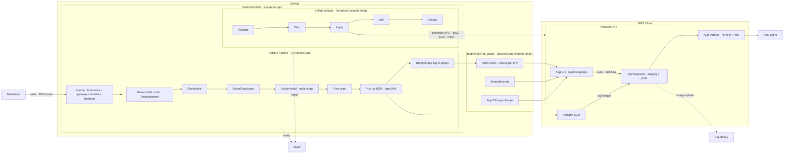
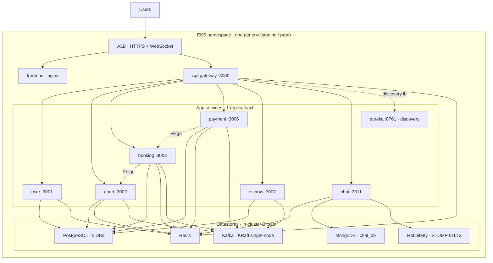
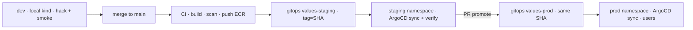

# Planning_CICD.md — GitOps CI/CD cho BadmintonHub lên AWS EKS

> **Mô hình**: *Reproducible ephemeral production-shaped demo* — làm **đúng chuẩn production**, đẩy lên **AWS Free-Tier**, chạy **ổn** rồi **`terraform destroy` xoá sạch**; khi cần demo **`terraform apply` dựng lại**. Toàn hệ thống **tái lập 100% bằng code**.
>
> Kiến trúc bám sát khoá **vprofile GitOps** đã học (Terraform→EKS · GitHub Actions→ECR · Helm+ArgoCD · SonarQube · Slack), điều chỉnh cho **các service ĐÃ BUILD** của BadmintonHub.
>
> **Tài liệu này là KẾ HOẠCH để hiểu + runbook 7 ngày + prompt paste-ready mỗi Day.** Chưa tạo Dockerfile/Helm/Terraform thật — đó là việc từng Day.

> 🎯 **Buổi demo = `terraform apply` → người dùng thật vào dùng 5–10 phút → `terraform destroy`.** Cụm chỉ sống đúng lúc demo → chi phí ≈ vài xu/buổi. Mọi thiết kế (IaC + GitOps + image ở ECR + state ở S3) tồn tại để **dựng lại trong ~15' và xoá sạch trong ~10'**. Không giữ data (ephemeral). Runbook buổi demo: **§7.3**.

---

## 1. Mục tiêu & phạm vi

**Mục tiêu**: đưa hệ thống BadmintonHub từ *chạy-local-bằng-`mvn spring-boot:run`* lên **cụm Kubernetes trên AWS EKS**, vận hành theo **GitOps** (mọi thay đổi = 1 commit → tự động deploy), có **CI đầy đủ** (build/test/quét chất lượng/quét bảo mật) và **tái lập được** (destroy → apply → tự hồi phục).

**Deploy cái gì** (9 image):

| Nhóm | Thành phần | Port | Ghi chú |
|---|---|---|---|
| Platform | `eureka-server` | 8761 | service discovery — **giữ nguyên**, 0 đổi code |
| Platform | `api-gateway` | 3000 | JWT filter · rate-limit (cần Redis) · CORS · `lb://` routing |
| Business | `user-service` | 3001 | auth/JWT/OAuth2 |
| Business | `court-service` | 3002 | sân/slot/pricing · Kafka consumer |
| Business | `booking-service` | 3003 | đặt sân · Outbox · Feign→court |
| Business | `payment-service` | 3006 | Bank QR · Outbox · Feign→booking |
| Business | `escrow-service` | 3007 | ký quỹ · Outbox (đang "ngủ") |
| Business | `chat-service` | 3011 | STOMP realtime · Mongo · RabbitMQ relay |
| Frontend | `frontend` (nginx) | 80 | React 19 + Vite (static) |

**KHÔNG deploy trong core demo**:
- `ai-service` (3010) — đã build (**Python** · LangGraph · chatbot đặt sân) nhưng **NGOÀI scope** vì cần Ollama `qwen2.5:3b` (~2GB RAM, nặng cho node Free-Tier spot) hoặc Gemini API. Đưa vào = **Phụ lục** (stretch).
- `matchmaking` (3004), `coach` (3005), `notification` (3008), `event` (3009) — mới scaffold rỗng. Gateway vẫn có route sẵn — khi build xong chỉ cần thêm 1 `values-*.yaml`.

**Nguyên tắc vàng của tài liệu này**:
1. **Reproducible-from-code** — không click tay trên AWS Console. `terraform apply` + ArgoCD = cả hệ thống tự lắp ráp.
2. **Rẻ nhất có thể** — datastore chạy **in-cluster** (không managed), node **spot**, **teardown sau mỗi demo** (§7.3).
3. **Chất lượng production ở chỗ MIỄN PHÍ** — GitOps, CI gates, health probe, TLS, SealedSecrets, observability.
4. **0 đổi code service** — cấu hình 100% qua env (`${VAR:default}` + `spring-dotenv`) → map thẳng ConfigMap/Secret.

---

## 2. Bản đồ khoá học → dự án (cái đã học dùng ở đâu)

| Section khoá vprofile | Áp vào BadmintonHub | Day |
|---|---|---|
| S8 — Containerization (Docker) | Dockerfile multi-stage cho 8 service Java + nginx cho FE | **Day 1** |
| S15–16 — Kubernetes + Java trên K8s | Helm chart tái sử dụng · Deployment/Service/Ingress · probe | **Day 2, 4** |
| S17–18 — Terraform + State | `terraform/` dựng VPC/EKS/ECR + backend S3/DynamoDB | **Day 3** |
| S14, S20 — GitHub Actions CI/CD + GitOps | `.github/workflows` CI + Terraform pipeline | **Day 5** |
| S12–13 — Continuous Delivery | ArgoCD GitOps loop + promote staging→prod | **Day 6** |
| S10–11 — CI với SonarQube/Nexus/Slack | SonarCloud gate + Trivy + Slack notify | **Day 5** |
| S19 — GitOps (Argo) | `badmintonHub-gitops` repo + app-of-apps | **Day 6** |
| (mở rộng) — Observability | kube-prometheus-stack + Loki + tracing | **Day 7** |

> Khác biệt so với vprofile: vprofile deploy 1 app Java + MySQL/Memcached/RabbitMQ. BadmintonHub = **8 service Spring Cloud** (Eureka discovery, Kafka event-driven, 2 loại DB) → ta tái dùng **cùng bộ khung** (Terraform/Helm/ArgoCD/GHA) nhưng nhân bản chart cho nhiều service + thêm Kafka/Mongo/RabbitMQ vào tầng data.

### 2.5 Day nào làm ở REPO nào (tra nhanh)

> 2 repo, mỗi repo có **CLAUDE.md riêng**. Mở Claude Code **đúng thư mục repo** của Day → context tự đúng. Prompt paste-ready của mỗi Day nằm ở **§6**.

| Day | Mở Claude Code ở | Deliverable chính | Sở hữu bởi |
|---|---|---|---|
| **1** | `badmintonHub` (app) | 8 Dockerfile Java + FE nginx + `.dockerignore` + `docker-compose.app.yml` | app repo |
| **2** | `badmintonHub-gitops` | `charts/service/` + `values/<svc>.yaml` + `values/infra.yaml` → test **kind** (dev) | gitops repo |
| **3** | `badmintonHub` (app) | `terraform/` (VPC/EKS/ECR/IRSA + backend S3/DynamoDB) + add-on | app repo |
| **4** | `badmintonHub-gitops` | Deploy infra+app lên EKS `staging` + Ingress/TLS + FE per-env | gitops repo |
| **5** | `badmintonHub` (app) | `.github/workflows/ci.yml` + `terraform.yml` | app repo |
| **6** | `badmintonHub-gitops` | `apps/` ApplicationSet + cài ArgoCD + SealedSecrets + promote | gitops repo |
| **7** | **cả 2** | Observability (gitops) + teardown/rebuild (`terraform destroy` ở app repo) | cả 2 |

- **app repo `badmintonHub`** sở hữu: Dockerfiles · `docker-compose.app.yml` · `terraform/` · `.github/workflows/`.
- **gitops repo `badmintonHub-gitops`** sở hữu: `charts/service/` · `values/` · `apps/` · `sealed-secrets/` · `infra/`.

---

## 3. Kiến trúc tổng thể

### 3.1 Sơ đồ 1 — Luồng GitOps CI/CD đầu-cuối (bản BadmintonHub của PDF vprofile)



**Giải thích từng thành phần:**

| Thành phần | Vai trò |
|---|---|
| **app monorepo** (`badmintonHub`) | Chứa source + Dockerfile + workflow CI + `terraform/`. Developer commit vào đây. |
| **CI (GitHub Actions)** | Build→test→Checkstyle→Sonar→Docker→Trivy→push ECR→**bump tag** sang gitops repo. |
| **Terraform pipeline** | Dựng/huỷ hạ tầng AWS (6 hộp validate→destroy). |
| **gitops repo** (`badmintonHub-gitops`) | **Desired state**: Helm chart + values mỗi env + SealedSecrets + ArgoCD Application. ArgoCD chỉ đọc repo này. |
| **ECR** | Kho image Docker. |
| **ArgoCD** (trong EKS) | Watch gitops repo → **sync** cụm về đúng desired state (self-heal + prune). Đây là "watches Git Repo" trong PDF. |
| **ALB Ingress** | Cổng HTTPS + WebSocket vào cụm, chia route `/`→FE, `/api`+`/ws`→gateway. |
| **Slack / Cloudinary** | Notify CI/CD · lưu ảnh biên lai + ảnh chat (SaaS ngoài). |

**Vì sao tách 2 repo?** CI (app repo) *ghi* tag vào gitops repo, ArgoCD *đọc* gitops repo → không có vòng lặp "CI commit → CI tự trigger lại". Đây là chuẩn app/helm-repo của vprofile.

### 3.2 Sơ đồ 2 — Bên trong cụm EKS (1 environment: routing + service→datastore)



**Service → datastore matrix** (nguồn: khảo sát code thật):

| Service | PostgreSQL | Redis | Kafka | MongoDB | RabbitMQ | Ghi chú |
|---|:---:|:---:|:---:|:---:|:---:|---|
| user | `user_db` | ✅ | — | — | — | Kafka có dep nhưng **không dùng runtime** |
| court | `court_db` | ✅ | ✅ | — | — | consumer `booking.slot.changed` + scheduler gen slot |
| booking | `booking_db` | ✅ | ✅ | — | — | Outbox + Feign→court |
| payment | `payment_db` | ✅ | ✅ | — | — | Outbox + Feign→booking + Cloudinary |
| escrow | `escrow_db` | — | ✅ | — | — | **không Redis**; Outbox; đang ngủ |
| chat | — (exclude JPA) | ✅ | — | `chat_db` | ✅ (STOMP :61613) | Cloudinary; `CHAT_BROKER_RELAY=true` |
| gateway | — | ✅ | — | — | — | rate-limit token-bucket |

**Ghi chú kiến trúc quan trọng:**
- **Eureka được GIỮ** làm 1 pod. Gateway + Feign vẫn resolve `lb://<service>` qua Eureka → **0 đổi code**. (Hướng "cloud-native" bỏ Eureka dùng K8s DNS = Phụ lục.)
- **1 PostgreSQL** chứa **5 database** (init script tạo user/court/booking/payment/escrow_db) — nhẹ hơn 5 instance, đúng tinh thần demo.
- **RabbitMQ chỉ để STOMP relay** (fan-out tin nhắn chat cross-instance) — dữ liệu ephemeral, không cần bền.
- **Tất cả app = 1 replica** (demo ephemeral, khớp posture pilot của CLAUDE.md; HA = Phụ lục).

### 3.3 Sơ đồ 3 — Promote dev → staging → prod (cùng image SHA đi lên)



| Env | Chạy ở đâu | Chi phí | Mục đích |
|---|---|---|---|
| **dev** | Cụm **local kind/minikube** | **$0** | Hack + smoke-test nhanh, không tốn AWS |
| **staging** | Namespace `staging` trên EKS | ephemeral | ArgoCD auto-sync mọi merge → verify trước |
| **prod** | Namespace `prod` trên EKS | ephemeral | Promote **cùng image SHA** đã verify ở staging bằng 1 PR |

> **Promote = đổi tag ở `values-prod.yaml` sang đúng SHA đã chạy ổn ở staging.** Không build lại → image bất biến, "cái đã test là cái lên prod".

---

## 4. Quyết định kiến trúc & lý do

| Quyết định | Chọn | Lý do |
|---|---|---|
| Datastore | **In-cluster Bitnami** (không managed) | Demo bị xoá sau mỗi lần → backup/HA/PITR của RDS/MSK là **lãng phí** + phá Free-Tier. |
| Sửa code app? | **KHÔNG** | Mỗi demo rebuild DB rỗng ở **1 replica** → `ddl-auto=update` tạo schema mới sạch; đua Outbox/scheduler chỉ cắn khi >1 replica. |
| ai-service? | **NGOÀI core demo** | Python + Ollama ~2GB RAM (hoặc Gemini API) → nặng/đắt cho node Free-Tier; là mảnh mới nhất. Stretch = Phụ lục. |
| Discovery | **Giữ Eureka** | Lift-and-shift, 0 rủi ro. Bỏ Eureka = code change → để Phụ lục. |
| Replica | **1 mỗi service** | Ephemeral demo, tiết kiệm RAM Free-Tier. |
| Môi trường | **dev-local + staging/prod trên EKS** | 3 env như yêu cầu, nhưng dev free-local để rẻ. |
| Secret | **SealedSecrets** | Miễn phí, **commit an toàn vào Git** (hợp GitOps + rebuild). Không dùng plain Secret. |
| Node | **t3.large/xlarge spot ×2-3** | Rẻ nhất; demo vài giờ ≈ vài $. |
| TLS | **cert-manager + Let's Encrypt** (hoặc ALB DNS thô) | Miễn phí, tự cấp lại mỗi lần rebuild; buổi 5–10' có thể bỏ domain, dùng http. |
| IaC state | **S3 + DynamoDB lock** | State **sống sót qua destroy→rebuild** → apply lại 1 phát. |

---

## 5. Tiền đề & công cụ

**Tài khoản/dịch vụ:**
- AWS account (12-tháng Free-Tier) + IAM user có quyền EKS/EC2/VPC/ECR/IAM/S3/DynamoDB.
- 1 domain (Route53 hosted zone, ~$0.50/mo) — cho TLS + host đẹp. *(Tuỳ chọn: buổi 5–10' có thể bỏ, dùng thẳng DNS ALB http.)*
- GitHub account (2 repo: `badmintonHub`, `badmintonHub-gitops`) + GitHub Actions.
- SonarCloud (**free chỉ cho public repo**; repo private → trả phí hoặc self-host SonarQube) · Slack workspace + Incoming Webhook.
- Cloudinary account (ảnh biên lai/chat) — bắt buộc khi `SPRING_PROFILES_ACTIVE=prod`.

**Cài trên máy dev:**
```bash
aws --version          # AWS CLI v2
kubectl version --client
helm version           # v3
terraform version      # >= 1.6
docker version
kind version           # cụm K8s local (dev)
kubeseal --version     # SealedSecrets CLI
eksctl version         # (tuỳ chọn, tiện tạo add-on/IRSA)
```

**Secret cần chuẩn bị** (nạp qua SealedSecret, KHÔNG commit thô): `JWT_SECRET`, `SENDGRID_API_KEY`, `CLOUDINARY_CLOUD_NAME/API_KEY/API_SECRET`, `GOOGLE_CLIENT_ID/SECRET`, mật khẩu Postgres/Mongo/RabbitMQ (`RABBITMQ_USER=badminton`). *(Danh sách đầy đủ = `.env.example` repo app.)*

---

## 6. Lộ trình 7 ngày (mỗi Day: repo + việc làm + prompt paste-ready + acceptance check)

> Mỗi Day = 1 mảng trọn vẹn, kết thúc bằng **✅ acceptance check**. Thứ tự phụ thuộc: Docker → Helm/local → EKS → deploy → CI → CD/GitOps → observability/teardown.
>
> **Cách dùng prompt**: mở Claude Code **đúng thư mục repo** ghi ở đầu Day → paste nguyên block **📋 Prompt paste-ready** → Claude tự plan-mode + khảo sát code + hỏi lại nếu cần → build.

> ⚠️ **Ephemeral = mất data mỗi lần teardown.** Mô hình này hợp **buổi demo ngắn có người thật vào dùng 5–10'** rồi `destroy` (§7.3, đúng scope đã chốt). Nếu cần **onboard user giữ dữ liệu lâu dài** → xem **Phụ lục** (RDS/không teardown/Flyway) — ngoài scope demo này.

### Day 1 — Containerize (Docker)

> 🗂 **Repo: `badmintonHub` (app)** — mở Claude Code ở thư mục app repo.

**Mục tiêu**: mọi service + FE chạy được bằng image tự build.

**Việc làm:**
1. **Dockerfile multi-stage dùng chung** cho 8 service Java (`eureka-server`, `api-gateway`, `user/court/booking/payment/escrow/chat-service`). Vì monorepo → build cần các module nội bộ (`common`, `common-security`).
2. **Dockerfile FE** (`frontend/`): build Vite → phục vụ `dist/` bằng nginx (kèm `nginx.conf` fallback SPA + proxy `/api`,`/ws` khi chạy compose).
3. `.dockerignore` (bỏ `target/`, `node_modules/`, `.git/`).
4. `docker-compose.app.yml` = `docker-compose.yml` (infra) **+ 9 app image** — wiring env sang DNS service (`postgres-user`, `redis`, `kafka:29092`, `mongodb-chat`, `rabbitmq`, `eureka-server`).

**Ví dụ Dockerfile Java (mẫu, chỉnh `SERVICE`):**

> ⚠️ **Monorepo aggregator**: `pom.xml` gốc liệt kê **16 module** và các service (user/court/booking/payment/escrow/chat) **đều depend `common-test`**. Nếu chỉ `COPY` lẻ vài module, Maven reactor fail ngay: `Child module /app/matchmaking-service does not exist`. → **`COPY . .` cả repo** (hoặc pom rút gọn liệt kê đúng module cần) + BuildKit cache mount cho `.m2` để bù layer-cache. Đánh đổi: build context lớn hơn.

```dockerfile
# ---- build ---- (COPY cả repo; KHÔNG copy lẻ 3 module — aggregator cần đủ module dir)
FROM maven:3.9-eclipse-temurin-21 AS build
WORKDIR /app
COPY . .
RUN --mount=type=cache,target=/root/.m2 \
    mvn -q -pl user-service -am -DskipTests package
# ---- runtime ----
FROM eclipse-temurin:21-jre
WORKDIR /app
ENV JAVA_TOOL_OPTIONS="-XX:MaxRAMPercentage=75 -XX:+UseContainerSupport"
COPY --from=build /app/user-service/target/user-service-1.0.0-SNAPSHOT.jar app.jar
EXPOSE 3001
ENTRYPOINT ["java","-jar","app.jar"]
```

**Lệnh chính:**
```bash
docker build -f user-service/Dockerfile -t badmintonhub/user-service:dev .
docker compose -f docker-compose.yml -f docker-compose.app.yml up -d
```

✅ **Check**: `docker compose ... up` → toàn stack lên bằng image tự build; đăng ký → đăng nhập → đặt sân → thanh toán → chat chạy qua các container.

📋 **Prompt paste-ready — Day 1**
```text
Vai trò: senior DevOps engineer, quen Spring Cloud monorepo + Docker multi-stage.
Repo/thư mục: mở ở badmintonHub (app repo).
Đọc trước: Planning_CICD.md §Day 1 (repo gitops sibling) · pom.xml gốc + module <modules> · docker-compose.yml · .env.example · frontend/ (Vite).
Chốt-cứng:
  - Multi-stage: build với maven:3.9-eclipse-temurin-21, runtime eclipse-temurin:21-jre.
  - Monorepo aggregator: COPY . . (KHÔNG copy lẻ module — reactor cần đủ 16 module dir) + BuildKit cache mount .m2.
  - Mỗi service build bằng `mvn -pl <svc> -am -DskipTests package`; JAVA_TOOL_OPTIONS MaxRAMPercentage=75.
  - 0 đổi code app (chỉ Dockerfile/.dockerignore/compose); config qua env.
  - Chỉ 9 image (8 Java + FE nginx). KHÔNG containerize ai-service/matchmaking/coach/notification/event.
Plan-mode trước: khảo sát pom + docker-compose thật, xác nhận tên jar + port từng service, rồi mới viết.
Phạm vi: (1) 1 Dockerfile/service Java (8 file) · (2) frontend/Dockerfile + nginx.conf (SPA fallback + proxy /api,/ws) · (3) .dockerignore · (4) docker-compose.app.yml nối infra + 9 app image, wiring env DNS service (postgres-*, redis, kafka:29092, mongodb-chat, rabbitmq, eureka-server).
DoD: `docker compose -f docker-compose.yml -f docker-compose.app.yml up -d` lên toàn stack bằng image tự build; e2e login→đặt sân→thanh toán→chat qua container.
```

---

### Day 2 — Helm + cụm DEV local (kind)

> 🗂 **Repo: `badmintonHub-gitops`** — chart + values sống ở repo này. Test trên kind (dev, $0).

**Mục tiêu**: deploy toàn hệ thống lên Kubernetes local (= môi trường **Dev**), **de-risk trước khi trả tiền EKS**.

**Việc làm:**
1. **1 Helm chart tái sử dụng** `charts/service/` (template chung): `Deployment` (3 probe: startup/liveness/readiness = `/actuator/health`) + `Service` (ClusterIP) + `envFrom` (ConfigMap + Secret) + `resources` (requests nhỏ `128Mi/100m`) + `imagePullPolicy`.
2. **values mỗi service** (`values/user.yaml`...): image, port, env riêng.
3. Chart riêng cho **FE** (nginx) + **eureka**.
4. **Infra bằng Bitnami Helm** (`values/infra.yaml`): 1 PostgreSQL (initdb 5 DB qua `initdbScripts`), Redis, Kafka (KRaft single-node), MongoDB, RabbitMQ (**bật plugin `rabbitmq_stomp`** + expose 61613).
   - ⚠️ **Bitnami 2025→2026**: từ 28/8/2025 ảnh free chuyển sang `bitnamilegacy`, nhiều tag `docker.io/bitnami/*` bị gỡ → chart mặc định có thể **pull 404**. **Bắt buộc**: ghim chart version (`helm install ... --version <x.y.z>`) + override registry (`--set global.imageRegistry=docker.io --set image.repository=bitnamilegacy/`) **HOẶC mirror ảnh vào ECR** (hợp tinh thần "reproducible"). Áp cho cả 5: Postgres/Redis/Kafka/Mongo/RabbitMQ.
   - ⚠️ **Kafka SASL default**: chart mới mặc định **SASL_PLAINTEXT**, nhưng client chỉ có `KAFKA_BOOTSTRAP_SERVERS` (không SASL) → auth fail. Ép PLAINTEXT + single-node:
     ```yaml
     controller.replicaCount: 1
     listeners.client.protocol: PLAINTEXT
     sasl.enabled: false
     offsets.topic.replicationFactor: 1
     transaction.state.log.replicationFactor: 1
     ```
5. **ConfigMap** (env non-secret trỏ DNS in-cluster) + **SealedSecret** (JWT/Cloudinary/…).

**Bảng env → giá trị in-cluster** (nguồn: `.env.example` repo app — đủ để viết ConfigMap/Secret khỏi mở repo app). Gộp **1 PostgreSQL/5 DB**: compose dev chạy 9 PG riêng, ở K8s dùng **1 instance**, mỗi service trỏ 1 DB qua **full-URL** `DB_<SVC>_URL` (nên "0 đổi code"):

| Env var | Giá trị (staging · ns `data-staging`) | Loại |
|---|---|---|
| `DB_<SVC>_URL` | `jdbc:postgresql://postgresql.data-staging.svc.cluster.local:5432/<svc>_db` | ConfigMap |
| `POSTGRES_USERNAME` / `POSTGRES_PASSWORD` | dùng chung 1 user cho 5 DB | **Secret** |
| `REDIS_HOST` / `REDIS_PORT` | `redis-master.data-staging.svc.cluster.local` / `6379` | ConfigMap |
| `KAFKA_BOOTSTRAP_SERVERS` | `kafka.data-staging.svc.cluster.local:9092` | ConfigMap |
| `MONGODB_CHAT_URI` | `mongodb://<user>:<pass>@mongodb.data-staging.svc.cluster.local:27017/chat_db` | **Secret** |
| `RABBITMQ_HOST` / `RABBITMQ_STOMP_PORT` | `rabbitmq.data-staging.svc.cluster.local` / `61613` | ConfigMap |
| `RABBITMQ_USER` / `RABBITMQ_PASS` · `CHAT_BROKER_RELAY` | `badminton` · creds · `true` | Secret · ConfigMap |
| `EUREKA_URL` | `http://eureka-server.staging.svc.cluster.local:8761/eureka` | ConfigMap |
| `FRONTEND_URL` | `https://staging.badminton.<domain>` | ConfigMap |
| `JWT_SECRET`, `CLOUDINARY_*`, `GOOGLE_CLIENT_*`, `SENDGRID_*` | (từ `.env.example`) | **Secret** |

> Bitnami PG `initdbScripts` tạo 5 DB: `user_db, court_db, booking_db, payment_db, escrow_db` (escrow **không** Redis; chat **không** Postgres, chỉ Mongo). Prod: thay `staging`→`prod`, `data-staging`→`data-prod`.

**Ví dụ probe trong `charts/service/templates/deployment.yaml`:**
```yaml
readinessProbe:
  httpGet: { path: /actuator/health, port: {{ .Values.port }} }
  initialDelaySeconds: 20
  periodSeconds: 10
livenessProbe:
  httpGet: { path: /actuator/health, port: {{ .Values.port }} }
  initialDelaySeconds: 40
```

> Dùng `/actuator/health` cho cả 3 probe là đủ cho demo. Muốn K8s-idiomatic hơn: bật `management.endpoint.health.probes.enabled=true` (repo app) để tách `/actuator/health/liveness` + `/readiness`. Optional.

**Lệnh chính:**
```bash
kind create cluster --name badminton-dev
kubectl create ns badminton && kubectl create ns data
helm install infra bitnami-umbrella -n data -f values/infra.yaml
helm install user charts/service -n badminton -f values/user.yaml   # lặp cho từng service
kubectl -n badminton port-forward svc/api-gateway 3000:3000
```

✅ **Check**: e2e xanh trên kind (login→book→pay→chat); `kubectl get pods -A` tất cả Running/Ready.

📋 **Prompt paste-ready — Day 2**
```text
Vai trò: senior Platform engineer, thạo Helm chart tái sử dụng + Bitnami + kind.
Repo/thư mục: mở ở badmintonHub-gitops (repo này). Chart + values sống ở đây.
Đọc trước: CLAUDE.md (repo này) · Planning_CICD.md §Day 2 (bảng env → in-cluster) · .env.example repo app (sibling) để lấy tên biến thật.
Chốt-cứng:
  - 1 chart charts/service/ TÁI SỬ DỤNG cho MỌI service (Deployment 3 probe /actuator/health + Service ClusterIP + envFrom ConfigMap+Secret + resources 128Mi/100m + 1 replica).
  - Infra = Bitnami Helm, GHIM chart version + override registry bitnamilegacy (né 404 2025→2026). Kafka KRaft single-node PLAINTEXT (sasl.enabled=false, RF=1). RabbitMQ bật plugin rabbitmq_stomp + expose 61613.
  - 1 PostgreSQL / 5 DB qua initdbScripts (user/court/booking/payment/escrow_db); mỗi service trỏ DB_<SVC>_URL full-URL → 0 đổi code.
  - Secret KHÔNG commit thô — placeholder giá trị, seal ở Day 6. Env non-secret → ConfigMap.
Plan-mode trước: đọc .env.example thật, map từng biến → ConfigMap/Secret, rồi mới viết template.
Phạm vi: (1) charts/service/ (template + values.yaml default) · (2) values/<svc>.yaml mỗi service (image/port/env) · (3) chart FE + eureka · (4) values/infra.yaml Bitnami umbrella · (5) ConfigMap + Secret placeholder.
DoD: kind create cluster → helm install infra + từng service → `kubectl get pods -A` Running/Ready → port-forward gateway → e2e login→book→pay→chat xanh trên kind.
```

---

### Day 3 — EKS bằng Terraform + add-on

> 🗂 **Repo: `badmintonHub` (app)** — `terraform/` sống ở app repo.

**Mục tiêu**: hạ tầng AWS **dựng bằng code**, có ECR, sẵn sàng nhận app.

**Việc làm:**
1. **Backend Terraform**: S3 bucket (state) + DynamoDB table (lock) — tạo 1 lần, **không nằm trong destroy**.
2. `terraform/` (dùng module cộng đồng `terraform-aws-modules/vpc` + `.../eks`): VPC (public + private subnet, 2 AZ) · EKS control plane · **1 managed node group spot** (t3.large ×2) · **ECR repo mỗi service** · OIDC provider + **IRSA** (cho ALB controller, EBS CSI, cert-manager, External-DNS).
3. `terraform apply` → `aws eks update-kubeconfig --name badminton`.
4. **Add-on cụm** (Helm, dùng IRSA): **AWS EBS CSI driver** + StorageClass `gp3` · **AWS Load Balancer Controller** · **cert-manager** (+ ClusterIssuer Let's Encrypt) · (tuỳ chọn) **ExternalDNS**.

**Lệnh chính:**
```bash
cd terraform && terraform init && terraform apply
aws eks update-kubeconfig --name badminton --region ap-southeast-1
helm install aws-lb-controller eks/aws-load-balancer-controller -n kube-system ...
helm install cert-manager jetstack/cert-manager -n cert-manager --set crds.enabled=true
```

✅ **Check**: `kubectl get nodes` → Ready; `aws ecr describe-repositories` liệt kê 9 repo; StorageClass `gp3` tồn tại.

📋 **Prompt paste-ready — Day 3**
```text
Vai trò: senior Cloud/Terraform engineer, thạo terraform-aws-modules + EKS + IRSA.
Repo/thư mục: mở ở badmintonHub (app repo). terraform/ sống ở đây.
Đọc trước: Planning_CICD.md §Day 3 + §8 (chi phí) + §9 (rủi ro né NAT).
Chốt-cứng:
  - Backend REMOTE: S3 (state) + DynamoDB (lock), tạo tách, KHÔNG nằm trong destroy chính.
  - Dùng module cộng đồng vpc + eks. Node group SPOT t3.large ×2. 9 ECR repo (mỗi service 1). OIDC + IRSA cho ALB controller/EBS CSI/cert-manager/ExternalDNS.
  - Rẻ nhất: né NAT Gateway (node public subnet map_public_ip_on_launch=true) HOẶC thêm VPC endpoints ecr.api/ecr.dkr/s3/sts/logs — nếu không pod kẹt ImagePullBackOff.
  - Teardown-được: mọi resource trong `terraform destroy` trừ S3/DynamoDB/ECR.
Plan-mode trước: chốt region + AZ + CIDR + tên cluster, liệt kê 9 ECR repo name khớp service.
Phạm vi: terraform/ (backend.tf · vpc · eks · node group spot · 9 ecr · irsa) + script/helm cài add-on (EBS CSI + gp3 StorageClass · aws-load-balancer-controller · cert-manager + ClusterIssuer letsencrypt).
DoD: terraform apply → `kubectl get nodes` Ready · `aws ecr describe-repositories` = 9 repo · StorageClass gp3 tồn tại.
```

---

### Day 4 — Deploy lên EKS + Ingress/TLS (staging)

> 🗂 **Repo: `badmintonHub-gitops`** — manifest deploy (helm install app+infra, ingress) sống ở đây.

**Mục tiêu**: hệ thống truy cập được trên EKS (namespace `staging`) — **HTTPS domain thật** *hoặc* **DNS ALB thô** cho buổi 5–10'.

**Việc làm:**
1. **Push image lên ECR** (thủ công lần đầu): `docker tag` + `docker push` cho 9 image (hoặc script vòng lặp).
2. `helm install` **infra** (Bitnami) vào ns `data-staging` + **app** (charts/service) vào ns `staging` — trỏ image = ECR URL.
3. **Ingress** (ALB): rule `/`→frontend, `/api/**`+`/ws/**`→gateway; annotation `alb.ingress.kubernetes.io/scheme=internet-facing`, `target-type=ip`.
   - **Nhánh A — có domain**: `cert-manager.io/cluster-issuer: letsencrypt-prod` cấp cert cho host → HTTPS `https://staging.badminton.<domain>`.
   - **Nhánh B — buổi 5–10' rẻ/nhanh**: bỏ cert-manager annotation, listener 80, dùng thẳng **DNS ALB** (`k8s-...elb.amazonaws.com`) → http. Không kẹt chờ ACME mỗi lần rebuild.
4. **FE build per-env**: image FE staging nhúng `VITE_API_URL` + `VITE_CHAT_WS_URL` trỏ host tương ứng (domain HTTPS/WSS **hoặc** ALB DNS http/ws).

**Ví dụ Ingress (rút gọn, nhánh có domain):**
```yaml
apiVersion: networking.k8s.io/v1
kind: Ingress
metadata:
  annotations:
    kubernetes.io/ingress.class: alb
    alb.ingress.kubernetes.io/scheme: internet-facing
    alb.ingress.kubernetes.io/target-type: ip
    cert-manager.io/cluster-issuer: letsencrypt-prod   # bỏ dòng này ở nhánh B (http)
spec:
  rules:
    - host: staging.badminton.example.com               # bỏ host ở nhánh B (dùng ALB DNS)
      http:
        paths:
          - path: /api
            pathType: Prefix
            backend: { service: { name: api-gateway, port: { number: 3000 } } }
          - path: /ws
            pathType: Prefix
            backend: { service: { name: api-gateway, port: { number: 3000 } } }
          - path: /
            pathType: Prefix
            backend: { service: { name: frontend, port: { number: 80 } } }
```

✅ **Check**: `curl <URL>/actuator/health` = 200; mở trình duyệt đăng nhập + đặt sân + chat qua URL live.

📋 **Prompt paste-ready — Day 4**
```text
Vai trò: senior Platform engineer, thạo ALB Ingress + cert-manager + Helm on EKS.
Repo/thư mục: mở ở badmintonHub-gitops (repo này).
Đọc trước: Planning_CICD.md §Day 4 + §Day 2 (values đã có) · output ECR repo URL từ Day 3.
Chốt-cứng:
  - Push 9 image lên ECR (script vòng lặp tag=SHA). helm install infra vào data-staging, app vào staging, image = ECR URL.
  - Ingress ALB internet-facing, target-type=ip, route /→FE · /api,/ws→gateway (WebSocket cho STOMP).
  - Domain LINH HOẠT: có Route53 → cert-manager letsencrypt HTTPS; KHÔNG → ALB DNS thô http (bỏ annotation cert + host) cho buổi 5–10' (né chờ ACME).
  - FE build per-env: VITE_API_URL + VITE_CHAT_WS_URL khớp URL đang dùng (https/wss hoặc http/ws).
Plan-mode trước: xác nhận có domain hay không → chọn nhánh A/B; liệt kê 9 image ECR URL.
Phạm vi: (1) script push ECR · (2) values-staging trỏ ECR + helm install infra+app ns staging/data-staging · (3) Ingress (2 nhánh) · (4) values FE per-env staging.
DoD: `curl <URL>/actuator/health`=200; trình duyệt login→đặt sân→chat qua URL live (staging).
```

---

### Day 5 — CI (GitHub Actions) + Terraform pipeline

> 🗂 **Repo: `badmintonHub` (app)** — `.github/workflows/` sống ở app repo.

**Mục tiêu**: mỗi push tự build/quét/đẩy image + bump tag; hạ tầng có pipeline riêng.

**Việc làm:**
1. **`.github/workflows/ci.yml`**:
   - **path-filter matrix** (`dorny/paths-filter`) → chỉ build service có file đổi; đổi `common/**` → build hết.
   - Job build: `mvn -pl <svc> -am verify` (Testcontainers — `ubuntu-latest` có sẵn Docker) + **Checkstyle**.
   - **SonarCloud** scan + quality gate (fail nếu gate đỏ).
   - Docker build multi-stage → **Trivy** scan (fail HIGH/CRITICAL) → **push ECR** tag = `${{ github.sha }}`.
   - **Bump tag**: checkout `badmintonHub-gitops`, sửa `values-<svc>-staging.yaml` `image.tag`, commit/push (dùng PAT/deploy key).
   - **Slack** notify success/fail.
2. **`.github/workflows/terraform.yml`** (mirror vprofile-infra): `validate` + `plan` (comment PR) + `apply` (merge main) + `drift` (scheduled cron) + `destroy` (`workflow_dispatch` thủ công). Auth AWS bằng **OIDC role** (không lưu access key).
3. **Branch protection** `main`: required checks = build + Sonar gate.

**Lệnh/idea chính:**
```yaml
# ci.yml (rút gọn 1 service)
- run: mvn -pl payment-service -am verify
- uses: aquasecurity/trivy-action@master
  with: { image-ref: "${{ steps.ecr.outputs.uri }}:${{ github.sha }}", exit-code: '1', severity: 'HIGH,CRITICAL' }
```

✅ **Check**: push 1 commit → CI xanh → image mới trong ECR (tag=SHA) + `values-staging` trong gitops repo được bump.

📋 **Prompt paste-ready — Day 5**
```text
Vai trò: senior CI/CD engineer, thạo GitHub Actions matrix + OIDC-to-AWS + Trivy/Sonar.
Repo/thư mục: mở ở badmintonHub (app repo). .github/workflows/ sống ở đây.
Đọc trước: Planning_CICD.md §Day 5 + §Day 1 (Dockerfile) · Dockerfile 9 service · tên ECR repo (Day 3).
Chốt-cứng:
  - path-filter matrix (dorny/paths-filter): chỉ build service đổi; common/** → build hết.
  - build = `mvn -pl <svc> -am verify` (Testcontainers, ubuntu-latest có Docker) + Checkstyle + SonarCloud gate.
  - Docker multi-stage → Trivy fail HIGH/CRITICAL → push ECR tag=github.sha (KHÔNG latest).
  - Bump tag: checkout badmintonHub-gitops, sửa values-<svc>-staging.yaml image.tag, commit/push (deploy key/PAT). Đây là bước đóng vòng CI→gitops.
  - AWS auth = OIDC role, KHÔNG lưu access key. Slack notify.
Plan-mode trước: chốt secret cần (ECR registry, GITOPS_DEPLOY_KEY, SONAR_TOKEN, SLACK_WEBHOOK, AWS OIDC role ARN).
Phạm vi: (1) ci.yml (matrix build→sonar→trivy→ecr→bump gitops→slack) · (2) terraform.yml (validate/plan/apply/drift/destroy, OIDC) · (3) note branch protection main.
DoD: push 1 commit → CI xanh → image tag=SHA trong ECR + values-<svc>-staging trong gitops repo được bump tự động.
```

---

### Day 6 — GitOps CD + promote (ArgoCD)

> 🗂 **Repo: `badmintonHub-gitops`** — `apps/` + SealedSecrets sống ở đây.

**Mục tiêu**: đóng vòng lặp GitOps — commit → tự lên EKS; promote staging→prod bằng PR.

**Việc làm:**
1. **Sắp xếp repo `badmintonHub-gitops`**: `charts/` (chart tái sử dụng từ Day 2) + `values/<svc>-{staging,prod}.yaml` + `sealed-secrets/` + `apps/` (ArgoCD Application).
2. **Cài ArgoCD** vào ns `argocd` (Helm/manifest) + **SealedSecrets controller**.
3. **App-of-apps + ApplicationSet**: 1 root `Application` trỏ `apps/` chứa **ApplicationSet** (matrix generator: services × [staging, prod]) → tự sinh 9×2 = 18 child Application + 1 app cho infra (Bitnami) + 1 cho ingress. Bật `syncPolicy.automated` (prune + selfHeal). Dùng ApplicationSet thay vì viết tay 18 manifest.
4. **Đóng vòng**: CI (Day 5) bump `values-staging` → ArgoCD auto-sync ns `staging`.
5. **Promote**: PR sửa `values-prod` sang **đúng SHA** đã verify ở staging → merge → ArgoCD sync ns `prod`.

**Ví dụ ArgoCD ApplicationSet (services × envs):**

> ⚠️ **KHÔNG** dùng `valueFiles: ["../../values/..."]` trong Application đơn — ArgoCD chặn valueFiles nằm ngoài `source.path` (`charts/service`) → app Error `valueFiles must be within the app path`. Dùng **ApplicationSet + multi-source (`$values` ref)**: vừa hợp lệ path, vừa khỏi viết tay 9×2 = 18 Application.

```yaml
apiVersion: argoproj.io/v1alpha1
kind: ApplicationSet
metadata: { name: badmintonhub, namespace: argocd }
spec:
  generators:
    - matrix:
        generators:
          - list: { elements: [ {svc: eureka-server}, {svc: api-gateway}, {svc: user-service}, {svc: court-service}, {svc: booking-service}, {svc: payment-service}, {svc: escrow-service}, {svc: chat-service}, {svc: frontend} ] }
          - list: { elements: [ {env: staging}, {env: prod} ] }
  template:
    metadata: { name: '{{svc}}-{{env}}' }
    spec:
      project: default
      sources:
        - repoURL: https://github.com/phucgigital03/BadmintonHub-GitOps
          targetRevision: main
          ref: values                              # nguồn chứa values/, dùng làm $values
        - repoURL: https://github.com/phucgigital03/BadmintonHub-GitOps
          path: charts/service                     # nguồn chart
          helm: { valueFiles: [ '$values/values/{{svc}}-{{env}}.yaml' ] }
      destination: { server: https://kubernetes.default.svc, namespace: '{{env}}' }
      syncPolicy: { automated: { prune: true, selfHeal: true } }
```

✅ **Check**: đổi 1 dòng code → merge → **tự lên prod không thao tác tay**; `argocd app list` Healthy/Synced; rollback = `git revert` PR trong gitops repo.

📋 **Prompt paste-ready — Day 6**
```text
Vai trò: senior GitOps engineer, thạo ArgoCD ApplicationSet + SealedSecrets.
Repo/thư mục: mở ở badmintonHub-gitops (repo này).
Đọc trước: CLAUDE.md (repo này) · Planning_CICD.md §Day 6 · charts/values đã có (Day 2).
Chốt-cứng:
  - App-of-apps: 1 root Application trỏ apps/ chứa ApplicationSet matrix (9 svc × 2 env = 18 child) + 1 app infra + 1 app ingress.
  - Multi-source $values ref (KHÔNG valueFiles ngoài source.path → ArgoCD chặn). syncPolicy.automated prune+selfHeal.
  - Secret: seal bằng kubeseal → CHỈ commit SealedSecret vào sealed-secrets/. TUYỆT ĐỐI không commit secret thô.
  - Promote staging→prod = PR đổi values-prod image.tag sang đúng SHA đã verify ở staging (KHÔNG build lại).
  - repoURL = github.com/phucgigital03/BadmintonHub-GitOps.
Plan-mode trước: xác nhận cấu trúc apps/ + danh sách secret cần seal (JWT/Cloudinary/DB/RabbitMQ/Google/SendGrid).
Phạm vi: (1) apps/ root Application + ApplicationSet · (2) hướng dẫn cài ArgoCD + SealedSecrets controller · (3) sealed-secrets/*.yaml (seal từ .env thật) · (4) values-<svc>-{staging,prod}.yaml.
DoD: `argocd app list` Synced/Healthy; CI bump staging → tự sync; PR promote prod → tự lên prod; rollback = git revert.
```

---

### Day 7 — Observability + teardown/rebuild + hardening-free

> 🗂 **Repo: cả 2** — observability manifests ở gitops repo; `terraform destroy` ở app repo.

**Mục tiêu**: nhìn thấy hệ thống (metrics/log/trace) + chứng minh **tái lập được** + siết các thứ production-free.

**Việc làm:**
1. **Observability** (in-cluster, miễn phí): `kube-prometheus-stack` (Prometheus + Grafana) + **Loki** (log) + expose `/actuator/prometheus`. Hiện service chỉ expose `management.endpoints.web.exposure.include: health,info` → cần **thêm `micrometer-registry-prometheus`** (pom) + đổi include thành `health,info,prometheus` ở **repo app** — **thay đổi config/pom nhẹ, không đụng logic** (nằm ngoài "0 đổi code"). Tracing đẩy về Zipkin/OTel.
2. **Alert DLT/limbo** (điều kiện go-live ③ của CLAUDE.md): rule Prometheus/Loki bắt log `[DLT]` ERROR + gauge `*.outbox.stuck`/`payment.proof.stuck` → Slack.
3. **Production-free hardening**: `resources` requests/limits chuẩn, `PodDisruptionBudget`, **graceful shutdown** (`server.shutdown=graceful` + `preStop` sleep để Eureka deregister), `terminationGracePeriodSeconds`.
4. **Diễn tập teardown → rebuild** (workflow lõi — xem §7).

✅ **Check**: Grafana thấy metrics; kích 1 event lỗi → Slack cảnh báo; **`destroy` sạch (bill≈0) → `apply` → ArgoCD tự lắp lại → e2e xanh**.

📋 **Prompt paste-ready — Day 7**
```text
Vai trò: senior SRE, thạo kube-prometheus-stack + Loki + graceful shutdown trên K8s.
Repo/thư mục: manifests observability ở badmintonHub-gitops; đổi pom/config + terraform destroy ở badmintonHub (app).
Đọc trước: Planning_CICD.md §Day 7 + §7 (runbook teardown/rebuild) + §7.3 (demo 5–10').
Chốt-cứng:
  - Observability in-cluster miễn phí: kube-prometheus-stack + Loki. Thêm micrometer-registry-prometheus + include health,info,prometheus (thay đổi pom/config nhẹ, KHÔNG đụng logic).
  - Alert: rule bắt log [DLT] ERROR + gauge *.outbox.stuck/payment.proof.stuck → Slack.
  - Hardening-free: resources requests/limits, PodDisruptionBudget, graceful shutdown (server.shutdown=graceful + preStop sleep để Eureka deregister).
  - Chứng minh ephemeral: destroy sạch (bill≈0) → apply → ArgoCD tự lắp lại → e2e xanh.
Plan-mode trước: chốt phần nào ở gitops (Helm values obs + PDB) vs app repo (pom + application.yml).
Phạm vi: (1) values obs (prometheus/grafana/loki) + ServiceMonitor · (2) alert rule → Slack · (3) PDB + graceful shutdown patch · (4) bootstrap.sh + runbook teardown/rebuild.
DoD: Grafana có metrics; kích 1 event lỗi → Slack; chạy §7.3 demo 5–10' rồi §7.1 teardown → AWS về 0.
```

---

## 7. Runbook TEARDOWN / REBUILD / DEMO (workflow lõi)

> Đây là **lý do tồn tại của toàn bộ thiết kế IaC/GitOps**: xoá sạch để khỏi tốn tiền, dựng lại khi cần demo.

### 7.1 Teardown (xoá sạch — bill về ~0)
```bash
# 1. Xoá app + ingress trước (để ALB/PVC được release đúng)
argocd app delete -l env=staging --cascade
argocd app delete -l env=prod --cascade
kubectl delete ingress --all -A          # để AWS LB Controller gỡ ALB
# 2. Gỡ add-on tạo AWS resource ngoài (ALB, EBS)
helm uninstall aws-lb-controller -n kube-system
# 3. Huỷ hạ tầng
cd terraform && terraform destroy
```
- **Giữ lại**: S3 (state) + DynamoDB (lock) + ECR (image) → rebuild nhanh, không build lại image.
- **Kiểm tra hết tiền**: AWS Console → EC2 (0 instance), EKS (0 cluster), EC2 Load Balancers (0 ALB), NAT (0), EBS (0 volume "available").

### 7.2 Rebuild (dựng lại cho demo — vài lệnh)
```bash
cd terraform && terraform apply                      # VPC/EKS/nodes/ECR (~15')
aws eks update-kubeconfig --name badminton
# cài lại add-on + ArgoCD (script bootstrap.sh) → ArgoCD tự kéo gitops → cả hệ thống mọc lại
./bootstrap.sh
```
- Vì **desired state nằm trong gitops repo** + **image đã ở ECR** → ArgoCD tự lắp ráp toàn bộ. Chỉ chờ pod Ready.

### 7.3 Runbook buổi DEMO 5–10 phút (tinh thần "người dùng thật vào rồi tắt")

> Mục tiêu: cụm chỉ sống đúng buổi demo, người thật vào dùng **5–10'**, xong **destroy** ngay → chi phí ≈ vài xu.

**A. Trước khán giả (~15–20', warm-up):**
```bash
cd terraform && terraform apply && aws eks update-kubeconfig --name badminton
./bootstrap.sh                                   # ArgoCD + add-on → kéo gitops
argocd app list                                  # chờ tất cả Synced/Healthy
curl -s <URL>/actuator/health                    # smoke = 200
# chạy 1 lượt login → đặt sân → thanh toán → chat để chắc URL live OK
```

**B. Cửa sổ demo (5–10', người dùng thật):**
- Mời người thật (hội đồng/tester) đăng nhập trên URL live: **đặt sân → thanh toán Bank QR → chat real-time**.
- **QUAY MÀN HÌNH / CHỤP** làm bằng chứng — cụm sẽ bị xoá, data không giữ.
- (Tuỳ chọn) mở Grafana/ArgoCD cho khán giả thấy metrics + GitOps sync live.

**C. Ngay sau demo (teardown ~10'):**
```bash
# chạy §7.1
argocd app delete -l env=staging --cascade && argocd app delete -l env=prod --cascade
kubectl delete ingress --all -A
helm uninstall aws-lb-controller -n kube-system
cd terraform && terraform destroy
```
- Kiểm AWS Console về **0** (EC2/EKS/ALB/NAT/EBS) → **bill ≈ 0**.
- Giữ **S3/DynamoDB/ECR** → buổi sau chỉ `apply` lại ~15' (§7.2).

> 💡 **Kỷ luật**: đặt AWS Budget alert (email khi > $5) + hẹn giờ điện thoại "DESTROY" ngay sau demo. Quên tắt cả ngày ≈ vài $, cả tháng ≈ $150–200.

---

## 8. Chi phí & kiểm soát (Free-Tier)

**Sự thật thẳng thắn: EKS + node + ALB + NAT KHÔNG thuộc Free-Tier.** "Rẻ" đến từ **teardown sau mỗi demo** (§7.3).

| Hạng mục | Giá xấp xỉ | Free-Tier? |
|---|---|---|
| EKS control plane | ~$0.10/giờ (~$73/tháng) | ❌ |
| EC2 node t3.large **spot** ×2 | ~$0.05/giờ tổng | ❌ (t3.micro 750h có free nhưng quá nhỏ) |
| ALB | ~$0.0225/giờ + LCU | ❌ |
| NAT Gateway | ~$0.045/giờ + data | ❌ (**né**: dùng public subnet cho node hoặc NAT instance) |
| EBS gp3 | ~$0.08/GB-tháng | 30GB free |
| ECR | ~$0.10/GB-tháng | 500MB free |
| Route53 | $0.50/zone-tháng | ❌ (tuỳ chọn — bỏ nếu dùng ALB DNS) |
| S3 + DynamoDB (state) | ~vài cent | phần lớn free |

**Ước tính**: demo **5–10 phút** (spot, né NAT) ≈ **vài xu**; để chạy **3 giờ** ≈ **dưới $1**. Nếu **quên tắt cả tháng** ≈ **$150–200**. → **Kỷ luật `terraform destroy`** là quan trọng nhất.

**Mẹo tiết kiệm**: node **spot** · **né NAT Gateway** (đặt node ở public subnet cho demo) · scale app xuống 0 khi không demo · dùng **1 AZ** cho demo · đặt **AWS Budget alert** (email khi > $5) · bỏ domain, dùng ALB DNS http.

> ⚠️ Né NAT → node ở **public subnet phải có public IP** (`map_public_ip_on_launch=true`) để pull ECR + gọi EKS/STS API; nếu không, thêm **VPC endpoints** (`ecr.api`, `ecr.dkr`, `s3`, `sts`, `logs`) — thiếu cả hai thì pod kẹt `ImagePullBackOff`.

---

## 9. Rủi ro & giảm thiểu

| Rủi ro | Giảm thiểu |
|---|---|
| Quên tắt → cháy tiền | `terraform destroy` + AWS Budget alert + checklist §7.1 + hẹn giờ "DESTROY" sau demo |
| 3 env × full infra nặng RAM | 1 replica + `-XX:MaxRAMPercentage=75` + Kafka/PG single-node + **dev để local** |
| `ddl-auto` + không Flyway | Chấp nhận cho demo (rebuild schema rỗng, 1 replica). Flyway = Phụ lục |
| Outbox chưa `SKIP LOCKED` | Giữ **1 replica** booking/payment/escrow (không scale) trong demo |
| Secret lộ trong Git | **SealedSecrets** — chỉ commit bản đã seal |
| Testcontainers cần Docker (CI) | GHA `ubuntu-latest` có sẵn Docker daemon |
| Cloudinary prod-guard fail boot | Nạp `CLOUDINARY_*` qua SealedSecret khi `SPRING_PROFILES_ACTIVE=prod` |
| Eureka single-node | Chấp nhận cho demo; HA/K8s-native = Phụ lục |
| FE `VITE_*` bake lúc build | Build image FE **per-env** (staging/prod URL khác nhau) |
| ai-service nặng RAM nếu ép vào | **Ngoài core demo** (Phụ lục); nếu cần → node RAM lớn hoặc Gemini |

---

## 10. Definition of Done

- [ ] 9 image build được + smoke-test qua `docker-compose.app.yml` (Day 1 · app repo).
- [ ] Helm deploy toàn hệ thống lên **kind** (dev) e2e xanh (Day 2 · gitops repo).
- [ ] `terraform apply` dựng EKS + ECR + add-on; `kubectl get nodes` Ready (Day 3 · app repo).
- [ ] App chạy trên EKS `staging` qua **URL live** (HTTPS domain hoặc ALB DNS); `/actuator/health`=200 (Day 4 · gitops repo).
- [ ] CI xanh: build→test→Sonar→Trivy→ECR→bump gitops + Slack (Day 5 · app repo).
- [ ] ArgoCD Synced/Healthy; đổi 1 dòng code → tự lên prod; promote staging→prod bằng PR (Day 6 · gitops repo).
- [ ] Grafana có metrics + alert DLT→Slack; **destroy→apply→self-heal** thành công (Day 7 · cả 2).
- [ ] Diễn tập **demo 5–10' → destroy → bill≈0** (§7.3); toàn bộ tái lập bằng code.

---

## Phụ lục A — ai-service (concierge Python) = stretch demo

*(Ngoài 9-image core. Đưa vào chỉ khi muốn khoe chatbot AI đặt sân.)*

- **Dockerfile riêng** (Python 3.12 + uv, KHÔNG qua Maven aggregator) — ai-service nằm ngoài `<modules>` root pom.
- **2 phương án chạy LLM**:
  - **Gemini** (nhẹ RAM): chat gọi Gemini API → chỉ cần `GEMINI_API_KEY` (SealedSecret). Phụ thuộc API ngoài.
  - **Ollama sidecar** (full-local, ấn tượng): pod Ollama `qwen2.5:3b` (~2GB RAM) cạnh ai-service → **cần node RAM lớn hơn** (t3.xlarge), dễ OOM lúc demo.
- **RAG embeddings** vẫn qua Gemini (`gemini-embedding-001`@768) → `GEMINI_API_KEY` cần cả khi chat chạy Ollama.
- Cần thêm 1 `values/ai-service-*.yaml` + route gateway (đã có sẵn `lb://ai-service`).

## Phụ lục B — Graduate to always-on real production

*(Khi có user thật lâu dài — ngoài scope demo ephemeral này. Cần cả thay đổi code app.)*

| Hạng mục | Nâng cấp |
|---|---|
| Datastore | **RDS PostgreSQL Multi-AZ** (backup + PITR) · **MSK** (Kafka) · **ElastiCache** (Redis) · **DocumentDB/Atlas** (Mongo) · **Amazon MQ** (RabbitMQ) |
| Migration | **Flyway** thay `ddl-auto` (gộp `PaymentIndexInitializer`/`ChatIndexInitializer` thành versioned migration) |
| Concurrency | **Outbox `FOR UPDATE SKIP LOCKED`** + **ShedLock** (khoá scheduler phân tán) → scale mọi service **≥2** |
| Discovery | Bỏ Eureka → **Spring Cloud Kubernetes** / K8s Service DNS (hoặc Eureka HA peer-replication) |
| Secret | **External Secrets Operator + AWS Secrets Manager** (thay SealedSecrets) |
| Availability | HPA + Cluster Autoscaler/Karpenter + multi-AZ node group + PodDisruptionBudget |
| Bảo mật | **WAF** trên ALB + NetworkPolicy + private datastore + image signing (cosign) + SBOM |
| DR/Backup | Velero (cluster state) + RDS snapshot + tested restore |
| Môi trường | Tách **cluster** riêng cho prod (thay vì namespace) |

---

> **Tiếp theo**: duyệt tài liệu này → bắt đầu **Day 1** (mở Claude Code ở repo app `badmintonHub`, paste prompt §Day 1). Mỗi Day chạy độc lập, kết thúc bằng acceptance check + commit.
