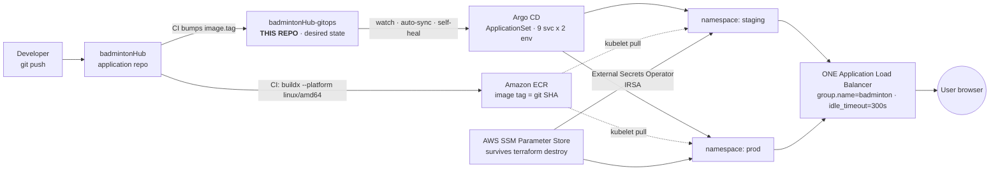

# BadmintonHub — GitOps

**Declarative desired state for a 9-service microservice platform on Amazon EKS — built to be destroyed and rebuilt every day, with zero manual steps, for ~$0.15 per demo session.**


This repository contains **no application source code**. It is the *desired state*: Helm charts, per-environment values, Argo CD `ApplicationSet`s, and `ExternalSecret` references. Argo CD watches this repo and reconciles the cluster to match it. **Changing a file here changes production. Rolling back is `git revert`.**

Application source, Dockerfiles, Terraform and CI live in the companion repo → [`badmintonHub`](https://github.com/phucgigital03/badmintonHub).

---

## The constraint that shaped every decision

The cluster is **ephemeral**. It exists only during a live demo:

```
terraform apply (~15 min) → real users use it for 5–10 min → terraform destroy (~10 min)
```

That single constraint rules out a surprising number of "standard" answers, and it is the reason this repo looks the way it does.

> ### 🎯 The golden rule: a rebuild must take **zero manual actions**
>
> `destroy` → `apply` → `bootstrap.sh` → green e2e, **without** anyone having to:
>
> | Forbidden manual step | What eliminates it |
> |---|---|
> | Re-seed / re-seal secrets | **External Secrets Operator reads AWS SSM** — parameters live *outside* the cluster |
> | Rebuild the frontend image | **Same-origin frontend** — calls `/api` relatively, derives WS from `window.location` |
> | Edit a ConfigMap for the new ALB DNS | same-origin ⇒ the public URL is not baked into anything |
> | Re-issue a certificate / fix DNS by hand | **ACM wildcard + ExternalDNS** in a bootstrap stack that is never destroyed |
>
> Any design that forces one of those four is **rejected**, even if it "works".

Two direct consequences that are worth spelling out, because both are the *opposite* of the popular choice:

- **No Sealed Secrets.** Its controller generates a fresh keypair on every install. A cluster rebuilt daily means every committed `SealedSecret` becomes undecryptable garbage → every pod comes up `CreateContainerConfigError`.
- **No cert-manager / Let's Encrypt.** An AWS ALB terminates TLS at the AWS layer and only accepts certificates from **ACM/IAM** — it cannot read the Kubernetes Secret where cert-manager stores them. Wiring it up fails *silently*: no HTTPS, no error to trace.

---

## Architecture at a glance



The loop is deliberately one-directional: **CI in the app repo *writes* the image tag here; Argo CD *reads* this repo and syncs.** Splitting the two repos is what prevents a CI-triggers-CI loop. Nothing is ever applied to the cluster with `kubectl` by hand — `selfHeal: true` would just overwrite it.

Full infrastructure view (VPC → EKS → node → PVC → EBS, plus the secret and image paths): **[`docs/ARCHITECTURE.md`](docs/ARCHITECTURE.md)**.

---

## The platform being deployed

9 deployable images across 5 datastores, all in-cluster:

| Service | Port | Postgres | Redis | Kafka | Mongo | RabbitMQ |
|---|---|:--:|:--:|:--:|:--:|:--:|
| `eureka-server` | 8761 | — | — | — | — | — |
| `api-gateway` | 3000 | — | ✅ | — | — | — |
| `user-service` | 3001 | `user_db` | ✅ | ✅ | — | — |
| `court-service` | 3002 | `court_db` | ✅ | ✅ | — | — |
| `booking-service` | 3003 | `booking_db` | ✅ | ✅ | — | — |
| `payment-service` | 3006 | `payment_db` | ✅ | ✅ | — | — |
| `escrow-service` | 3007 | `escrow_db` | — | ✅ | — | — |
| `chat-service` | 3011 | — | ✅ | — | `chat_db` | ✅ STOMP 61613 |
| `frontend` | 80 | — | — | — | — | — |

Spring Boot + Spring Cloud Gateway + Eureka, React/Vite frontend, event-driven via Kafka, WebSocket chat over a RabbitMQ STOMP relay.

---

## Design decisions worth defending in an interview

| Decision | Why | What breaks without it |
|---|---|---|
| **One Helm chart for all 9 services**, frontend included | An Argo CD `ApplicationSet` matrix generator can only fan out over a single chart | A separate chart for nginx/Eureka ⇒ 18 hand-written `Application` manifests |
| Object names come from **`nameOverride`**, never `.Release.Name` | Argo CD names releases `<svc>-<env>`, so the Service would become `user-service-staging` | `EUREKA_URL` → NXDOMAIN (service discovery gone) · frontend nginx `/api` proxy → 502 · Ingress backend never matches |
| Filename contract: **`values/<svc>-<env>.yaml`**, no exceptions | It is the shared contract between CI (tag bump) and the `ApplicationSet` | A typo'd filename means CI stays green, the commit lands, Argo CD reads nothing → **nothing deploys and nothing reports an error** |
| **Image tag = git SHA**, never `latest` | Immutable, auditable, and promotable | Promotion becomes a rebuild instead of a pointer move |
| Promotion = **PR changing `values/<svc>-prod.yaml` to the SHA already verified in staging** | Same artifact travels; the environment is the only variable | Rebuilding for prod means shipping an artifact nobody tested |
| **One ALB shared by both namespaces** via `group.name` | Saves $0.0225/h and ~2 min of provisioning on every `apply` | Two ALBs, two DNS names, twice the teardown surface |
| **No PodDisruptionBudget** at 1 replica | `minAvailable: 1` on a 1-replica Deployment permanently blocks every voluntary eviction | Node drains hang forever; and PDBs don't protect against spot interruption anyway (involuntary) |
| Bitnami chart versions **pinned, with verified image tags** | The free Bitnami catalog moved to `bitnamilegacy` in Aug 2025; the newest charts point at `tag: latest` | `ImagePullBackOff` on a cluster you rebuilt 10 minutes before a demo |
| `idle_timeout=300` on the ALB | The default is 60s — long enough to kill the chat WebSocket while a user sits idle | Chat dies mid-demo and looks like an application bug |
| ExternalDNS `ttl: 60` from day one | Default 300s: a rebuilt cluster gets a new ALB while resolvers still cache the old one | The public URL is dead for the first 5 minutes of the demo |

---

## Field notes: 13 design bugs caught by *actually running it*

The entire Day-2 design was validated on a local **kind** cluster before a single dollar was spent on EKS. That decision paid for itself: **13 things that were correct on paper were wrong in practice.** Each one is documented with its symptom, its diagnosis path, and the fix — in [`docs/DAY2-EXPLAINED.md`](docs/DAY2-EXPLAINED.md) and the rule files under [`.claude/rules/`](.claude/rules/).

A few of the more instructive ones:

<details>
<summary><b>🔴 Spring Security returns 403 on <code>/actuator/health/**</code> — 7 of 8 Java services never became Ready</b></summary>

The textbook Kubernetes answer is to split probes onto Spring Boot's `/actuator/health/liveness` and `/readiness`, enabled with one env var. That env var *did* reach the container. The endpoints still failed:

```
/actuator/health            → 200    permitAll on this LITERAL path
/actuator/info              → 200    idem
/actuator/health/liveness   → 403    ← what the probe was calling
/actuator/anything-at-all   → 403    ← proves it's Security, not a 404
```

`SecurityConfig` only permits two literal paths. Every sub-path is blocked *before* it reaches the actuator. The misleading part: kubelet reports `connection refused` while the JVM boots and `403` afterwards, which reads exactly like "the app hasn't started yet".

**Fix, with zero application changes:** liveness → `/actuator/info` (touches no datastore, so it only fails on a genuinely dead JVM), readiness → `/actuator/health` (composite is *safe* for readiness: a Redis blip removes the pod from Endpoints instead of restarting it). The principle behind the rule was never "use the `/liveness` endpoint" — it was **liveness must not depend on a datastore**, and `/actuator/info` satisfies that more strictly.
</details>

<details>
<summary><b>🔴 "The cluster is out of hardware" was wrong — it was a restart loop</b></summary>

Observed: node CPU at **954–1298%** (ceiling 800%), load average **61**, `kubectl exec` failing with `ttrpc: closed`, `helm` failing with `TLS handshake timeout`. The obvious conclusion — *this 8 GB laptop can't run this* — was **wrong**, and it nearly moved a whole verification phase onto billable EKS.

The real cause was two bugs above and below this one (403 probes, OOMKills) sending pods into a crash loop, and **every restart booted another JVM**. The CPU storm was the symptom, not the constraint.

After fixing both: **3 services Ready in under 60s, 0 restarts, load average 3.67.**

**The rule that came out of it: read the `RESTARTS` column before blaming hardware.** Restarts climbing across pods = find the cause, don't raise timeouts. Restarts at 0 and still slow = you actually are out of resources. Many pods restarting at the *same instant* = a node-level event, not a per-service bug.
</details>

<details>
<summary><b>🔴 A Bitnami NetworkPolicy silently swallowed the STOMP port — while every diagnostic showed green</b></summary>

`chat-service` could not reach RabbitMQ on 61613. Everything that could be checked, checked out:

```
kubectl get svc rabbitmq        → stomp:61613 present
kubectl get endpointslice       → stomp=61613 present
rabbitmq-diagnostics listeners  → "port: 61613, protocol: stomp" listening
rabbitmq-plugins list -e        → [E*] rabbitmq_stomp enabled
```

Isolating it by varying one dimension at a time:

| From → to | 5672 | 61613 |
|---|:--:|:--:|
| chat-service → Service DNS | ✅ | ❌ |
| chat-service → **pod IP** (bypassing the Service) | ✅ | ❌ |
| **inside the rabbitmq pod** → 127.0.0.1 and pod IP | ✅ | ✅ |

Same source, same destination, only the port differs ⇒ not DNS, not the Service, not kube-proxy ⇒ something filters *by port* ⇒ NetworkPolicy. The chart creates one by default listing only the ports it knows about (4369/5672/5671/25672/15672). 61613 is not among them.

The symptom was `ConnectTimeoutException`, **not** `connection refused` and **not** an auth error — which is exactly why the first instinct is to go dig through credentials. **`refused` = nobody is listening · `timeout` = something is eating your packets.**
</details>

<details>
<summary><b>⚠️ <code>MaxRAMPercentage=75</code> + a tight limit = OOMKilled (and lowering the percentage alone did not fix it)</b></summary>

| limit | % | heap | left for non-heap | result |
|---|---|---|---|---|
| 448Mi | 75 | 336Mi | **112Mi** | ❌ OOMKilled |
| 448Mi | 55 | 248Mi | 200Mi | ❌ **still** OOMKilled once Redis went down |
| 640Mi | 55 | 352Mi | 288Mi | ✅ stable |

Spring Boot needs ~150–200Mi outside the heap for metaspace, thread stacks, code cache and direct buffers. The second row is the interesting one: measuring while everything is healthy and concluding "448Mi is enough" is a mistake — the composite health endpoint **blocks** rather than failing fast when Redis dies, requests pile up every 10s, and peak RSS goes well above steady state. **Size limits against your failure mode, not your happy path.**
</details>

<details>
<summary><b>⚠️ Helm ignores unknown keys in silence — Kafka chart 32.x removed the two keys that mattered</b></summary>

`sasl.enabled` and `autoCreateTopicsEnable` no longer exist in the pinned chart version. Helm doesn't warn, doesn't error, and `helm template` stays green — the config simply never takes effect. Since the application publishes to ~17 topics by name at runtime with no `NewTopic` beans, auto-create failing means consumers hang and producers get `UNKNOWN_TOPIC_OR_PARTITION`. The only visible symptom would have been *"booking succeeds but the slot never updates"*, mid-demo.

**Verification has to happen on the broker, not in the rendered YAML** — read `server.properties` on the running pod.
</details>

<details>
<summary><b>⚠️ Bitnami's MongoDB image is amd64-only — which breaks kind on Apple Silicon, but not EKS</b></summary>

Every checked tag of `bitnamilegacy/mongodb` is amd64-only; the pod dies with `exec format error` and a log that never mentions architecture. The other four datastores are multi-arch, so it only bites Mongo.

Resolved without forking the environment: [`infra/templates/mongodb-oss.yaml`](infra/templates/mongodb-oss.yaml) runs upstream `mongo:8.0` (multi-arch) behind `mongodbOss.enabled`, **for `dev` only**. Both paths expose the *same* `mongodb:27017` Service with the root user in `admin`, so `MONGODB_CHAT_URI` is byte-identical across every environment — and the template has a `fail` guard if both are ever enabled at once.
</details>

**Also caught on kind, for free:** `timeoutSeconds` defaults to **1 second** and a probe timeout counts as a probe failure (Spring actuator under load routinely exceeds it, so Kubernetes kills healthy pods) · `RollingUpdate` at 1 replica forces two JVMs to run concurrently exactly when the new one needs CPU to boot · Redis auth must be off because the app has no password field, and since the gateway rate-limits *every* route, a broken Redis means **100% of requests 500**, not one degraded feature · MongoDB's root user lives in `admin`, so the URI needs `?authSource=admin` · booking requires a verified email (`hasAuthority('EMAIL_VERIFIED')`), which would have produced a 403 in the middle of the live demo.

---

## Proven end-to-end, not just rendered

`helm lint` passing on 27 files proves nothing about whether the system works. The write path was closed with real traffic on kind:

```
POST /api/auth/register            → 201
GET  /api/auth/verify-email        → 200      (token read from logs; SendGrid key empty ⇒ dev fallback)
POST /api/auth/login               → email_verified=true
POST /api/bookings                 → 201      status=PENDING, holdExpiresAt = createdAt + 10 min
                                              (matches BOOKING_HOLD_MINUTES in app-config)
→ court_db slot flips to RESERVED with the correct bookingId
```

That last arrow is the one that matters: it proves the full asynchronous loop — `booking-service` produces `booking.slot.changed` → Kafka → `court-service` consumes → writes `court_db`. **15 topics were auto-created** despite the codebase containing no `NewTopic` bean, which closes the Kafka auto-create trap with traffic instead of by reading config. Hammering the gateway returned **429**, confirming the Redis-backed rate limiter at both tiers.

All 9 services reached Ready on kind, proving the chart, values and wiring are correct for all 9.

---

## Cost engineering

Treated as a first-class design input, not an afterthought:

| Scenario | Cost |
|---|---|
| One complete session (`apply` + demo + `destroy`) | **≈ $0.15** |
| Forgetting to tear down for a day | a few dollars |
| Forgetting to tear down for a month | **≈ $150–200** |

Choices that follow from it: **no NAT Gateway** (~$45/month saved) · spot node group · one shared ALB · in-cluster datastores instead of RDS/ElastiCache · everything expensive-to-recreate (state, images, secrets, DNS zone, certificate) parked in a **bootstrap stack that is never destroyed**, which is what makes a rebuild take 15 minutes.

The teardown runbook is **order-dependent**, and the ordering is the whole point:

```bash
argocd app delete badmintonhub-root --cascade   # 1. root, not children — the AppSet controller regenerates children instantly
kubectl delete pvc --all -n data-staging        # 2. PVCs WHILE THE CLUSTER IS ALIVE — the Delete reclaim policy
kubectl delete pvc --all -n data-prod           #    only runs when the PVC is deleted. Destroy the cluster first
                                                #    and nobody ever calls it → orphaned EBS keeps billing.
kubectl delete ingress --all -A                 # 3. let the LB controller remove the ALB...
helm uninstall aws-lb-controller -n kube-system # 4. ...before removing the controller itself
cd ../badmintonHub/terraform && terraform destroy
```

Skipping step 2 leaves ~40 GB of orphaned volumes (5 datastores × 2 envs × 8 Gi) quietly costing **$3.2/month** that nothing in the console draws attention to. Verification is a command, not a feeling:

```bash
aws ec2 describe-volumes --filters Name=status,Values=available --query 'Volumes[].VolumeId'  # must be EMPTY
aws elbv2 describe-load-balancers --query 'LoadBalancers[].LoadBalancerName'                  # must be EMPTY
```

---

## Repository layout

```
charts/service/      One reusable Helm chart rendering all 9 services, frontend included.
                     Deployment + Service + separated startup/liveness/readiness probes +
                     optional envFrom + graceful shutdown (preStop 15s / grace 45s, because
                     Eureka leases outlive a dead pod by 30s and the gateway would route into it).
charts/platform/     Per-namespace shared objects: the app-config ConfigMap (every non-secret
                     env var in ONE place), Ingress (Day 4), ExternalSecret (Day 6).
infra/               Umbrella chart for 5 Bitnami datastores, versions pinned, per-env overrides.
values/              27 files, <svc>-<env>.yaml, 9 services x 3 environments.
scripts/             kind-up · kind-secret · kind-deploy · kind-verify — local cluster in 4 commands.
apps/                Argo CD app-of-apps + ApplicationSet (Day 6).
external-secrets/    ExternalSecret manifests — parameter NAMES only, never values (Day 6).
docs/                ARCHITECTURE.md · MANUAL-SETUP.md · DAY2-EXPLAINED.md
.claude/             8 rule files + 11 slash commands encoding this repo's invariants,
                     so AI-assisted changes cannot silently violate them.
```

**Nothing secret is ever committed.** This repository is public; Git holds only `ExternalSecret` manifests referencing SSM parameter paths (`/badminton/<env>/*`). Real values are written to SSM `SecureString` once, live outside the cluster, and survive every `terraform destroy`.

---

## Run it locally

Requires Docker (≥12 GB for the full stack), `kind`, `kubectl`, `helm`, and the 9 images built from the [companion app repo](https://github.com/phucgigital03/badmintonHub).

```bash
cp .env.example .env      # local-only; gitignored. staging/prod read from SSM instead.
./scripts/kind-up.sh      # create the cluster and load all 9 images into the node
./scripts/kind-secret.sh  # materialise app-secrets from .env (SSM + ESO replaces this on EKS)
./scripts/kind-deploy.sh  # datastores → platform ConfigMap → 9 services, strictly one at a time
./scripts/kind-verify.sh  # assert every known trap: Redis PONG, authSource, STOMP reachability, topics
```

`kind-deploy.sh` deploys **strictly sequentially** on purpose — a booting Spring JVM consumes 1–2 full CPUs for ~2 minutes, so releasing four at once pushes an 8-CPU node past its ceiling and Kubernetes starts killing pods that are booting *legitimately*. `kind-verify.sh` skips checks for services that aren't deployed, so partial runs still give a usable signal.

---

## Status & roadmap

An 8-day build plan, executed in order. This repo owns Days 2, 4, 6 (+7, 8); the app repo owns Days 1, 3, 5.

| Day | Repo | Deliverable | Status |
|---|---|---|---|
| 1 | app | 8 Java Dockerfiles + nginx frontend + compose | ✅ |
| **2** | **this** | Reusable chart · 27 values · Bitnami umbrella · kind scripts · **validated e2e on kind** | ✅ |
| 3 | app | Terraform bootstrap (S3/DynamoDB/9 ECR) + VPC/EKS/IRSA + add-ons | ⏳ |
| **4** | **this** | Deploy to EKS staging · ALB Ingress over raw DNS · same-origin frontend | 📋 |
| 5 | app | GitHub Actions: CI + Terraform workflows | 📋 |
| **6** | **this** | Argo CD `ApplicationSet` · External Secrets + SSM · promotion flow | 📋 |
| **7** | both | Observability · teardown/rebuild runbook | 📋 |
| **8** | both | Domain + HTTPS via ACM & ExternalDNS | 📋 |

**Days 1–7 run entirely without a domain**, on raw HTTP over the ALB DNS name. Domain and TLS are an add-on deliberately deferred to Day 8 — but the seam is designed up front: the Day-4 Ingress template will render `rules[].host` only when `ingress.host` is non-empty, and the certificate/listener/redirect annotations only when `ingress.certificateArn` is non-empty, both defaulting to `""`. **Day 8 then costs two values per environment, one PR, and an Argo CD sync.** The alternative — writing a hostless Ingress now and rewriting the manifest two days before a live demo — is how that day goes wrong.

Known open items, stated plainly: `staging`/`prod` values still carry placeholder image tags pending the ECR registry from Day 3, and `chat-service`'s `WebSocketConfig` needs to be checked for `setAllowedOriginPatterns("*")` support at Day 4 — if it can't accept a wildcard origin, the changing ALB DNS forces a manual ConfigMap edit per rebuild, which violates the golden rule and needs to be known *before* T-2, not discovered at it.

---

## Documentation

| Document | What it covers |
|---|---|
| [`docs/ARCHITECTURE.md`](docs/ARCHITECTURE.md) | Infrastructure view: browser → Route53 → ALB → EKS → pod → PVC → EBS; what survives `destroy` and what bills when idle |
| [`docs/DAY2-EXPLAINED.md`](docs/DAY2-EXPLAINED.md) | All 13 findings, grouped by *class of mistake* rather than chronology — written for readers new to Kubernetes |
| [`docs/MANUAL-SETUP.md`](docs/MANUAL-SETUP.md) | Every unavoidable manual step (AWS account, IAM, third-party keys, 20 SSM parameters) + a per-day console verification map |
| [`.claude/rules/`](.claude/rules/) | The 8 invariants, each with the failure it prevents and how to diagnose it |
| `Planning_CICD.md` | Full design and the day-by-day execution plan |

---

<sub>Companion repository: [**badmintonHub**](https://github.com/phucgigital03/badmintonHub) — application source, Dockerfiles, Terraform, CI.</sub>
