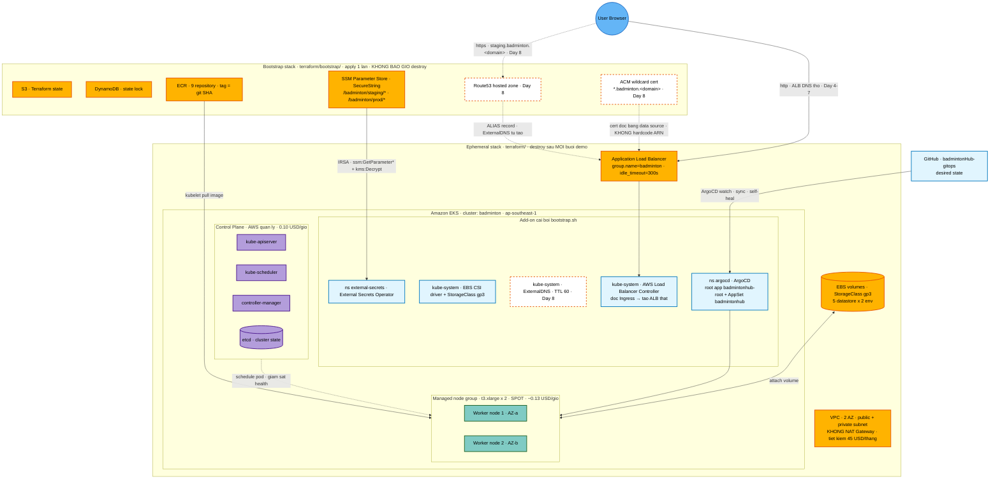
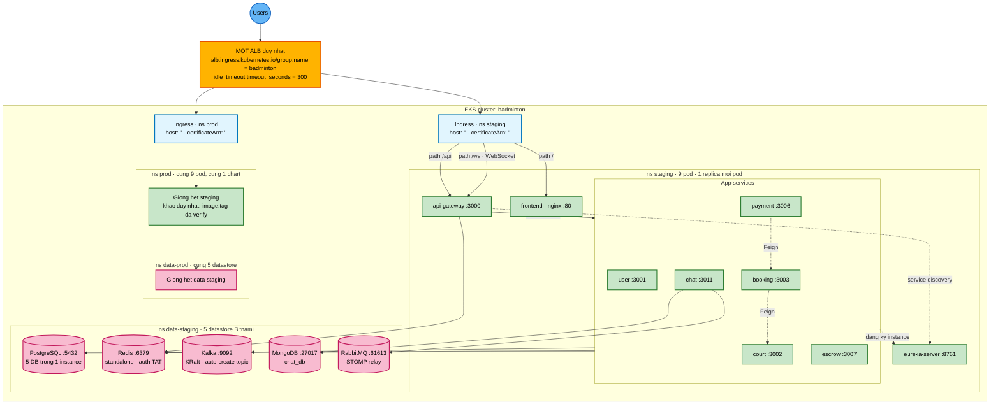
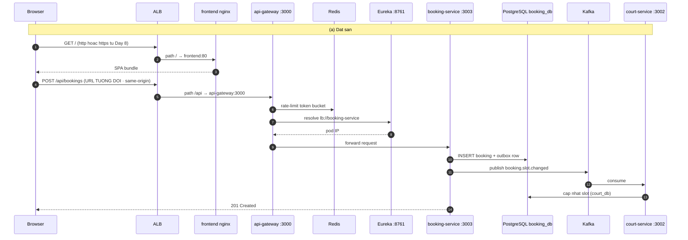
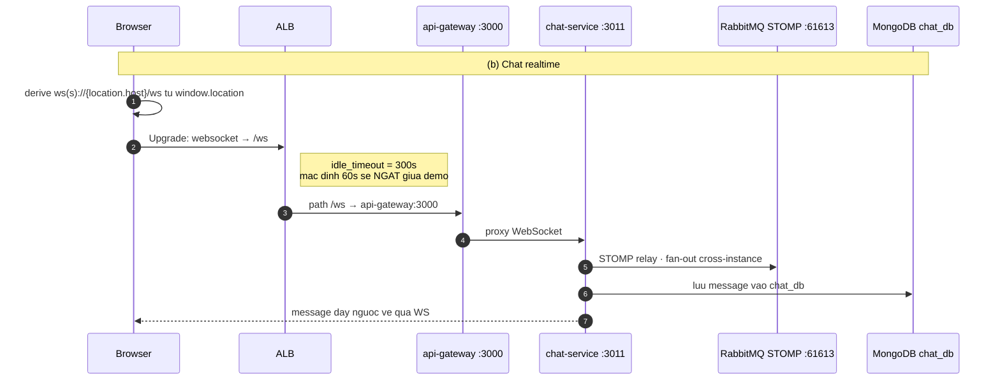

# BadmintonHub — Kiến trúc hệ thống (bức tranh tổng quát)

Tài liệu này vẽ **góc nhìn vật lý / hạ tầng**: từ trình duyệt người dùng → Route53 → ALB → EKS control plane → worker node → pod → PVC → ổ đĩa EBS, cộng với đường đi của secret và image.

> **Góc nhìn logic** (luồng CI/CD đầu-cuối · service→datastore · chuỗi promote) đã có sẵn ở `Planning_CICD.md` §3.1–3.3 — tài liệu này **không chép lại**, chỉ bổ sung phần còn thiếu.

## Quy ước đọc

| Ký hiệu | Nghĩa |
|---|---|
| Nét liền, màu đặc | Có từ **Day 4–7** — http thô trên ALB DNS, không domain |
| **Nét đứt viền cam** + hậu tố `Day 8` | **Chỉ xuất hiện từ Day 8** (domain + HTTPS). Trước đó không tồn tại. |
| `&lt;domain&gt;`, `&lt;account-id&gt;` | Placeholder — repo này **PUBLIC**, không ghi giá trị thật |

> ⚠️ **Sơ đồ là thiết kế đích, không phải trạng thái hiện tại.** Repo mới chỉ có doc + `.claude/`; `charts/`, `values/`, `apps/`, `infra/`, `external-secrets/` **chưa dựng** (Day 2/4/6).

---

## §1 — Toàn cảnh AWS: cái gì sống sót `terraform destroy`

Đây là câu hỏi quan trọng nhất của mô hình này. Hạ tầng chia làm **2 stack Terraform** theo đúng tiêu chí đó.



### Thành phần — vai trò — vòng đời — chi phí

| Thành phần | Vai trò | Sống sót `destroy`? | Tính tiền khi cụm đã tắt? |
|---|---|:---:|---|
| **S3 bucket** | Lưu Terraform state | ✅ Giữ | ~$0 (vài KB) |
| **DynamoDB table** | State lock, chống 2 người `apply` cùng lúc | ✅ Giữ | ~$0 (on-demand, không request) |
| **ECR × 9 repo** | Kho image, tag = git SHA | ✅ Giữ | **≈ $0.30/tháng** — lý do rebuild không phải build lại image |
| **SSM Parameter Store** | Giá trị secret thật, **sống ngoài cụm** | ✅ Giữ | **$0** (Standard tier) |
| **Route53 hosted zone** *(Day 8)* | DNS zone `badminton.<domain>` | ✅ Giữ | **$0.50/tháng** |
| **ACM wildcard cert** *(Day 8)* | Cert `*.badminton.<domain>` cho ALB | ✅ Giữ | **$0** (ACM public cert miễn phí) |
| **VPC + subnet** | Mạng cho cụm, không NAT GW | ❌ Xoá | $0 |
| **EKS control plane** | API server, etcd — AWS quản lý | ❌ Xoá | $0 sau destroy · **$0.10/giờ** khi sống |
| **Node group `t3.xlarge` × 2 spot** | Chạy toàn bộ pod (32 GB RAM) | ❌ Xoá | $0 sau destroy · **~$0.13/giờ** khi sống |
| **ALB** | Cổng vào duy nhất | ❌ Xoá *(nếu xoá Ingress trước)* | $0 sau destroy · **$0.0225/giờ** khi sống |
| **EBS volume** | PV cho 5 datastore × 2 env | ❌ Xoá *(nếu xoá PVC trước)* | ⚠️ **~$3.2/tháng nếu mồ côi** — xem §5 |

> 🎯 **Tại sao chia 2 stack**: mọi thứ cần để dựng lại cụm (state · image · secret · DNS · cert) nằm ở stack **không bao giờ destroy**. Nhờ vậy rebuild = `terraform apply` + `bootstrap.sh` và **0 thao tác tay** — không nạp lại secret, không build lại image, không xin lại cert.

> ⚠️ **Không dùng cert-manager / Let's Encrypt.** ALB terminate TLS ở tầng AWS và **chỉ nhận cert từ ACM/IAM** — nó không đọc được K8s Secret nơi cert-manager cất cert. Gắn vào là **im lặng không có HTTPS**, không có lỗi nào để lần ra.

---

## §2 — Một ALB, hai namespace

Sơ đồ §3.2 của `Planning_CICD.md` vẽ **bên trong một** namespace. Đây là phần nó không thể hiện: **`staging` và `prod` dùng chung đúng một ALB**, gộp bằng annotation `group.name`.



### 2a. Routing rule (giống nhau cho cả 2 env)

| Path (`pathType: Prefix`) | Backend | Port | Ghi chú |
|---|---|---|---|
| `/` | `frontend` | 80 | nginx trả SPA build sẵn |
| `/api` | `api-gateway` | 3000 | FE gọi **tương đối** → same-origin, không CORS |
| `/ws` | `api-gateway` | 3000 | WebSocket chat — **bắt buộc** `idle_timeout=300` |

> ⚠️ **`idle_timeout` mặc định của ALB là 60s.** Người dùng ngồi im 1 phút giữa buổi demo là kết nối chat bị ngắt — và lúc đó rất khó quy trách nhiệm. Đã set `300` ngay từ bản template.

### 2b. Namespace layout

| Namespace | Chứa gì | Ai tạo |
|---|---|---|
| `staging` / `prod` | 9 app pod + ConfigMap + Secret `app-secrets` | **ArgoCD** (`CreateNamespace=true`) |
| `data-staging` / `data-prod` | 5 datastore Bitnami + PVC | ArgoCD (app infra) |
| `argocd` | ArgoCD + root app + ApplicationSet | `bootstrap.sh` |
| `external-secrets` | ESO + ServiceAccount gắn IRSA | `bootstrap.sh` |
| `kube-system` | AWS LB Controller · EBS CSI · ExternalDNS *(Day 8)* | `bootstrap.sh` |

> ⚠️ Cụm vừa `apply` **chưa có** ns `staging`/`prod`. Thiếu `syncOptions: [CreateNamespace=true]` → cả 18 child app Error `namespace not found`, và vì đây là đường rebuild nên nó **vỡ mỗi buổi demo**.

### 2c. DNS in-cluster (env `staging`; prod thay `staging`→`prod`, `data-staging`→`data-prod`)

| Đích | FQDN |
|---|---|
| PostgreSQL | `postgresql.data-staging.svc.cluster.local:5432` |
| Redis | `redis-master.data-staging.svc.cluster.local:6379` |
| Kafka | `kafka.data-staging.svc.cluster.local:9092` |
| MongoDB | `mongodb.data-staging.svc.cluster.local:27017` |
| RabbitMQ (STOMP) | `rabbitmq.data-staging.svc.cluster.local:61613` |
| Eureka | `eureka-server.staging.svc.cluster.local:8761/eureka` |

> 💡 **Vì sao `group.name` chung**: 2 Ingress gộp vào **1** ALB thay vì 2 → tiết kiệm $0.0225/giờ và **~2 phút provisioning mỗi lần `apply`** — đáng kể khi cụm dựng lại mỗi buổi.

> 💡 **1 PostgreSQL / 5 database.** Local `docker-compose` chạy 9 instance Postgres riêng; lên K8s gộp còn 1 instance, 5 DB tạo bằng `initdbScripts`. Mỗi service trỏ full-URL `DB_<SVC>_URL` nên **0 đổi code**.

---

## §3 — Secret, Config và Storage: cái gì bơm vào pod

```mermaid
flowchart LR
    classDef aws  fill:#ffb300,stroke:#e65100,stroke-width:2px,color:#000000;
    classDef k8s  fill:#e1f5fe,stroke:#0277bd,stroke-width:2px,color:#000000;
    classDef svc  fill:#c8e6c9,stroke:#2e7d32,stroke-width:2px,color:#000000;
    classDef db   fill:#f8bbd0,stroke:#c2185b,stroke-width:2px,color:#000000;

    subgraph OUT["Ngoai cum · song sot terraform destroy"]
        direction TB
        SSM["SSM Parameter Store<br/>/badminton/staging/*<br/>SecureString"]:::aws
        ECRR["ECR · image tag = git SHA"]:::aws
    end

    subgraph IN["Trong cum EKS"]
        direction TB

        subgraph SECFLOW["Luong SECRET"]
            direction LR
            ESOP["ESO pod<br/>SA: external-secrets"]:::k8s
            CSS["ClusterSecretStore: aws-ssm<br/>provider: ParameterStore"]:::k8s
            ES["ExternalSecret: app-secrets<br/>dataFrom.find.path"]:::k8s
            SEC["K8s Secret: app-secrets<br/>CHI ref ten param trong Git"]:::k8s
            ESOP --> CSS --> ES --> SEC
        end

        CM["ConfigMap<br/>gia tri KHONG bi mat"]:::k8s

        POD["App pods · ns staging<br/>envFrom: configMapRef + secretRef"]:::svc

        subgraph STORE["Luong STORAGE"]
            direction LR
            PVC["PVC x 5 / env"]:::db
            SC["StorageClass gp3"]:::db
            CSID["EBS CSI driver<br/>SA gan IRSA"]:::k8s
            PVC --> SC --> CSID
        end
    end

    EBSV[("EBS volume<br/>reclaimPolicy: Delete")]:::aws

    SSM -->|"IRSA · ssm:GetParameter* + kms:Decrypt"| ESOP
    SEC -->|"envFrom.secretRef"| POD
    CM  -->|"envFrom.configMapRef"| POD
    ECRR -->|"kubelet pull"| POD
    CSID -->|"provision + attach"| EBSV
    POD -.->|"mount volume"| PVC
```



### 3a. Bốn IRSA role — thiếu cái nào hỏng cái đó

| Role | ServiceAccount / namespace | Quyền chính | Thiếu thì sao |
|---|---|---|---|
| **AWS Load Balancer Controller** | `kube-system` | `elasticloadbalancing:*`, `ec2:Describe*` | Ingress **không có ADDRESS** → không có ALB → không vào được hệ thống |
| **EBS CSI driver** | `kube-system` | `ec2:CreateVolume`, `AttachVolume`, … | PVC kẹt `Pending` → 5 datastore không boot |
| **External Secrets** | `external-secrets` / `external-secrets` | `ssm:GetParameter*`, `ssm:DescribeParameters` trên `/badminton/*` + `kms:Decrypt` | `SecretSyncedError` / `AccessDenied` → pod `CreateContainerConfigError` |
| **ExternalDNS** *(Day 8)* | `kube-system` | `route53:ChangeResourceRecordSets`, `ListHostedZones` | Record DNS không tự tạo → phải sửa DNS tay mỗi buổi (**vi phạm tiêu chí 0 thao tác tay**) |

### 3b. Secret vs ConfigMap — ranh giới rõ ràng

| **Secret** — vào SSM `/badminton/<env>/*` | **ConfigMap** — commit thẳng vào `values/` |
|---|---|
| `JWT_SECRET` | `REDIS_HOST` · `REDIS_PORT` |
| `POSTGRES_USERNAME` · `POSTGRES_PASSWORD` | `DB_<SVC>_URL` (JDBC URL in-cluster) |
| `MONGODB_CHAT_URI` *(nhớ `?authSource=admin`)* | `KAFKA_BOOTSTRAP_SERVERS` |
| `RABBITMQ_PASS` | `RABBITMQ_HOST` · `RABBITMQ_STOMP_PORT` · `RABBITMQ_USER=badminton` |
| `SENDGRID_API_KEY` | `EUREKA_URL` · `FRONTEND_URL` |
| `CLOUDINARY_CLOUD_NAME` · `CLOUDINARY_API_KEY` · `CLOUDINARY_API_SECRET` | `CHAT_BROKER_RELAY=true` |
| `GOOGLE_CLIENT_ID` · `GOOGLE_CLIENT_SECRET` | `MANAGEMENT_ENDPOINT_HEALTH_PROBES_ENABLED=true` · `SPRING_PROFILES_ACTIVE=prod` |

> 🔴 **Repo này PUBLIC.** Git **chỉ** chứa `ExternalSecret` ref **tên** param. Tuyệt đối không commit giá trị thô, `.env`, hay ciphertext.

> ⚠️ **Không dùng SealedSecrets.** Controller của nó sinh keypair mới mỗi lần cài; cụm này destroy sau mỗi buổi → cụm mới = khoá mới → mọi `SealedSecret` đã commit thành rác không giải mã được.

### ⚠️ Hai ràng buộc bắt buộc nhớ

1. **Thứ tự bootstrap**: ESO + `ClusterSecretStore` phải **Ready trước khi ArgoCD sync app**. Không thì pod khởi động lúc Secret chưa tồn tại → `CreateContainerConfigError`. Nó tự khỏi sau khi ESO sync, nhưng giữa buổi demo trông y như cụm hỏng.
2. **PVC phải xoá KHI CỤM CÒN SỐNG**: `reclaimPolicy: Delete` chỉ chạy vào lúc PVC bị xoá. Destroy thẳng cụm thì không ai gọi nó → **~40 GB EBS mồ côi (5 datastore × 2 env × 8 Gi) vẫn tính tiền âm thầm**.

---

## §4 — Vòng đời một request

Hai kịch bản đúng bằng hai thứ người thật sẽ làm trong 5–10 phút demo.





### Bốn cái bẫy nằm ngay trên đường request này

| Triệu chứng | Gốc rễ | Đã chặn bằng |
|---|---|---|
| WebSocket chat chết giữa buổi demo | ALB `idle_timeout` mặc định **60s** | `load-balancer-attributes: idle_timeout.timeout_seconds=300` |
| **Toàn bộ** request trả 500 | Redis bật auth → `NOAUTH`, mà gateway áp `RequestRateLimiter` cho **mọi route** | Bitnami override `auth.enabled=false` |
| "Đặt sân xong slot không cập nhật" | Kafka không auto-create topic; code dùng ~17 topic theo tên, **không có bean `NewTopic`** | `autoCreateTopicsEnable=true` |
| Nút copy số tài khoản báo "Đã copy" nhưng clipboard rỗng | `navigator.clipboard` là **secure-context-only**, không chạy trên http | **Hết sau Day 8.** Trước đó: đọc/gõ tay, đừng bấm nút copy |

> 💡 **FE same-origin — trụ cột của "0 thao tác tay"**: FE gọi `/api` **tương đối** và derive WS từ `window.location`. Hệ quả: ALB DNS đổi sau mỗi `apply` mà **không cần build lại image FE, không cần sửa ConfigMap**; CORS thành same-origin; và hôm bật HTTPS ở Day 8, FE **tự chuyển `ws://` → `wss://`**. Bake cứng `ws://` thì chat chết vì mixed content, phát hiện đúng lúc T-2.

> ⚠️ **Probe tách riêng, không dùng `/actuator/health`.** Endpoint đó là composite gộp `db` + `redis` + `mongo` + Eureka — Redis nhấp nháy vài nhịp là liveness fail → K8s restart pod → pod restart lại làm Redis thêm tải → **cascade restart giữa buổi demo**. Dùng `/actuator/health/liveness` và `/actuator/health/readiness` (bật bằng 1 biến env, **0 dòng code**).

---

## §5 — Vòng đời một buổi demo

```mermaid
flowchart LR
    classDef aws  fill:#ffb300,stroke:#e65100,stroke-width:2px,color:#000000;
    classDef k8s  fill:#e1f5fe,stroke:#0277bd,stroke-width:2px,color:#000000;
    classDef user fill:#64b5f6,stroke:#1565c0,stroke-width:2px,color:#000000;

    A["terraform apply<br/>~15 phut"]:::aws
    B["aws eks update-kubeconfig<br/>--name badminton"]:::aws
    C["./bootstrap.sh<br/>4 buoc CO RANG BUOC thu tu"]:::k8s
    D["ArgoCD sync<br/>20 app → Synced/Healthy"]:::k8s
    E(("DEMO THAT<br/>5-10 phut<br/>nguoi dung that")):::user
    F["teardown §7.1<br/>5 buoc DUNG THU TU"]:::k8s
    G["terraform destroy<br/>~10 phut"]:::aws
    H["Bill ve ~0<br/>chi con ECR + SSM"]:::aws

    A --> B --> C --> D --> E --> F --> G --> H
```



### 5a. Thứ tự `bootstrap.sh` — có ràng buộc, không đảo được

| # | Bước | Vì sao đúng thứ tự này |
|---|---|---|
| 1 | EBS CSI driver + StorageClass `gp3` | Datastore cần PV; không có SC thì PVC `Pending` |
| 2 | AWS Load Balancer Controller | Phải sẵn sàng trước khi có Ingress, không thì Ingress không ra ALB |
| 3 | **ESO + `ClusterSecretStore`** | **Phải xong TRƯỚC bước 4** — không thì pod start lúc Secret chưa có |
| 4 | ArgoCD + root app `badmintonhub-root` | Từ đây ArgoCD tự kéo toàn bộ 20 app về |

*(Day 8 thêm ExternalDNS vào script.)*

### 5b. Thứ tự teardown §7.1 — bỏ bước nào mất tiền bước đó

| # | Lệnh | Bỏ bước này thì sao |
|---|---|---|
| 1 | `argocd app delete badmintonhub-root --cascade` | Xoá **child** app là vô nghĩa — ApplicationSet controller sinh lại ngay lập tức |
| 2 | `kubectl delete pvc --all -n data-staging` (và `-n data-prod`) | **~40 GB EBS mồ côi ≈ $3.2/tháng** chảy âm thầm |
| 3 | `kubectl delete ingress --all -A` | ALB không được gỡ → vẫn tính $0.0225/giờ |
| 4 | `helm uninstall aws-lb-controller -n kube-system` | Phải sau bước 3; gỡ trước thì không còn ai gỡ ALB |
| 5 | `cd ../badmintonHub/terraform && terraform destroy` | — |

**Verify bill về 0 — chạy thật, đừng tin cảm giác:**

```bash
aws ec2 describe-volumes --filters Name=status,Values=available --query 'Volumes[].VolumeId'
aws elbv2 describe-load-balancers --query 'LoadBalancers[].LoadBalancerName'
# Ca hai phai RONG
```

### 5c. Chi phí

| Kịch bản | Tiền |
|---|---|
| **1 buổi trọn gói** (apply + demo + destroy) | **≈ $0.15** |
| Cụm sống liên tục | ≈ $0.25/giờ (EKS $0.10 + node $0.13 + ALB $0.0225) |
| Quên tắt 1 ngày | vài $ |
| **Quên tắt 1 tháng** | **≈ $150–200** |
| Standing cost giữa các buổi | $0.30/tháng (ECR) → **$0.80/tháng sau Day 8** (+Route53 zone) |

> 🎯 **Rẻ = kỷ luật teardown, không phải kiến trúc rẻ.** Đặt AWS Budget alert (email khi > $5) + hẹn giờ điện thoại "DESTROY" ngay sau demo.

---

## §6 — Bảng tra nhanh

### 9 image được deploy

| Service | Port | Postgres | Redis | Kafka | Mongo | RabbitMQ | Probe path |
|---|---|---|:--:|:--:|:--:|:--:|---|
| `eureka-server` | 8761 | — | — | — | — | — | `/actuator/health/{liveness,readiness}` |
| `api-gateway` | 3000 | — | ✅ | — | — | — | ↑ |
| `user-service` | 3001 | `user_db` | ✅ | — | — | — | ↑ |
| `court-service` | 3002 | `court_db` | ✅ | ✅ | — | — | ↑ |
| `booking-service` | 3003 | `booking_db` | ✅ | ✅ | — | — | ↑ |
| `payment-service` | 3006 | `payment_db` | ✅ | ✅ | — | — | ↑ |
| `escrow-service` | 3007 | `escrow_db` | — | ✅ | — | — | ↑ |
| `chat-service` | 3011 | — | ✅ | — | `chat_db` | ✅ STOMP 61613 | ↑ |
| `frontend` | 80 | — | — | — | — | — | **`/`** (nginx) |

**KHÔNG deploy**: `ai-service` (3010, Python · nặng RAM Free-Tier) · `matchmaking-service` (3004) · `coach-service` (3005) · `notification-service` (3008) · `event-service` (3009) — scaffold rỗng.

### Con số chốt

| Hạng mục | Giá trị |
|---|---|
| Cluster / Region | `badminton` / `ap-southeast-1` |
| Node group | `t3.xlarge` × 2 · **SPOT** · 32 GB RAM |
| VPC | 2 AZ · public + private subnet · **không NAT Gateway** |
| Replica mỗi service | **1** · requests `128Mi` / `100m` |
| ArgoCD | root `badmintonhub-root` → AppSet `badmintonhub`<br/>**9 svc × 2 env = 18 child** + 1 infra + 1 ingress = **20 app** |
| Image tag | **git SHA** — bất biến, không bao giờ `latest` |
| Values contract | `values/<svc>-<env>.yaml` · `env ∈ {dev, staging, prod}` |
| Ingress | `group.name=badminton` · `idle_timeout=300` · TTL `60` *(Day 8)* |

> ⚠️ **Chưa chốt**: phiên bản Kubernetes của EKS **chưa được ghim ở bất kỳ đâu** trong `Planning_CICD.md`. Cần quyết khi làm **Day 3** (repo app) và ghim vào `terraform/`, không để module tự chọn default.

### Đọc tiếp

| Cần gì | Đọc ở đâu |
|---|---|
| Luồng CI/CD logic · service→datastore · promote chain | `Planning_CICD.md` §3.1–3.3 |
| Runbook teardown / rebuild / warm-up demo | `Planning_CICD.md` §7 |
| Prompt paste-ready từng Day | `Planning_CICD.md` §6 |
| Tổng quan repo + quy ước bắt buộc | `CLAUDE.md` |
| Luật chi tiết theo thư mục | 8 file trong `.claude/rules/` (xem Rules Index ở `CLAUDE.md`) |
