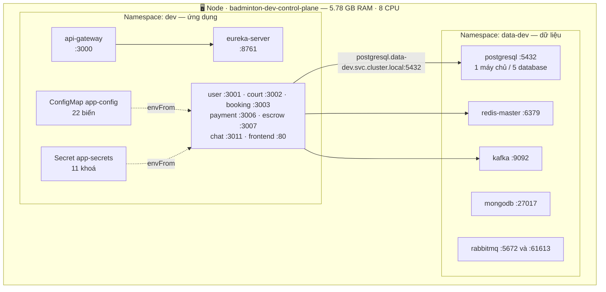
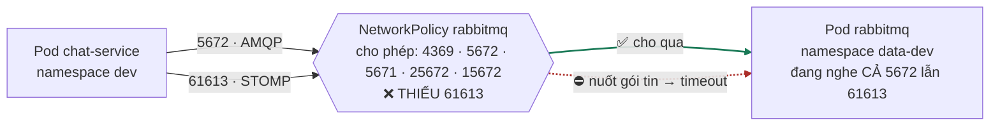
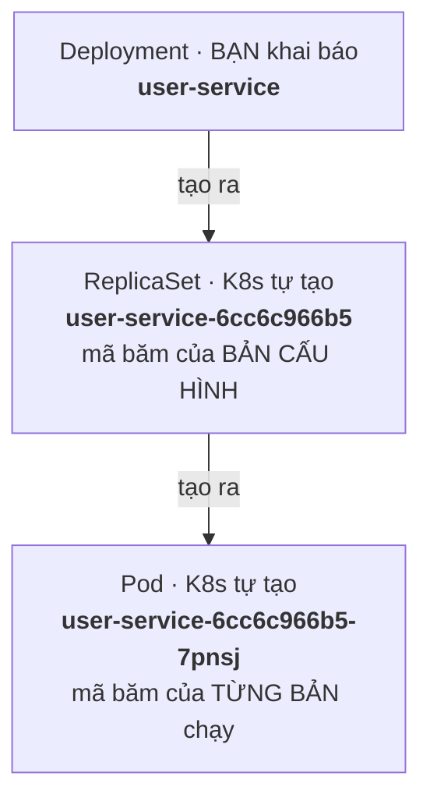
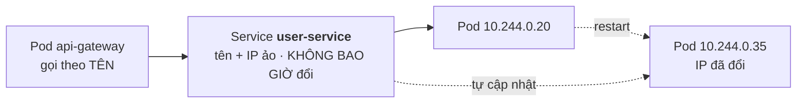
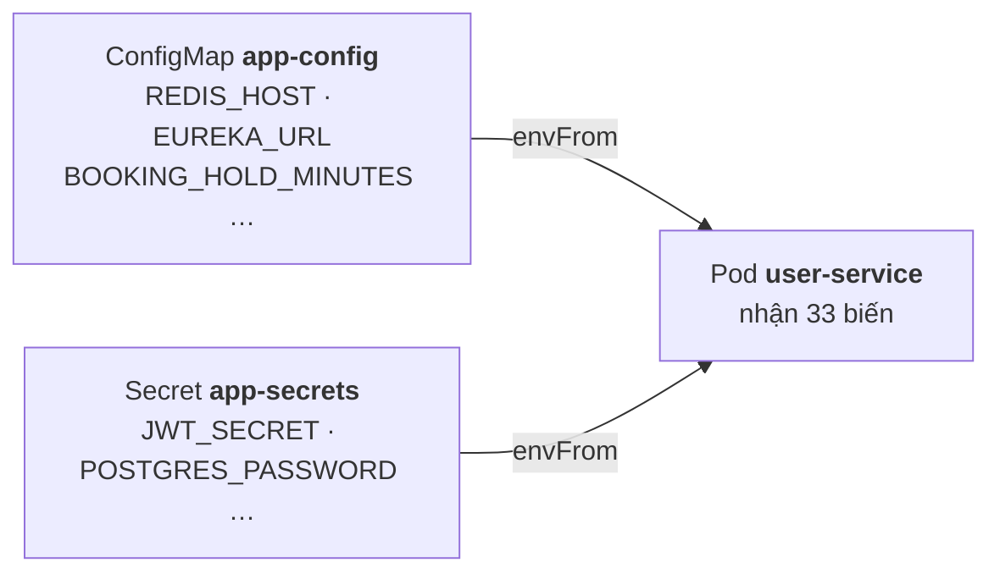
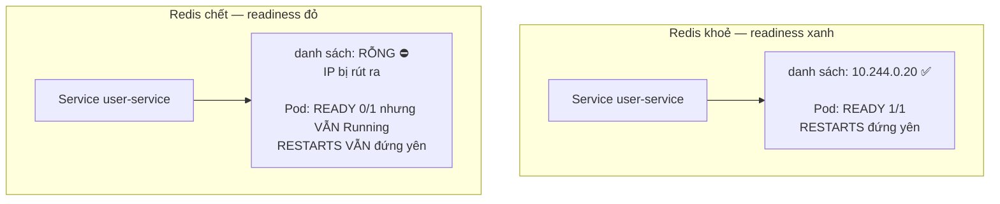
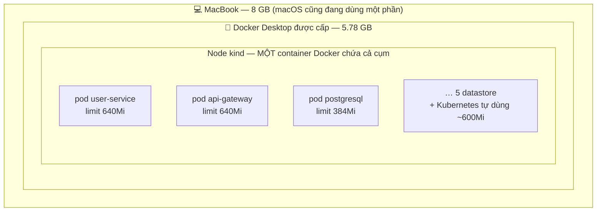
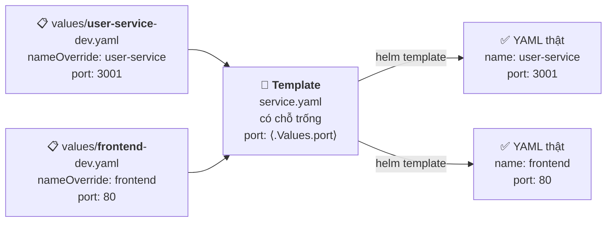
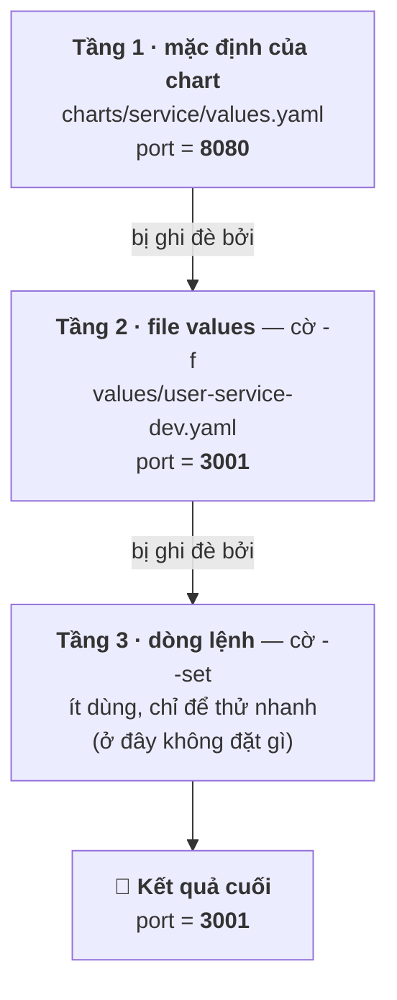

# Day 2 giải thích cho người mới

> Tài liệu này viết cho **người chưa từng dùng Kubernetes**. Nó kể lại Day 2 đã làm gì, 13 chỗ bản thiết kế trên giấy sai khi chạy thật, và những khái niệm cần học — mỗi khái niệm gắn với đúng chỗ nó gây rắc rối.
>
> Khác với [`.claude/rules/`](../.claude/rules/): rule viết cho Claude đọc lúc đang code — súc tích, mệnh lệnh, giả định đã biết K8s. File này giải thích **vì sao**.

---

## 1. Day 2 giải quyết vấn đề gì?

Day 1 đã đóng gói 9 ứng dụng thành **Docker image** — mỗi image là một hộp chứa sẵn code + Java runtime + mọi thứ cần để chạy.

Nhưng có image rồi thì vẫn còn một câu hỏi lớn: **làm sao nói cho Kubernetes biết phải chạy chúng thế nào?**

Kubernetes không tự đoán được:

- `user-service` nghe ở cổng 3001, `api-gateway` ở 3000, `frontend` ở 80
- `user-service` cần Postgres + Redis + Kafka, `escrow-service` không cần Redis, `chat-service` không cần Postgres
- Địa chỉ database là gì, mật khẩu lấy ở đâu
- Làm sao biết một ứng dụng đã khởi động xong hay đang chết

Day 2 là viết ra tất cả những câu trả lời đó, dưới dạng file YAML.

### Vì sao test trên `kind` trước?

`kind` = **K**ubernetes **in** **D**ocker — một cụm Kubernetes thu nhỏ chạy ngay trong Docker trên laptop.

Cụm EKS thật trên AWS tốn tiền theo giờ. Nếu mang một bản thiết kế chưa kiểm chứng lên đó, mỗi lần sai lại phải sửa–deploy–chờ, vừa mất thời gian vừa mất tiền.

Phiên này chứng minh quyết định đó đúng: **13 chỗ sai** đã bị bắt trên kind, hoàn toàn miễn phí.

---

## 2. Đã dựng những gì

| Thành phần | Nội dung | Lý do tồn tại |
|---|---|---|
| [`charts/service/`](../charts/service/) | **Một khuôn mẫu** Helm dùng chung cho cả 9 service | 9 service khác nhau ở port/image/probe nhưng **giống nhau ở cấu trúc**. Viết 1 khuôn + 9 bộ giá trị thay vì 9 bản sao gần giống nhau |
| [`charts/platform/`](../charts/platform/) | ConfigMap `app-config` — mọi biến môi trường **không bí mật** | Gom về một chỗ. Đổi địa chỉ database chỉ sửa 1 dòng thay vì 27 file |
| [`infra/`](../infra/) | 5 datastore: PostgreSQL, Redis, Kafka, MongoDB, RabbitMQ | Ứng dụng cần chúng mới chạy được |
| [`values/`](../values/) | **27 file** `<service>-<môi-trường>.yaml` | 9 service × 3 môi trường (`dev` trên kind, `staging` + `prod` trên EKS) |
| [`scripts/`](../scripts/) | 4 script: `kind-up` · `kind-secret` · `kind-deploy` · `kind-verify` | Dựng cụm, nạp mật khẩu, deploy, và kiểm các bẫy đã biết |

### Bản đồ cụm — dựng xong thì trông thế này



**Node** là một cái **máy**. Với kind, cả cụm nằm gọn trong *một* container Docker đóng vai máy đó — nên mọi pod đều chia nhau đúng 5.78 GB. Trên EKS thì khác: nhiều node, mỗi node một máy ảo EC2, và pod được rải ra.

**Namespace** chia tài nguyên thành nhóm, như thư mục. Tách 2 namespace để **xoá riêng được**: runbook dọn cụm xoá `PVC` trong `data-dev`, nếu app nằm chung thì lệnh xoá hàng loạt rất dễ trúng nhầm.

Địa chỉ gọi liên namespace theo công thức *tên-Service* **.** *tên-namespace* **.** `svc.cluster.local`.

### Vì sao **một** chart cho cả 9 service?

Đây là quyết định quan trọng nhất về cấu trúc, và lý do nằm ở **Day 6**.

Day 6 sẽ dùng ArgoCD với "ApplicationSet" — một cơ chế sinh tự động 18 ứng dụng (9 service × 2 môi trường) từ **một** khuôn mẫu. Cơ chế đó chỉ hoạt động khi cả 9 service dùng chung một chart.

Nếu Day 2 viết chart riêng cho `frontend` (vì nó là nginx chứ không phải Java) thì Day 6 sẽ phải viết tay 18 file cấu hình. Nên chart phải **đủ tổng quát** để render được cả `frontend` (nginx, cổng 80, không có biến môi trường nào) lẫn `eureka-server` (Java, cổng 8761).

---

## 3. Mười ba phát hiện — nhóm theo *loại sai lầm*

Tôi nhóm theo loại thay vì theo thứ tự thời gian, vì như vậy bạn rút ra được **nguyên tắc** chứ không chỉ nhớ 13 sự kiện rời rạc.

### Nhóm A — Tài liệu không khớp code thật

#### A1. `user-service` **có** dùng Kafka

Bảng thiết kế ghi `user-service` không dùng Kafka. Đọc `application.yml` thật thì nó có khai `spring.kafka.bootstrap-servers`.

Thiếu biến `KAFKA_BOOTSTRAP_SERVERS` → ứng dụng dùng giá trị mặc định `localhost:9092` → không có Kafka nào ở đó → treo.

> **Nguyên tắc:** nguồn sự thật về tên biến môi trường là `application.yml` **của từng service**, không phải bảng tổng hợp hay `.env.example`.

#### A2. `FRONTEND_URL` không chỉ dùng cho link email

Tài liệu ghi biến này chỉ dùng để tạo link trong email xác thực. Thực tế `chat-service` còn nạp nó vào `WebSocketConfig.setAllowedOrigins()` — tức **danh sách origin được phép mở WebSocket**.

Sai giá trị → **chat chết trong khi mọi luồng khác vẫn xanh**. Rất khó truy, vì không có gì báo lỗi rõ ràng.

Điều này đe doạ trực tiếp một nguyên tắc lớn của dự án: cụm được dựng lại trước mỗi buổi demo, và mỗi lần dựng lại thì địa chỉ ALB đổi. Nếu `setAllowedOrigins` không nhận ký tự đại diện thì **mỗi buổi demo phải sửa ConfigMap bằng tay** — phá vỡ mục tiêu "dựng lại không cần thao tác tay nào".

→ Đã ghim thành việc bắt buộc kiểm ở Day 4.

#### A3. Đặt sân **bắt buộc email đã xác thực**

`BookingController.create` khai:

```java
@PreAuthorize("hasAnyRole('USER','COACH','STAFF','ADMIN') and hasAuthority('EMAIL_VERIFIED')")
```

Tài liệu ghi "đăng nhập không phụ thuộc `emailVerified`" — **đúng với đăng nhập**, nhưng dễ hiểu nhầm thành cả luồng demo không cần xác thực.

Thực tế: người dùng mới đăng ký sẽ nhận **403 ngay ở bước đặt sân**. Tức là chết đúng giữa buổi demo 5–10 phút, trước mặt khán giả.

> **Nguyên tắc:** một câu đúng ở phạm vi hẹp (đăng nhập) có thể bị hiểu sai thành đúng ở phạm vi rộng (cả luồng). Khi đọc tài liệu, hỏi: *câu này đúng cho **bước nào**?*

---

### Nhóm B — Thư viện bên ngoài đã đổi

#### B1. Chart Kafka phiên bản 32.x đã bỏ hai tuỳ chọn

Tài liệu bảo đặt `sasl.enabled: false` và `autoCreateTopicsEnable: true`. Cả hai **không còn tồn tại** trong phiên bản đang dùng.

Cạm bẫy nằm ở chỗ: **Helm bỏ qua tuỳ chọn sai trong im lặng.**

```
Viết sai tên tuỳ chọn
  → helm template vẫn chạy, không cảnh báo gì
  → deploy vẫn thành công
  → pod vẫn lên
  → và bạn chỉ phát hiện khi ứng dụng không kết nối được
```

Cách viết đúng cho phiên bản 32.x là đặt giao thức cho cả ba listener, và bật auto-create qua `controller.overrideConfiguration`.

> **Nguyên tắc:** không tin YAML đã render. Phải kiểm ở **cấu hình thật trên máy chủ**:
> ```bash
> kubectl -n data-dev exec statefulset/kafka-controller -c kafka -- \
>   grep '^auto.create.topics.enable' /opt/bitnami/kafka/config/server.properties
> ```

#### B2. Image MongoDB của Bitnami chỉ build cho Intel

Máy dev là Apple Silicon (chip ARM). Image `bitnamilegacy/mongodb` chỉ có bản `amd64`.

Pod sẽ chết với `exec format error`, và **log không hề nhắc gì tới kiến trúc CPU** — rất dễ đi tìm nhầm hướng.

Cách xử ở repo này: `dev` (kind, ARM) dùng image chính chủ `mongo:8.0` (có cả hai kiến trúc), `staging`/`prod` (EKS, Intel) vẫn dùng chart Bitnami. Hai đường cho ra **cùng** một Service tên `mongodb` cổng 27017, nên ứng dụng không biết có sự khác biệt.

#### B3. Chart Bitnami chặn render nếu đổi registry

Từ 2025, Bitnami chuyển image miễn phí sang `bitnamilegacy` và thêm bước kiểm tra image. Đổi `image.repository` mà không bật `global.security.allowInsecureImages: true` thì chart **từ chối render**.

#### B4. NetworkPolicy mặc định nuốt cổng phụ ← *bẫy tinh vi nhất*

Chart Bitnami tự tạo một **NetworkPolicy** (tường lửa giữa các pod) chỉ liệt kê các cổng nó biết: `4369, 5672, 5671, 25672, 15672`. Cổng **61613** (STOMP, dùng cho chat) không có trong đó.



Điều làm bẫy này khó chịu là **mọi dấu hiệu bề mặt đều xanh**:

```
kubectl get svc rabbitmq        → có cổng stomp:61613  ✅
kubectl get endpointslice       → có stomp=61613       ✅
rabbitmq-diagnostics listeners  → "port: 61613" đang nghe ✅
rabbitmq-plugins list -e        → [E*] rabbitmq_stomp  ✅
```

Nhưng từ pod khác gọi vào thì **timeout**.

**Cách khoanh vùng đã dùng để tìm ra** — đây là kỹ thuật đáng học:

| Thử từ đâu → tới đâu | cổng 5672 | cổng 61613 |
|---|:--:|:--:|
| chat-service → tên Service | ✅ | ❌ |
| chat-service → **thẳng IP của pod** (bỏ qua Service) | ✅ | ❌ |
| **bên trong chính pod rabbitmq** → localhost và IP của mình | ✅ | ✅ |

Đọc bảng này:
- Bỏ qua Service mà vẫn hỏng → **không phải** lỗi Service hay DNS
- Từ bên trong thì được, từ ngoài thì không, **cùng nguồn cùng đích chỉ khác cổng** → có thứ gì đó lọc **theo cổng** → NetworkPolicy

> **Nguyên tắc vàng:** `connection refused` = *không ai nghe*. `timeout` = *có thứ gì đó nuốt gói tin*. Hai triệu chứng dẫn tới hai hướng điều tra hoàn toàn khác nhau.

---

### Nhóm C — Hiểu nhầm hành vi Kubernetes / JVM

#### C1. Spring Security chặn endpoint probe → 403 ← *bug quan trọng nhất*

Chart gọi `/actuator/health/liveness` để kiểm tra pod còn sống. Đo thật trên kind:

```
/actuator/health              → 200   ← SecurityConfig cho phép đúng đường dẫn này
/actuator/info                → 200   ← và đường dẫn này
/actuator/health/liveness     → 403   ← probe gọi cái này
/actuator/bat-ky-cai-gi       → 403   ← chứng minh là Security chặn, KHÔNG phải 404
```

Chi tiết `/actuator/bat-ky-cai-gi` cũng trả 403 rất quan trọng: nếu là **404** thì nghĩa là endpoint chưa được bật; **403** nghĩa là endpoint có tồn tại nhưng bị chặn quyền. Hai chẩn đoán khác nhau hoàn toàn.

**Hệ quả: pod không bao giờ được đánh dấu sẵn sàng** — đúng với **cả 7 service Java có Spring Security**.

Và đây là phần đáng sợ nhất: `eureka-server` thoát vì nó **không có** Spring Security. Nên nếu chỉ test mỗi eureka-server, bug này **ẩn hoàn toàn** và sẽ nổ ở Day 4 khi đã trả tiền EKS.

> **Nguyên tắc:** khi test, chọn mẫu thử **đại diện cho số đông**, đừng chọn cái đơn giản nhất. `eureka-server` là service duy nhất trong 8 cái không có security — chính vì thế nó là mẫu thử **tệ nhất**.

**Cách sửa, 0 dòng code ứng dụng:**

| Probe | Đường dẫn | Vì sao |
|---|---|---|
| liveness | `/actuator/info` | Không chạm database/Redis/Kafka nào → chỉ fail khi JVM thật sự chết hoặc treo |
| readiness | `/actuator/health` | Có kiểm database. Dùng cho **readiness** thì an toàn — xem C2 |

#### C2. Vì sao readiness dùng endpoint có kiểm database thì an toàn, còn liveness thì không?

Đây là khái niệm cốt lõi, đáng hiểu kỹ.

`/actuator/health` là endpoint **tổng hợp**: nó kiểm database + Redis + MongoDB + Eureka rồi trả về một kết quả chung. Redis chớp một nhịp là nó trả "không khoẻ".

- Nếu dùng cho **liveness**: Redis chớp → K8s tưởng ứng dụng chết → **giết và khởi động lại pod** → pod khởi động lại làm Redis thêm tải → càng nhiều pod chết → **dây chuyền sụp đổ**
- Nếu dùng cho **readiness**: Redis chớp → K8s **rút pod khỏi danh sách nhận request**, nhưng **không giết nó**. Redis khoẻ lại thì pod tự quay về. Không có dây chuyền

> **Điểm cốt lõi chưa bao giờ là "phải dùng endpoint tên `/liveness`"** — mà là **liveness không được phụ thuộc vào thứ bên ngoài**. `/actuator/info` thoả điều kiện đó còn chặt hơn.

#### C3. `timeoutSeconds` mặc định là **1 giây**

Probe bị **timeout** thì Kubernetes tính y hệt như probe **fail**.

Actuator của Spring Boot khi máy đang bận thường trả lời chậm hơn 1 giây → K8s giết pod **đang khoẻ mạnh** → pod khởi động lại làm máy thêm bận → đúng cái dây chuyền mà việc tách liveness/readiness sinh ra để tránh.

Triệu chứng nhìn thấy: `context deadline exceeded (Client.Timeout exceeded while awaiting headers)`.

Chú ý: đây là *timeout*, **không phải** *connection refused* — nên đừng đọc nhầm thành "ứng dụng chưa lên".

#### C4. `MaxRAMPercentage=75` + giới hạn bộ nhớ chật = bị giết

Một container Java có hai vùng bộ nhớ:

- **Heap** — nơi chứa object, JVM quản lý
- **Non-heap** — metaspace, thread stack, code cache, buffer… Spring Boot cần khoảng **150–200MB**

Image đặt sẵn `MaxRAMPercentage=75`, nghĩa là heap lấy 75% giới hạn.

| Giới hạn | Heap (75%) | Còn lại cho non-heap | Kết quả |
|---|---|---|---|
| 448MB | 336MB | **112MB** | ❌ `OOMKilled` |
| 448MB | 246MB *(hạ xuống 55%)* | 200MB | ❌ **vẫn** `OOMKilled` khi Redis chết |
| 640MB | 352MB (55%) | 288MB | ✅ ổn |

Dòng thứ hai là bài học: **hạ tỉ lệ heap thôi không đủ, phải nâng cả giới hạn**.

Lý do đỉnh bộ nhớ cao hơn dự đoán: khi Redis chết, `/actuator/health` **treo** chứ không trả lỗi ngay (nó chờ Redis timeout). Probe readiness cứ 10 giây lại bắn thêm một request, request cũ chưa xong → tồn đọng → bộ nhớ phình.

> **Nguyên tắc:** đo bộ nhớ lúc mọi thứ khoẻ rồi kết luận "giới hạn này đủ" là **sai**. Phải đo cả lúc thành phần phụ thuộc bị hỏng.

#### C5. `RollingUpdate` với 1 bản sao bắt hai JVM cùng chạy

Kubernetes có hai chiến lược cập nhật:

- **RollingUpdate** — dựng pod mới, **chờ nó sẵn sàng**, rồi mới xoá pod cũ. Không gián đoạn dịch vụ
- **Recreate** — xoá pod cũ trước, rồi mới dựng pod mới. Gián đoạn vài chục giây

Với chỉ 1 bản sao, RollingUpdate nghĩa là **hai JVM cùng chạy** đúng lúc JVM mới cần nhiều CPU nhất để khởi động. Trên máy chật thì việc cập nhật không bao giờ hoàn tất.

→ `dev` dùng `Recreate`, `staging`/`prod` giữ `RollingUpdate` (không được gián đoạn trước mặt người dùng).

---

### Nhóm D — Lỗi kiểu dữ liệu YAML

#### D1. `2592000000` biến thành `2.592e+09`

Viết trong values:

```yaml
refreshExpirationMs: 2592000000
```

YAML hiểu đây là **số**, và khi render ra chuỗi thì thành `"2.592e+09"` (ký hiệu khoa học). Spring cố parse thành kiểu `Long` → lỗi → ứng dụng không khởi động được.

Cách sửa: bọc trong ngoặc kép ngay từ values.

```yaml
refreshExpirationMs: "2592000000"
```

> **Nguyên tắc:** trong YAML, số nguyên lớn và những thứ trông giống số (số điện thoại, mã zip, phiên bản `1.10`) nên để dạng chuỗi.

---

### Nhóm E — Môi trường khác nhau

#### E1. nginx của frontend dùng DNS của Docker

```
/etc/nginx/conf.d/default.conf:21  →  resolver 127.0.0.11
DNS thật của pod trong K8s         →  10.96.0.10
```

`127.0.0.11` là DNS nội bộ của **Docker**, chỉ tồn tại trong mạng docker-compose. Trong Kubernetes thì DNS là kube-dns. Nginx không phân giải được tên `api-gateway` → **502 với mọi request `/api` và `/ws`**.

Điểm thú vị: bug này **không ảnh hưởng EKS**, vì ở đó ALB Ingress route `/api` thẳng vào gateway, nginx của frontend chỉ phục vụ file tĩnh nên không bao giờ chạy nhánh proxy.

> **Nguyên tắc:** một file cấu hình đúng trong docker-compose chưa chắc đúng trong Kubernetes. Những chỗ hay khác nhau: DNS, tên host, đường mạng, biến môi trường.

---

## 4. Bài học chẩn đoán — cái đắt nhất của phiên này

Giữa phiên, tôi thấy:

```
CPU node        1298%   (trần là 800%)
load average    61
kubectl exec    ttrpc: closed
helm            TLS handshake timeout
```

Tôi kết luận: *"máy 8GB không đủ, phải dời phần kiểm chứng sang EKS"*.

**Kết luận đó sai.**

Nguyên nhân thật là hai bug C1 (probe 403) và C4 (OOMKilled) tạo ra **vòng lặp restart**:

```
pod fail probe
  → K8s giết và khởi động lại
    → khởi động thêm một JVM nữa (JVM khởi động rất ngốn CPU)
      → máy nặng hơn
        → pod khác cũng fail probe
          → lặp lại, ngày càng tệ
```

Cơn bão CPU là **hậu quả**, không phải **nguyên nhân**.

Sau khi sửa hai bug: **3 service sẵn sàng trong dưới 60 giây**, load average từ 61 xuống **3.67**.

### Cách phân biệt

| Dấu hiệu | Nghĩa | Nên làm gì |
|---|---|---|
| Cột `RESTARTS` **tăng dần** ở nhiều pod | Vòng lặp restart | Tìm **nguyên nhân** (probe? bộ nhớ?), **đừng** vội nới timeout |
| `RESTARTS` = 0 mà vẫn chậm | Thật sự thiếu tài nguyên | Giảm số service, tăng RAM |
| Nhiều pod restart **cùng một thời điểm** | Sự kiện ở tầng máy chủ (hết RAM) | Xem `free -m` trên node |

> **Nguyên tắc:** luôn nhìn cột `RESTARTS` **trước khi** đổ lỗi cho phần cứng.

---

## 5. Khái niệm cần học

### Tầng 1 — Kubernetes căn bản

| Khái niệm | Hiểu đơn giản | Gặp ở đâu trong phiên này |
|---|---|---|
| **Node** | Một cái **máy** — nơi cắm CPU/RAM/đĩa cho pod chạy | kind chỉ có **1 node**: `badminton-dev-control-plane` |
| **Pod** | Đơn vị nhỏ nhất K8s chạy, thường là 1 container | Thứ ta nhìn suốt buổi qua `kubectl get pods` |
| **Deployment** | "Tôi muốn luôn có N bản pod này chạy" | Mỗi service là một Deployment |
| **ReplicaSet** | Deployment tạo ra nó để giữ đúng số lượng pod | Đổi cấu hình → RS mới sinh ra, RS cũ về 0 |
| **Service** | Tên cố định + IP ảo để gọi tới pod | 🔴 Tên phải **đúng chữ** — xem ghi chú dưới |
| **Namespace** | Thư mục ảo chia nhóm tài nguyên | `dev` cho app, `data-dev` cho database |
| **ConfigMap** | Nơi để biến môi trường không bí mật | `app-config` |
| **Secret** | Như ConfigMap nhưng cho thứ nhạy cảm | `app-secrets` |
| **StatefulSet** | Như Deployment nhưng cho thứ **có dữ liệu** | 5 datastore dùng nó |
| **PVC** | Đơn xin cấp ổ đĩa | Postgres/Kafka cần lưu dữ liệu |
| **NetworkPolicy** | Tường lửa giữa các pod | 🔴 Nó chặn cổng 61613 làm chat chết (B4) |

#### Ai tạo ra ai

Bạn chỉ khai báo **Deployment**. Hai tầng dưới do Kubernetes tự sinh — đó là lý do tên pod trông như dãy ký tự ngẫu nhiên.



Đọc tên pod ngược từ phải sang: `7pnsj` là bản chạy cụ thể, `6cc6c966b5` là phiên bản cấu hình, `user-service` là Deployment.

Đổi cấu hình → Kubernetes sinh ReplicaSet **mới**, đưa RS cũ về 0 pod. Bạn đã thấy đúng hiện tượng này mỗi lần tôi sửa probe: `kubectl get rs` hiện nhiều dòng, chỉ một dòng có `DESIRED 1`.

#### Service: cái tên không bao giờ đổi

Pod chết và sinh lại liên tục, mỗi lần một IP khác. Không ai gọi được một thứ như thế. Service là lớp tên cố định đứng trước, che đi sự thay đổi đó.



#### ConfigMap và Secret bơm biến vào Pod

Cùng một image chạy được ở dev, staging và prod — khác nhau chỉ ở đống biến môi trường bơm vào lúc container khởi động.



Secret **không** được mã hoá — nó chỉ mã hoá base64 và tách quyền truy cập riêng. Giá trị thật không bao giờ nằm trong Git: Day 6 sẽ kéo chúng từ AWS SSM.

> ⚠️ **Rất dễ quên:** sửa ConfigMap **không** làm pod khởi động lại — biến môi trường chỉ đọc một lần lúc container start. ArgoCD sẽ báo "đã đồng bộ" trong khi pod vẫn chạy giá trị cũ. Sau khi đổi phải chạy `kubectl rollout restart deploy`.

**🔴 Bẫy tên Service — đáng hiểu kỹ**

Day 6 ArgoCD sẽ đặt tên bản cài đặt là `<service>-<môi-trường>`, ví dụ `user-service-staging`. Nếu chart đặt tên object theo tên bản cài đặt thì Service sẽ thành `user-service-staging`, và khi đó:

- Biến `EUREKA_URL` trỏ tới `eureka-server.<namespace>.svc.cluster.local` → **không phân giải được** → cả cụm mất khả năng tìm nhau
- nginx của frontend proxy tới host `api-gateway` → **502**
- Ingress Day 4 khai `backend.service.name: api-gateway` → **không khớp**

→ Vì thế mọi file values **bắt buộc** có `nameOverride`, và chart bắt buộc khai nó.

### Tầng 2 — Ba loại probe

| Probe | K8s hỏi gì | Fail thì sao |
|---|---|---|
| **startup** | "Khởi động xong chưa?" | Chờ tiếp, **chưa hỏi** 2 câu kia |
| **liveness** | "Còn sống không?" | **Giết và khởi động lại pod** |
| **readiness** | "Nhận request được chưa?" | Rút khỏi Service, **không giết** |

`startupProbe` sinh ra để giải quyết mâu thuẫn: JVM cần 2 phút để khởi động, nhưng liveness phải nhạy để bắt được treo. Có startup probe thì liveness chỉ bắt đầu hỏi **sau khi** startup đã thành công một lần.

Các thông số cần khai tường minh:

| Thông số | Mặc định | Vì sao phải đổi |
|---|---|---|
| `timeoutSeconds` | **1 giây** | Quá ngắn cho actuator dưới tải → giết pod đang khoẻ |
| `failureThreshold` (startup) | 3 | Quá ít cho JVM — một Spring context mất ~125 giây để khởi tạo |
| `failureThreshold` (liveness) | 3 (=30 giây) | Quá nhạy — một đợt dọn rác dài cũng đủ gây restart oan |

#### "Rút khỏi Service, không giết" nghĩa là gì?

Mỗi Service giữ một **danh sách IP của các pod đang sẵn sàng**. Readiness probe chính là thứ quyết định pod có tên trong danh sách đó — nó *không* động gì tới tiến trình đang chạy.



Ví như một quầy thu ngân:

| | Readiness fail | Liveness fail |
|---|---|---|
| Ví như | Nhân viên treo biển **"tạm nghỉ"** | Quản lý **cho nghỉ việc**, gọi người mới |
| Tiến trình Java | vẫn sống | **bị giết** |
| Request đang dở | phục vụ xong | mất |
| Thời gian hồi phục | **vài giây** | **~2 phút** (JVM khởi động lại) |
| Cột `RESTARTS` | không đổi | tăng thêm 1 |

Bạn đã nhìn thấy nó: lúc hạ Redis về 0, pod hiện `Running` nhưng `0/1`, và `RESTARTS` không nhúc nhích.

> ⚠️ Readiness fail **không hề miễn phí**. Với 1 bản sao, pod bị rút ra nghĩa là danh sách **rỗng** — không còn ai phục vụ, client sẽ lỗi. Nó chỉ **ít tàn phá hơn** restart rất nhiều: hồi phục tính bằng giây thay vì phút, và không kéo theo dây chuyền cả cụm cùng khởi động lại.

### Tầng 3 — Tài nguyên

- **`requests`** = xin tối thiểu. K8s dùng con số này để **chọn máy** xếp pod vào
- **`limits`** = trần. Vượt bộ nhớ → **bị giết** (`OOMKilled`). Vượt CPU → **bị làm chậm** (không bị giết)

#### `limits` là của MỘT container, không phải của máy

Đây là chỗ dễ nhầm nhất. Có **4 tầng lồng nhau**, mỗi tầng một giới hạn riêng:



`640Mi` là trần của **riêng pod đó**. Máy còn trống bao nhiêu không liên quan — vượt trần của chính nó là bị giết. Nhưng **tổng** tất cả pod phải vừa trong node:

```
9 service × 640Mi                          = 5.76 GB
node chỉ có                                  5.78 GB
còn lại cho 5 database + Kubernetes        ≈   20 MB   ← không thể
```

Thực tế chạy ổn định được khoảng **6 service**. Lúc dựng đủ 9, node còn 95 MB trống rồi 6 pod chết cùng lúc.

#### Hai kiểu "hết bộ nhớ" — phiên này gặp cả hai

| | Container vượt limit của **chính nó** | **Node** hết RAM |
|---|---|---|
| Thấy gì | `Reason: OOMKilled` | `Reason: Error` · `exit=137` |
| Bao nhiêu pod chết | **một** pod | **nhiều** pod cùng lúc |
| Máy còn RAM không | có thể còn nhiều | không |
| Sửa ở đâu | tăng `limits` của pod đó | giảm số pod, hoặc cấp thêm RAM cho Docker |
| Trong phiên này | `user-service` và `chat-service` chết riêng lẻ dù node còn 2.5 GB | dựng đủ 9 service → 6 pod chết trong vòng 7 giây |

> **Mẹo nhận ra trong 10 giây:** nhìn **dấu thời gian** trong cột `RESTARTS`. Restart rải rác → mỗi pod một lý do riêng, đọc log từng cái. Restart **chụm vào cùng một thời điểm** → đi kiểm node trước, đừng phí thời gian đọc log từng service.

Với Java, nhớ thêm phần non-heap 150–200MB (xem C4).

### Tầng 4 — Helm

#### Vấn đề Helm sinh ra để giải quyết

Kubernetes chỉ nhận YAML thuần. Không có Helm thì repo này phải viết tay:

```
9 service × 3 môi trường × 2 loại object (Deployment + Service) = 54 file YAML
```

Và 54 file đó **giống nhau tới ~95%** — chỉ khác vài chỗ: tên, cổng, image tag, giới hạn RAM. Muốn sửa cách khai probe? Sửa 54 chỗ. Quên một chỗ → bug ẩn, và bạn sẽ không biết cho tới khi nó nổ.

Helm cho phép viết **1 khuôn + 27 bộ giá trị**.

#### Khái niệm 1 — Chart là một **thư mục**, không phải file

Helm bắt buộc đúng ba thành phần:

```
charts/service/
├── Chart.yaml          ← thẻ tên: chart tên gì, phiên bản bao nhiêu
├── values.yaml         ← GIÁ TRỊ MẶC ĐỊNH
└── templates/          ← các khuôn YAML
    ├── deployment.yaml
    ├── service.yaml
    └── _helpers.tpl    ← tên bắt đầu bằng "_" : hàm dùng chung, KHÔNG sinh object
```

Repo này có **3 chart**:

| Chart | Sinh ra gì | Dùng cho |
|---|---|---|
| [`charts/service/`](../charts/service/) | Deployment + Service | cả 9 service, mỗi lần cài một cái |
| [`charts/platform/`](../charts/platform/) | ConfigMap `app-config` | 1 lần / namespace |
| [`infra/`](../infra/) | 5 datastore | 1 lần / namespace `data-<env>` |

#### Khái niệm 2 — Template = YAML có chỗ trống

[`charts/service/templates/service.yaml`](../charts/service/templates/service.yaml) **không phải** YAML hoàn chỉnh — chỗ nào cần khác nhau giữa các service thì để trống:

```yaml
apiVersion: v1
kind: Service
metadata:
  name: {{ include "service.name" . }}     # ← chỗ trống
spec:
  type: {{ .Values.service.type }}         # ← chỗ trống
  ports:
    - name: http
      port: {{ .Values.port }}             # ← chỗ trống
      protocol: TCP
```

Phần không có `{{ }}` (`apiVersion`, `kind: Service`, `protocol: TCP`) là **cố định** — mọi service giống nhau ở đó.



**Đó là toàn bộ ý tưởng của Helm.** Một template + 9 bộ values = 9 file YAML khác nhau. Không có Helm thì bạn phải nuôi 9 file gần-giống-hệt-nhau, và sửa một chỗ chung là sửa 9 lần.

Chỗ trống còn có loại **có điều kiện** — quyết định *có in ra hay không*:

```yaml
{{- if or .Values.envFrom.configMap .Values.envFrom.secret }}
envFrom:
  - configMapRef:
      name: {{ .Values.envFrom.configMap }}
{{- end }}
```

Kết quả thật: `user-service` sinh ra 5 dòng `envFrom`, còn `frontend` sinh ra **0 dòng** — không phải `envFrom` rỗng, mà là chữ `envFrom` **hoàn toàn không xuất hiện**. Đó là lý do một chart dùng được cho cả service Java (cần biến môi trường) lẫn nginx (không cần gì).

#### Khái niệm 3 — Values có **3 tầng chồng lên nhau**

Đây là chỗ hay nhầm nhất: giá trị **không** đến từ một nơi duy nhất. Tầng sau ghi đè tầng trước.



Hệ quả quan trọng: **tầng dưới chỉ cần khai những thứ nó muốn ĐỔI.**

Đó là lý do [`values/user-service-dev.yaml`](../values/user-service-dev.yaml) chỉ dài ~40 dòng — mọi thứ không nhắc tới đều lấy mặc định từ [`charts/service/values.yaml`](../charts/service/values.yaml). Mỗi dòng trong file values là một chỗ trống được điền:

```yaml
nameOverride: user-service            → tên Service (bắt buộc, xem §Bẫy tên Service)
port: 3001                            → cổng
image.repository: badmintonhub/user-service
livenessPath: /actuator/info
resources.limits.memory: 640Mi
```

#### Khái niệm 4 — Ba lệnh, chỉ **một** cái đụng tới cụm

| Lệnh | Làm gì | Có đụng cụm? |
|---|---|:--:|
| `helm lint` | Kiểm cú pháp chart | ❌ |
| `helm template` | **In ra** YAML sẽ sinh, để mắt người đọc | ❌ |
| `helm install` / `helm upgrade` | Sinh YAML **rồi gửi cho Kubernetes** | ✅ |

Cả Day 2 chạy `helm template` hàng chục lần trước khi `install` một lần. Đây cũng chính là cách bắt lỗi **mà không tốn tiền EKS**.

Thử ngay để thấy tận mắt — cùng một chart, đổi file values:

```bash
helm template demo charts/service -f values/user-service-dev.yaml -s templates/service.yaml
#   name: user-service        port: 3001

helm template demo charts/service -f values/frontend-dev.yaml     -s templates/service.yaml
#   name: frontend            port: 80
```

Chỗ trống `{{ .Values.port }}` đã thành `3001` và `80`. Đó là toàn bộ ý tưởng của Helm, nhìn thấy được trong 2 lệnh.

#### Khái niệm 5 — Umbrella chart = chart **gói** chart khác

[`infra/Chart.yaml`](../infra/Chart.yaml) không tự viết template nào cho 5 datastore. Nó chỉ **khai báo phụ thuộc**:

```yaml
dependencies:
  - name: postgresql
    version: 16.7.27                                  # ← GHIM phiên bản
    repository: https://charts.bitnami.com/bitnami
    condition: postgresql.enabled                     # ← công tắc bật/tắt
```

Chạy `helm dependency build` → Helm tải 5 chart về `infra/charts/*.tgz`. Từ đó `helm install infra` cài luôn cả 5.

Ba điều cần nhớ:

**① `condition` cho phép bật/tắt từng chart con bằng values.** Đây chính là cách xử lý bug B2 (MongoDB chỉ có bản Intel): `dev` tắt `mongodb.enabled` và bật `mongodbOss.enabled` (template tự viết, dùng image `mongo:8.0` chạy được cả ARM), còn `staging`/`prod` thì ngược lại.

**② Values của chart con nằm lồng dưới tên nó:**

```yaml
# infra/values.yaml
redis:                      # ← tên chart con
  auth:
    enabled: false          # ← đây là values CỦA chart redis, không phải của infra
kafka:
  controller:
    replicaCount: 1
```

**③ Mỗi chart con bắt buộc khai `fullnameOverride`.** Không khai thì Helm thêm tiền tố tên bản cài vào — Service thành `infra-postgresql` thay vì `postgresql`, và mọi địa chỉ trong ConfigMap sẽ trỏ sai. Đây đúng là **cùng một loại bẫy** với §Bẫy tên Service ở trên: tên object bị đổi trong im lặng, không có gì báo lỗi.

#### ⚠️ Helm bỏ qua tên sai **trong im lặng**

Gõ sai tên tuỳ chọn — `portt` thay vì `port` — rồi so kết quả:

```bash
diff <(helm template t charts/service -f values/user-service-dev.yaml -s templates/service.yaml) \
     <(helm template t charts/service -f values/user-service-dev.yaml -s templates/service.yaml --set portt=9999)
# → KHÔNG khác gì cả. Không lỗi, không cảnh báo.

helm template t charts/service -f values/user-service-dev.yaml -s templates/service.yaml --set port=9999 | grep 'port:'
# →       port: 9999          ← gõ đúng tên thì mới có tác dụng
```

Helm chỉ điền vào **những chỗ trống mà template có**. Đưa một cái tên template không đọc tới, nó lặng lẽ bỏ qua.

Cạm bẫy nằm ở đó: `helm lint` xanh, `helm template` xanh, deploy thành công, pod lên — mà tuỳ chọn bạn tưởng đã đặt thì **chưa bao giờ có tác dụng**. Đây chính là bug B1.

**Cách tự bảo vệ:** đừng tin YAML đã render — kiểm ở **cấu hình thật bên trong container**. Xem [`scripts/kind-verify.sh`](../scripts/kind-verify.sh): nó không đọc YAML mà `exec` vào broker để đọc file `server.properties`.

#### Tóm tắt Tầng 4

| Khái niệm | Ý nghĩa | Ở repo này là |
|---|---|---|
| **Chart** | **Thư mục** có `Chart.yaml` + `values.yaml` + `templates/` | `charts/service` · `charts/platform` · `infra` |
| **Template** | File YAML có `{{ }}`, Helm điền trước khi gửi K8s | `charts/service/templates/*.yaml` |
| **Values** | Giá trị điền vào — **3 tầng chồng nhau** | `charts/service/values.yaml` ← `values/<svc>-<env>.yaml` |
| **`_helpers.tpl`** | Hàm dùng chung, **không** sinh object | Nơi chặn §Bẫy tên Service bằng `required` |
| **Umbrella chart** | Chart khai chart con qua `dependencies` | `infra/` gói 5 datastore Bitnami |
| **`helm template`** | Xem trước YAML, **không** đụng cụm | Cách bắt lỗi miễn phí trước khi trả tiền EKS |
| **⚠️ Tên values sai** | Helm **bỏ qua im lặng**, mọi thứ vẫn xanh | Verify ở kết quả thật, không ở file values |

### Tầng 5 — Kỹ năng gỡ lỗi

Thứ tự đọc khi có sự cố:

```bash
kubectl -n dev get pods              # cột STATUS và RESTARTS trước tiên
kubectl -n dev describe pod <tên>    # phần Events ở CUỐI output
kubectl -n dev logs deploy/<tên>     # log ứng dụng
kubectl -n dev logs <pod> --previous # log của lần chết TRƯỚC ← hay bị quên
```

Bảng đọc triệu chứng:

| Thấy | Nghĩa | Nghi gì |
|---|---|---|
| `OOMKilled` | Vượt giới hạn bộ nhớ | `limits.memory`, `MaxRAMPercentage` |
| `CrashLoopBackOff` | Chết đi chết lại | Đọc `logs --previous` |
| `CreateContainerConfigError` | Thiếu ConfigMap/Secret | Sai tên, hoặc thứ tự tạo |
| `ErrImagePull` | Không lấy được image | Sai tên/tag, hoặc quên `kind load` |
| `connection refused` | **Không ai nghe** ở cổng đó | Ứng dụng chưa khởi động xong |
| **`timeout`** | **Có thứ gì đó nuốt gói tin** | NetworkPolicy, tường lửa |
| `403` | Bị chặn **quyền** (khác hẳn `404` = không tồn tại) | Cấu hình security |
| Pod `Running` nhưng `0/1` | Đang chạy nhưng **chưa sẵn sàng** | readiness probe đang fail |

---

## 6. Tự kiểm tra

<details>
<summary><b>1.</b> Pod hiện <code>Running</code> nhưng cột READY là <code>0/1</code>. Nghĩa là gì?</summary>

Container đang chạy, nhưng **readiness probe đang fail** nên K8s chưa cho nó nhận request. Pod vẫn sống — nếu là liveness fail thì nó đã bị giết rồi. Đi xem `describe pod` phần Events để biết readiness fail vì lý do gì.
</details>

<details>
<summary><b>2.</b> Vì sao dùng endpoint có kiểm database cho <b>readiness</b> thì an toàn, còn cho <b>liveness</b> thì nguy hiểm?</summary>

Readiness fail chỉ **rút pod khỏi danh sách nhận request** — pod vẫn sống và tự quay lại khi database khoẻ.

Liveness fail thì **giết pod**. Database chớp một nhịp → tất cả pod bị giết → khởi động lại đồng loạt → database thêm tải → dây chuyền sụp đổ.
</details>

<details>
<summary><b>3.</b> <code>connection refused</code> khác <code>timeout</code> chỗ nào? Mỗi cái nghi gì?</summary>

`connection refused` = gói tin **tới nơi** nhưng không có ai nghe ở cổng đó → ứng dụng chưa khởi động xong, hoặc sai số cổng.

`timeout` = gói tin **không tới nơi**, có thứ gì đó nuốt mất → NetworkPolicy, security group, sai địa chỉ.

Đây chính là cách tìm ra bug B4.
</details>

<details>
<summary><b>4.</b> <code>helm template</code> chạy xanh, deploy thành công, pod lên. Có kết luận được cấu hình đúng không?</summary>

**Không.** Helm bỏ qua tuỳ chọn sai tên **trong im lặng**. Phải kiểm ở cấu hình thật bên trong container, ví dụ `kafka-controller` phải `grep` file `server.properties`.
</details>

<details>
<summary><b>5.</b> Nhiều pod cùng restart, CPU tăng vọt. Điều đầu tiên cần kiểm tra?</summary>

Cột **`RESTARTS`**. Nếu nó tăng dần thì CPU cao là **hậu quả** của vòng lặp restart chứ không phải nguyên nhân → đi tìm vì sao pod chết (probe? bộ nhớ?), đừng vội kết luận thiếu phần cứng.

Nếu nhiều pod restart **cùng một thời điểm** thì là sự kiện tầng máy chủ — kiểm `free -m` trên node.
</details>

<details>
<summary><b>6.</b> Vì sao <code>eureka-server</code> là mẫu thử <b>tệ nhất</b> để kiểm probe?</summary>

Vì nó là service duy nhất trong 8 cái **không có** Spring Security. Bug 403 chặn `/actuator/health/**` ảnh hưởng 7 service kia nhưng **hoàn toàn ẩn** nếu chỉ test eureka-server.

Bài học: chọn mẫu thử **đại diện cho số đông**, đừng chọn cái đơn giản nhất.
</details>

<details>
<summary><b>7.</b> Container Java giới hạn 448MB, <code>MaxRAMPercentage=75</code>. Vấn đề ở đâu?</summary>

Heap chiếm 336MB, chỉ còn **112MB** cho non-heap (metaspace, thread stack, code cache). Spring Boot cần 150–200MB cho phần đó → `OOMKilled`.

Và bài học sâu hơn: hạ tỉ lệ heap **thôi chưa đủ** — ở 55% vẫn chết khi Redis hỏng, vì lúc đó request tồn đọng làm đỉnh bộ nhớ cao hơn. Phải nâng cả giới hạn.
</details>

---

## 7. Đọc tiếp

| Muốn hiểu | Đọc |
|---|---|
| Bức tranh tổng quát hệ thống trên AWS | [`docs/ARCHITECTURE.md`](ARCHITECTURE.md) |
| Việc phải làm tay (tài khoản, API key, tham số) | [`docs/MANUAL-SETUP.md`](MANUAL-SETUP.md) |
| Kế hoạch đầy đủ 8 ngày | [`Planning_CICD.md`](../Planning_CICD.md) |
| Chi tiết kỹ thuật từng bẫy | [`.claude/rules/`](../.claude/rules/) |

**Tiếp theo là Day 3** — dựng hạ tầng AWS bằng Terraform. Làm ở repo `badmintonHub` (repo ứng dụng), **không phải** repo này.
